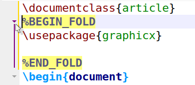
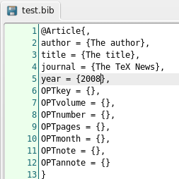
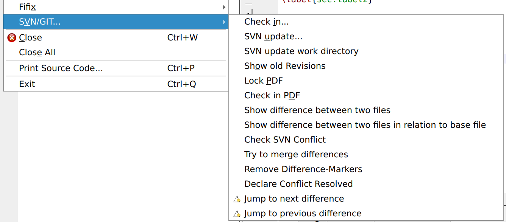
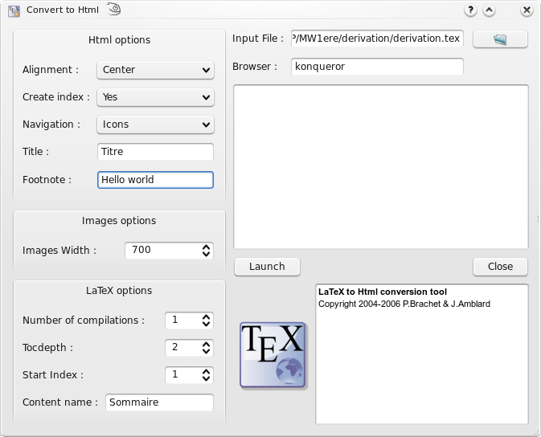
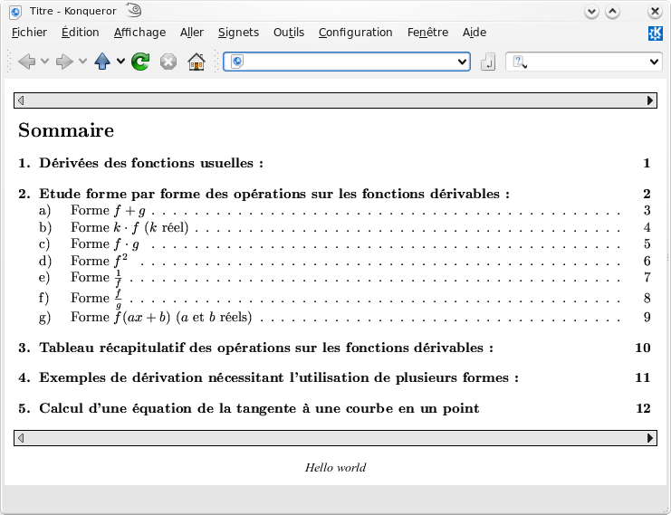

# Advanced features

## Sessions

TeXstudio uses "Sessions" to store and restore the set-up of open documents.
Session are stored as *.txss2* files.
By default, the session is stored when exiting from TeXstudio and restored at start-up.


## User Fold Marker

Normally every structure command marks a start of foldable range, and every environment or TeX group constructs a foldable range. You can mark an extra foldable range by inserting special comments `%BEGIN_FOLD` and `%END_FOLD`. 



## Bibliography

For the \"bib\" files , the \"Bibliography\" menu enables you to
directly insert the entries corresponding to the standard types of
document.

```{note}
The optional fields can be automatically deleted with the
\"Clean\" command of the \"Bibliography\" menu.
```



Specialized bibliography programs like [JabRef](https://github.com/JabRef/jabref) allow a more comfortable management of bibliography references. It can also be set up to insert *bibIDs* directly into TeXstudio.

## GIT/SVN Support

TeXstudio provides some basic support for version control management with git or subversion (svn).

Once [set up](configuration.md#configuring-svngit-support), saving the document will also generate a check-in.
This is only the case with explicit saves via "File/Save" (or the shortcut `CTRL+S`), saving via a compile run is not checked in. This allows tweaking the document around compilation runs without overflowing the version management.

Newly saved documents are automatically added to an exsiting repository, if no repository exist, a new one will be generated at the directory level of the document.

```{note}
You cannot checkout/clone a repository via TeXstudio. Just use the
normal tools for this. Once you have a working copy, TeXstudio can operate
on it.
```



\"File/Checkin\" 

:   Performs an explicit save and check in, with an input
    dialog which asks for a checkin in message which is stored in the SVN/GIT
    history.

\"File/Show old Revisions\"
:   Pops up a dialog, which shows all available
    revisions. A selection of an older revision leads to instantaneous
    change of the current document to that older revision. You can select
    and copy old parts to transfer them to the most recent version of your
    document, by copying the parts and then going back to most recent
    version. If you start editing that document directly, the dialog is
    closed and the present text will be your new most recent version though
    yet unsaved.

Lock PDF/Checkin PDF
:   allows to check in resulting pdf documents into the repository. SVN may lock the pdf from being changed by anyone else.

Show difference ...
:   shows diffs of two or three files in the editor. Changes are highlighted.

## Advanced header usage

So called \"magic comments\" are a way to adapt the options of the
editor on a per-document level. The concept was [originally introduced in TeXshop](http://www.texdev.net/2011/03/24/texworks-magic-comments/)
and has been adopted in a number of editors since. TeXstudio supports
the following magic comments:

`% !TeX spellcheck = de_DE` 
:   Defines the language used for spell checking of the document. This
    overrides the global spellchecking settings. Nevertheless, an
    appropriate dictionary has to be installed.

    If no spellchecking is desired, set value to \"*none*\".

`% !TeX encoding = utf8`
: Defines the character encoding of a document.

`% !TeX root = filename` 
:   Defines the root document for this file (i.e. the file which will be
    passed to the LaTeX compiler when building). This setting override
    the automatic root detection in TeXstudio. In turn, it\'s
    overridden, if an *explicit root document* is set at
    `Options -> Root Document`.

`% !TeX program = pdflatex`
:   Defines the compiler to be used for the document. To be precise, it
    overrides the default compiler (command `txs:///compile`) which is
    used in the actions \"Build & View\" as well as \"Compile\". Valid
    options are \"latex\", \"pdflatex\", \"xelatex\", \"lualatex\" and
    \"user*n*\" (e.g. user0 as user defined command 0)

`% !TeX TXS-program:bibliography = txs:///biber`
:   This is a TeXstudio-specific setting. It overrides the build-system
    command specified to the left by the one on the right. In the
    example, we tell TXS to use the biber command (`txs:///biber`) for
    the general \"Bibliography command\" (txs:///bibliography). See also
    the [description of the build system](configuration.md#advanced-configuration-of-the-build-system).
    
    Example:
    ```
    % !TeX TXS-program:compile = txs:///pdflatex/{-synctex}
    ```
    This will run pdflatex as defined in the option *without* the `-synctex=1` options, see [description of the build system](configuration.md#advanced-configuration-of-the-build-system).

`% !TeX TXS-SCRIPT = name`
:   This defines a temporary script macro .

    Example:
    ```
    % !TeX TXS-SCRIPT = foobar
    % //Trigger = ?load-this-file
    % app.load("/tmp/test/test.tex");
    % app.load("/tmp/test/a.tex");
    % TXS-SCRIPT-END
    ```
    This defines a temporary script macro which is executed, when the
    file is loaded, and which in turns loads the two files in /tmp/test.

    The macros defined via TXS-SCRIPT are active in all files of a
    document (e.g. included files). You cannot run them manually. They
    are run via the trigger (regular expression or special trigger, see
    section on triggers). The macro is just read once, when the file is
    opened. Changes during an edit session will only take effect when
    you reopen the file.

`% !BIB program = biber`
:   The special `% !BIB program` command is understood for compatibility
    with TeXShop and TeXWorks (also in the variant `% !BIB TS-program`).
    This is equivalent to
    `% !TeX TXS-program:bibliography = txs:///biber`

## Personal macros

TeXstudio allows you to insert your own macros. These macros are defined
with the \"Macros - Edit Macros\" menu. Macros can consist of simple
text which is directly placed into txs. It can also be an
\"environment\" which are automatically extended by begin/end or it can
be a java script. The needed functionality can be selected by checkbox.

The \"abbreviation\" is a pseudo-command for the latex completer. If the
pseudo-command is completed, the macro will be inserted instead. Note
that the pseudo-command needs to start with a backslash (\"\\\\\").

\"Trigger\" is a regular expression which triggers the inclusion of the
macro: When the last written characters match this expression, they are
removed and the macro is inserted/executed. (see
[below](#triggers) for more details).

Some macros can be directly downloaded from an internet repository. The
dialog is started with the button \"Browse\". For easier data exchange,
macros can be im- and exported to a file. If you want to add a macro of
your own to that repository, you can hand it in as a feature request on
[Github](https://github.com/texstudio-org/texstudio/issues).
Each macro can be assigned a fixed shortcut in the \"Shortcut\" box.
The list of macros on the left-hand side represents the macro ordering
in the macro-menu. It is rearranged with the
\"up\"/\"down\"/\"add\"/\"remove\" buttons or with drag and drop.
Folders can be added to sort a larger number of macros sensibly. To move
macros into/from folders, only drag and drop works.
The \"run script\" button directly executes a script in the editor for
testing.


### Text macros

Apart from normal text, some special codes are recognized and replaced
on insertion.

-   If you write %\| somewhere the cursor will be placed at that place
    in the inserted text. (A second %\| will select everything between
    them).
-   Write %\<something%\> to mark it as placeholder which is highlighted
    in the text and can be selected by `Ctrl+Left/Right`.
    Additional properties of the placeholder can be set after a %:,
    e.g. %\<something%:persistent,id:123,mirror%\>.
    The available properties are:
    -   select: The placeholder will be selected (similar to %\|)
    -   multiline: The placeholder is used for multiline text. If a
        macro insertion replaces an existing text, the replaced text is
        again inserted into a placeholder in the macro. If the original
        text spans more than one line, it will be inserted into a
        placeholder with the multiline property. Otherwise in a
        placeholder with the select-property.
    -   persistent: The placeholder is not automatically removed, when
        its text is changed in the editor
    -   mirror: The placeholder is a mirror of another placeholder in
        the macro and thus will always have the same content as the
        original placeholder. You should set an id, so it knows which
        placeholders are connected
    -   id:123: The id of the placeholder
    -   columnShift:-12: The placeholder is not placed where the %\<
        markers are, but some columns to the left of it
    -   translatable: The text of the placeholder should be added to
        translations (only applicable to macros that are known during
        the compilation of texstudio).
    -   cutInsert: The text of the placeholder is replaced by cut buffer
        (selected text when the snippet is inserted). This code is only
        necessary if not the first placeholder is intended to take the
        cut buffer, e.g. generate env (ctrl+e).
-   The option %(*filefilter*%) will be replaced by a filename which is
    asked for in a file dialog. The file filter is the standard
    Qt-Filefilterformat. For example \"Images (\*.png \*.xpm
    \*.jpg);;Text files (\*.txt);;XML files (\*.xml)\", see also
    [Qt-Doc](https://doc.qt.io/qt-6/qfiledialog.html)

### Environment macros

The text will be used as environment-name, thus \"%environment\" will be
inserted as:

```latex
\begin{environment}

\end{environment}
```

```{note}
TeXstudio needs that the env-name starts with \"%\", though that
character is not placed on insertion.
```

### Script Macros

Instead of using code snippets, you can also make use of scripting with
QJS, an application scripting language based on
[ECMAScript](https://doc.qt.io/qt-6/qtqml-javascript-functionlist.html). 

Put \"%SCRIPT\" in the first line to declare a macro as a script. Here
are the objects that provide the interface to the TeXstudio internals:

-   \"editor\" allows some top level operations like
    searching/save/load. in the current document
-   \"cursor\" gives access to cursor operations like moving, inserting
    and deleting texts.
-   \"fileChooser\" gives access to the filechooser dialog, a very
    simple file selection dialog
-   \"app\" to access application wide things like the clipboard or the
    menus

The following table gives an overview on the provided commands.

| Command | Description |
| --- | ------ |
| alert(str), information(str), warning(str) or critical(str) | shows str in a messagebox with a certain icon |
| confirm(str) or confirmWarning(str) | shows str as a yes/no question in a messagebox |
| debug(str) | prints str to stdout |
| writeFile(name, value) | Writes value to file name (requires write privileges) |
| readFile(name) | Reads the entire file name (requires read privileges) |
| system(cmd, workingDirectory=\"\") | Calls an external command **cmd**, which includes the program name and its arguments.<br>**cmd** may undergo command-line expansion as follows:<br>If **cmd** contains the string **txs:///** or if it does **not** contain any pipe (\|) characters, then **cmd** undergoes standard command-line expansion like any other [external command](configuration.md#command-syntax-in-detail). When expanding any tokens the current file is assumed to be the empty string, so any tokens that use the current file (e.g. **\%** or **?**) will expand to the empty string too.<br>If **cmd** does not contain the string **txs:///** and it contains at least one pipe character, then it is executed without any string expansion or replacement.<br>If **workingDirectory** is not set, the working directory will be inherited from the TeXstudio executable. This command returns a ProcessX object which has the following methods: <br>-   waitForFinished: Wait until the process is finished<br>-   readAllStandardOutputStr: Returns the stdout<br>-   readAllStandardErrorStr: Returns the stderr<br>-   exitCode: The exit code<br>-   exitStatus: The qt exit status<br>-   terminate or kill: Stops the process<br>If the script does is not granted permission to run the external command, then **system()** returns **null**.<br><br>Examples<br><br>List all the files in the Subversion repository /usr/local/svnrepository<br>The command contains the string **txs:///**, so it undergoes the expansion as an [external command](configuration.md#command-syntax-in-detail).<br>%SCRIPT<br>cmd = system("txs:///svn ls /usr/local/svnrepository")<br>  cmd.waitForFinished()<br>output = cmd.readAllStandardOutputStr()<br>alert (output)<br><br>Download the web page from **http://www.my-website.com??arg1=abc&arg2=def** and save it as the local file **/home/john/page.html**.<br>The command does not contain any pipe characters (\|), so it undergoes the expansion as an [external command](configuration.md#command-syntax-in-detail). Note that we have doubled the character **?** in the URL, otherwise it would be expanded to current file which in our case would be the empty string.<br><br>%SCRIPT<br>cmd = system ("wget -O /home/john/page.html http://www.my-website.com??arg1=abc&arg2=def")<br>cmd.waitForFinished() |
| ~~setGlobal(name, value)~~ | Unsuppoted since txs 4.x. Sets a temporary, global variable |
| ~~getGlobal(name)~~ | Unsuppoted since txs 4.x. Reads a global variable |
| ~~hasGlobal(name)~~ | Unsuppoted since txs 4.x. Checks for the existence of a global variable |
| setPersistent(name, value) | Sets a global configuration variable. (can change the values of the ini file, requires write privileges) |
| getPersistent(name) | Reads a global configuration variable. (can read all values of the ini file, requires read privileges) |
| hasPersistent(name) | Checks if a global configuration variable exists. (requires read privileges) |
| hasReadPrivileges() | Checks if the script has read privileges |
| hasWritePrivileges() | Checks if the script has write privileges |
| registerAsBackgroundScript(\[id\]) | Allows the script to run in the background (necessary iff the script should handle events/signals) |
| triggerMatches | Matches of the regular trigger expression, if the script was called by an editor [trigger](#triggers). |
| triggerId | Numeric id of the trigger, if the script was called by an event [trigger](#triggers). |
| ~~include(script)~~ | Unsuppoted since txs 4.x. Includes another script. Can be a filename or the name of a macro. |
| pdfs | List of all open, internal pdf viewers . |
| editor.search(searchFor, \[options\], \[scope\], \[callback\]) | Searches something in the editor.<br>-   searchFor is the text which is searched. It can be either a string (e.g. \"..\") or a regexp (e.g. /\[.\]{2}/). <br>-   options is a string and a combination of \"i\", \"g\", \"w\" to specify a case-*i*nsensitive search, a *g*lobal search (continue after the first match) or a whole-*w*ord-only search.<br>-   scope is a cursor constraining the search scope (see editor.document().cursor).<br>-   callback is a function which is called for every match. A cursor describing the position of the match is passed as first argument.<br>All arguments except searchFor are optional, and the order may be changed (which may not be future compatible). The function returns the number of found matches.|
| editor.replace(searchFor, \[options\], \[scope\], \[replaceWith\]) | This function searches and replaces something in the editor. It behaves like editor.search apart from the replaceWith argument which can be a simple string or a callback function. If it is a function the return value of replaceWith is used to replace the match described by the cursor passed to replaceWith. |
| editor.replaceSelectedText(newText, \[options\]) | This function replaces the current selections with newText or inserts newText, if nothing is selected. If newText is a function, it will be called with the selected text and corresponding cursor, and the return value will be the newText. It is recommended to use this function for all text replacements/insertions, since it is the easiest way to handle multiple cursors/block selections correctly.<br>Options is an object that can have the following properties:<br>-   `{"noEmpty": true}` only replaces; does not insert anything if the selection is empty<br>-   `{"onlyEmpty": true}` only inserts at the cursor position; does not change non empty selected text<br>-   `{"append": true}` appends newText to the current selection, does not remove the old text<br>-   `{"prepend": true}` prepends newText to the current selection, does not remove the old text<br>-   `{"macro": true}` Treats newText as normal macro text, e.g. inserting %\< %\> placeholders<br><br>Examples:<br>`editor.replaceSelectedText("world", {"append": true} )` Appends \"world\" to the current selections.<br>`editor.replaceSelectedText(function(s){return s.toUpperCase();})` Converts the current selection to uppercase. |
| editor.insertSnippet(text); | Inserts a text snippet into the editor. For a list of extended features and syntax see [Text Macros](#text-macros). |
| editor.undo(); | undo last command in editor |
| editor.redo(); | redo last command in editor |
| editor.cut(); | cut selection to clipboard |
| editor.copy(); | copy selection to clipboard |
| editor.paste(); | paste clipboard contents |
| editor.selectAll(); | select all |
| editor.selectNothing(); | select nothing (clear selections) |
| editor.cutBuffer | If a macro was triggered by a key press and there was a selection previous to the key press, the content of the selection is stored in the cutBuffer. The selection and its content is removed before the macro is entered. |
| editor.find(); | activate \"find panel\" |
| editor.find(QString text, bool highlight, bool regex, bool word=false,bool caseSensitive=false); | activate \"find panel\" with predefined values |
| editor.find(QString text, bool highlight, bool regex, bool word, bool caseSensitive, bool fromCursor, bool selection); | activate \"find panel\" with predefined values |
| editor.findNext(); | find next |
| editor.replacePanel(); | replace (if find panel open and something is selected) |
| editor.gotoLine(); | activate \"goto line panel\" |
| editor.indentSelection(); | indent selection |
| editor.unindentSelection(); | unindent selection |
| editor.commentSelection(); | comment selection |
| editor.uncommentSelection(); | uncomment selection |
|editor.clearPlaceHolders(); |clear place holders |
| editor.nextPlaceHolder(); | jump to next place holder |
| editor.previousPlaceHolder() | jump to previous place holder |
| editor.setPlaceHolder(int i, bool selectCursors=true); | set Placeholder |
| editor.setFileName(f); | set filename to *f*|
| editor.write(str) | inserts str at the current cursors position (if there are cursor mirrors, str will be inserted by all of them) |
| editor.insertText(str) | inserts str at the current cursor position (cursor mirrors are ignored,so it is preferable to use replaceSelectedText or write instead) |
| editor.setText(*text*) | replace the whole text of the current document by *text* |
| editor.text() | return the text of the complete document |
| editor.text(int line) | return text of *line* |
|editor.document().lineCount() | Returns the number of lines |
| editor.document().visualLineCount() |Returns the number of visual lines (counting wrapped lines) |
| ~~editor.document().cursor(line, \[column = 0\], \[lineTo = -1\],\[columnTo = length of lineTo\])~~ |Unsupported in txs 4.x. Use new QDocumentCursor(\...) instead, see section cursor. |
| editor.document().text(\[removeTrailing = false\], \[preserveIndent = true\]) | Returns the complete text of the document |
| editor.document().textLines() | Returns an array of all text lines |
| editor.document().lineEndingString() | Returns a string containing the ending of a line (\\n or \\n\\r) |
| ~~editor.document().getLineTokens(lineNr)~~ | Unsupported in txs 4.x. |
| editor.document().canUndo() | Returns true if undo is possible |
| editor.document().canRedo() | Returns true if redo is possible |
| editor.document().expand(lineNr) | Unfold the line in editor |
| editor.document().collapse(lineNr) | Fold the line in editor |
| editor.document().expandParents(lineNr) | Expand all parents of the line until it is visible |
| editor.document().foldBlockAt(bool unFold, lineNr); | Collapses or expands the first block before lineNr |
| editor.document().getMasterDocument(); | Returns the open document which directly includes this document |
| ~~editor.document().getTopMasterDocument();~~ | *Deprecated:* Use getRootDocument() instead |
| editor.document().getRootDocument(); | Returns the open document which indireclty includes this document and is not itself included by any other document |
| editor.document().getMagicComment(name); | Returns the content of a magic comment, if it exists |
| editor.document().updateMagicComment(name, value, \[create = false\]); | Changes a magic comment |
| editor.document().labelItems/refItems/bibItems | Returns the ids of all labels/references or included bibliography files. |
| editor.document().getLastEnvName(lineNr) |Returns the name of the current environment (at the end of the line). |
| documentManager.currentDocument | Current document (usually the same as editor.document(), unless the script is running in background mode) |
| documents.masterDocument | Master document if defined |
| \[documentManager.\]documents | Array of all open documents |
| documentManager.findDocument(fileName) | Returns the open document with a certain file name |
| documentManager.singleMode() | Returns true if there is no explicit master document |
| ~~documentManager.~~ ~~getMasterDocumentForDoc(document)~~ | *Deprecated:* Use getRootDocumentForDoc(document) instead |
| documentManager. getRootDocumentForDoc(document) | Returns the open document (possibly indirectly) including the given document |
| documentManager.findFileFromBibId(id) | Returns the file name of the bib file containing an entry with the given id |
| new QDocumentCursor(editor.document(),line, \[column = 0\], \[lineTo = -1\], \[columnTo = length of lineTo\]) | Returns a cursor object. If lineTo is given the cursor has a selection from line:column to lineTo:columnTo, otherwise not. |
| cursor.atEnd() | returns whether the cursor is at the end of the document |
| cursor.atStart() | returns whether the cursor is at the start of the document |
| cursor.atBlockEnd() | returns whether the cursor is at the end of a block |
| cursor.atBlockStart() | returns whether the cursor is at the start of a block |
| cursor.atLineEnd() | returns whether the cursor is at the end of a line |
| cursor.atLineStart() | returns whether the cursor is at the start of a line |
| cursor.hasSelection() | return whether the cursor has a selection |
| cursor.lineNumber() | returns the line number of the cursor |
| cursor.columnNumber() | returns the column of the cursor |
| cursor.anchorLineNumber() | returns the line number of the anchor. |
| cursor.anchorColumnNumber() | returns the column of the anchor. |
| cursor.shift(int offset) | Shift cursor position (text column) by a number of columns (characters) |
| cursor.setPosition(int pos, MoveMode m = MoveAnchor) | set the cursor position after pos-characters counted from document start (very slow)|
| cursor.movePosition(int offset, MoveOperation op = NextCharacter, MoveMode m = MoveAnchor); |move cursor *offset* times. MoveOperations may be: <br>-   cursorEnums.NoMove<br>-   cursorEnums.Up<br>-   cursorEnums.Down<br>-   cursorEnums.Left<br>-   cursorEnums.PreviousCharacter = Left<br>-   cursorEnums.Right<br>-   cursorEnums.NextCharacter = Right<br>-   cursorEnums.Start<br>-   cursorEnums.StartOfLine<br>-   cursorEnums.StartOfBlock = StartOfLine<br>-   cursorEnums.StartOfWord<br>-   cursorEnums.StartOfWordOrCommand<br>-   cursorEnums.PreviousBlock<br>-   cursorEnums.PreviousLine = PreviousBlock<br>-   cursorEnums.PreviousWord<br>-   cursorEnums.WordLeft<br>-   cursorEnums.WordRight<br>-   cursorEnums.End<br>-   cursorEnums.EndOfLine<br>-   cursorEnums.EndOfBlock = EndOfLine<br>-   cursorEnums.EndOfWord<br>-   cursorEnums.EndOfWordOrCommand<br>-   cursorEnums.NextWord<br>-   cursorEnums.NextBlock<br>-   cursorEnums.NextLine = NextBlock<br><br>Options for MoveMode are:<br><br>-   cursorEnums.MoveAnchor<br>-   cursorEnums.KeepAnchor<br>-   cursorEnums.ThroughWrap |
| cursor.moveTo(int line, int column); | move cursor to *line* and *column* |
| cursor.eraseLine(); | remove current line |
| cursor.insertLine(bool keepAnchor = false); | insert empty line |
| cursor.insertText(text, bool keepAnchor = false) | insert *text* text at cursor (this function will ignore indentations and mirrors, see editor.write and editor.insertText)
| cursor.selectedText() | return the selected text |
| cursor.clearSelection(); | clears selection |
| cursor.removeSelectedText(); | removes selected text |
| cursor.replaceSelectedText(text); | replace selected text with *text* |
| cursor.deleteChar(); | removes char right to the cursor |
| cursor.deletePreviousChar(); | removes char left to the cursor |
| cursor.beginEditBlock(); | begins a new edit block. All cursor operations encapsulated in an edit block are undone/redone at once. |
| cursor.endEditBlock(); | ends an edit block |
| app.getVersion() | Current version (0xMMmm00) |
| app.clipboard | Property to read/write to the clipboard |
| app.getCurrentFileName() | File name of currently edited file |
| app.getAbsoluteFilePath(rel, ext = \"\") | Converts a relative filename to an absolute one |
| app.load(file) | Loads a file |
| app.fileOpen/Save/Close/\.../editUndo/\.../QuickBuild/\... | All menu commands (i.e. all slots in the texstudio.h file). You can view a list of all currently existing slots on the \"menu\" page of the config dialog. |
| app.completerIsVisible() | check if completer is visible. |
| app.newManagedMenu(\[parent menu,\] id, caption) | Creates a new menu and returns it |
| app.getManagedMenu(id) | Returns a [QMenu](https://doc.qt.io/qt-6/qmenu.html) with a certain id |
| app.newManagedAction(menu, id, caption) | Creates a new action and returns it<br><br>-   menu: Parent menu<br>-   id: Id of the new action (the final, unique id will be *menu id/action id*)<br>-   caption: Visible text<br><br>You can use action.triggered.connect(function(){ \... }); to link a function to the returned action (for details see the [qt signal/slot](https://doc.qt.io/qt-6/signalsandslots.html) documentation). |
| app.getManagedAction(\[id\]) | Returns a [QAction](https://doc.qt.io/qt-6/qaction.html) with a certain id (all ids have the form main/menu1/menu2/\.../menuN/action, with usually one menu, e.g. \"main/edit/undo\", see texstudio.cpp) |
| app.loadManagedMenu(filename) | load menu structure from an xml-file, same format as uiconfig.xml |
| app.setupToolBars() | recreate toolbars. Call this if a newly created menu is used in the toolbar.  |
| app.createUI(file, \[parent\]) | Loads a certain ui file and creates a QWidget\* from it |
| app.createUIFromString(string, \[parent\]) | Creates a QWidget\* described in the string |
| app.slowOperationStarted()/slowOperationEnded() | Notify txs about the start/end of a slow operation to temporary disable the endless loop detection. |
| app.simulateKeyPress(shortcut) | Trigger a KeyPress event for the given shortcut, e.g. `app.simulateKeyPress("Shift+Up")`. *Note*: this is mainly intended for shortcuts and navigation. Currently, it does not support all functions of a KeyPress event. In particular, you cannot type any text. |
| new UniversalInputDialog() | Creates a new dialog |
| dialog.add(defaultValue, \[description, \[id\]\]) | Adds a new variable with the given default value, optional description and id to the dialog; and returns the corresponding qt component. A string default value becomes a QLineEdit, a number a QSpinBox and an array a QComboBox. |
| dialog.get(nr/id) | Returns the current value of the nr-th added variable or the variable with a certain id. |
| dialog.getAll() | Returns the value of all variables as combined numerical/associative array. You can use returnvalue\[i\] to get the i-th variable, and returnvalue.id to get the variable with a certain id. |
| dialog.exec() | Displays the dialog. Returns 1 if the user accepted the dialog, 0 if it was canceled. |
| dialog.show() | Displays the dialog asynchronously. |
| ~~UniversalInputDialog(\[\[defaultValue\_0, description\_0, id\_0\],\[defaultValue\_1, description\_1, id\_1\], \...\])~~ | Not working in txs 4.0.0. ~~Short form: Creates a new dialog, adds all variables of the array and call exec on it.~~ |
| fileChooser.exec() | show dialog and wait until it is closed again |
| fileChooser.setDir(dir) | set directory in the dialog to *dir* |
| fileChooser.setFilter(filter) | set file filter to *filter*, using the QT-format, see above |
| fileChooser.fileName() | return selected filename (after exec) |


Some examples:

-   Copy current file name to clipboard:

    ```javascript
    %SCRIPT
    app.clipboard = editor.fileName();
    ```

-   Execution of editor text:

    ```javascript
    %SCRIPT
    eval(editor.text());
    ```

-   Show all properties of an object:
    ```javascript
    %SCRIPT
    function write_properties(obj) {
        app.fileNew();
        newEditor = documentManager.currentDocument.editorView.editor;   //access the newly created document
        newEditor.setText(Object.getOwnPropertyNames(obj).join("\n"));   //print the properties
    }

    obj = editor;                                                        //object to show (e.g. the current editor)
    write_properties(obj)
    ```

-   Additional action in the edit menu
    ```javascript
    %SCRIPT
    var menu = app.getManagedMenu("main/edit");                   //get edit menu
    var act = app.newManagedAction(menu, "script", "scripttest"); //add action
    act.triggered.connect(function(){alert("called");});          //register simple handler
    registerAsBackgroundScript("test");                           //keep handler valid
    ```

-   Asynchronous dialog:
    ```javascript
    %SCRIPT
    var ui = createUI(" ... path to your ui file ...");  //load dialog
    ui.accepted.connect(function(){alert("x");})         //react to dialog closing
    registerAsBackgroundScript("abc");                   //keep function valid
    ui.show();                                           //show dialog
    ```

    The dialog is described in an ui file which can be created with the
    Qt Designer.

More examples can be found in the
[Wiki](https://github.com/texstudio-org/texstudio/wiki/Scripts).

### Triggers

#### Regular Expressions

In its simplest form, the trigger is simply a text, which is replaced by
the macro. E.g. trigger=\"eg\" macro=\"example given\", \"eg\" in \"the
leg\" is replaced on pressing \"g\" by \"example given\"

As the trigger is a regular expression, more elaborate triggers can be
created. TXS makes use of look-behind searching: \"(?\<=\\s)%\" is used
to replace a \"%\" if the previous character is a space. More help on
regular expressions can be found on the internet.

You can access the matched expression in the script via the global
variable `triggerMatches`. `triggerMatches` is an array. It\'s zero-th
component is the match to the complete regexp. The following elements
are matches to groups (if groups are defined).

Example:

    Trigger: #([a-z])
    Typed text: #a

    triggerMatches[0] == '#a'
    triggerMatches[1] == 'a'

Note: Triggers are inactive while the completer is active. For example
you cannot trigger on `\\sec` if the completer is open suggesting to
complete `\section`.

#### Limitation of Scope

To the scope in which a macro will be active, you can prepend an
expression of the pattern `(?[scope-type]:...)`.

| Scope Limiting Expression | Meaning |
| --- | --- |
| `(?language:...)`       | The macro is only active if the highlighting of the document matches the given language.<br> Example: `(?language:latex)` |
| `(?highlighted-as:...)` | Restrict the macro to certain highlighted environments. The possible values correspond to the list on the syntax highlighting config page.<br>Example: `(?highlighted-as:numbers,math-delimiter,math-keyword)` |
| `(?not-highlighted-as:...)` |  Similar to `(?highlighted-as:...)`, but the macro is deactivated in the given environments. |

You may combine `(?language:...)` and `(?highlighted-as:...)`
expressions. However, combing `(?highlighted-as:...)` and
`(?not-highlighted-as:...)` does not make sense logically and has
undefined behavior.

Note that you still need the regular expression of the trigger itself.
Here\'s a full complex example:
`(?language:latex)(?highlighted-as:comment,commentTodo)FIXME`. This
trigger responds to typing \"FIXME\", but only in comments and
todo-notes of latex documents.

#### Event Triggers

Additionally the following special trigger terms (without parentheses)
can be used to execute the script when the corresponding event occurs:

| Special Trigger | Executed on Event |
|  --- | --- |
|  ?txs-start  | TeXstudio is started. |
|  ?new-file   | A new file is created |
|  ?new-from-template | A new file is created from a template |
|  ?load-file  | A file is loaded |
|  ?load-this-file | The file containing the macro is loaded (only makes sense, if the script is defined as [magic comment](#advanced-header-usage)) |
|  ?save-file      | A file is saved |
|  ?close-file     | A file is closed |
|  ?master-changed | A document is un/defined as master document |
|  ?after-typeset  | A latex-like command has ended |
|  ?after-command-run |  A command run has ended (e.g. a compile command that calls latex twice and opens the viewer, will trigger this event once, but after-typeset twice) |

Multiple of these special triggers can be combined by \| symbols.

## Save/Load Profile

TeXstudio offers the possibility to save/load profile files (.txsprofile).
Profile files are complete configuration files, containing *all* configuration settings.
To use it meaningfully for exchanging profiles or settings, the .txsprofile file, which is a text file, should be stripped down to the necessary settings.
In case of syntax highlighting, this affects the formats section.
```
[formats]
data\align-ampersand\bold=true
data\align-ampersand\fontFamily=
data\align-ampersand\foreground=#0055ff
data\align-ampersand\italic=false
data\align-ampersand\overline=false
...
```

In case of other settings, the setting name is usually similar to the configuration settings name, so guessing should work. The section header for the setting like `[formats]` or `[texmaker]` needs to be present before the actual setting.

Example:

```
[texmaker]
Tools\Commands\latex="latex -src -interaction=nonstopmode %.tex"
```

## The \"Convert to Html\" command

This command (from the \"Tools\" menu ) produces a set of html pages
from a LaTeX source file with one image for each html page. Each page in
the slide presentation corresponds to one of the postscript pages you
would obtain running LaTeX.

The command also produces an index page corresponding to the table of
contents you would obtain with LaTeX. Each item of the index page
includes a link to the corresponding html page.

You can create links in the html pages by using the `\\ttwplink{}{}` command in the tex file.

Synopsis:

```latex
\ttwplink{http://www.mylink.com}{my text} (external link)
\ttwplink{page3.html}{my text} (internal link)
\ttwplink{name_of_a_label}{my text} (internal link)
```

```{warning}
You can\'t use this command with the hyperref package (and
some others packages). This command can only be used with the \"Convert
to html\" tool.
```





