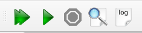

# Compiling a document

## Compiling

The easiest way to compile a document is to use the \"Compile\" command (`F6`)
or the \"Build&View\" command (`F5`).
This runs the latex compiler and, if necessary, bibtex, sometimes several times until a final pdf is produced.
"Build&View" directly calls the "View" command after building.




```{warning}
All your files must have an extension.
```

You can select the default command via the ["Configure TeXstudio"](configuration.md#configuring-the-build-system) dialog.

You can also launch single commands directly in the "Tools" menu.

The \"Clean\" command in the \"Tools menu\" allows you to erase
the files (dvi, toc, aux\...) generated by a LaTeX compilation. Finally documents, i.e. pdf files, are not removed.

## The log files

The log panel gives you insight to all the information output to the
log file by the command processing your LaTeX file. This panel can show
the log file in two ways: First the log file, highlighted at important
messages, and second as a table, that extracts the error and warning
messages as well as messages for bad boxes from the log file for easier
overview. The buttons *Log File* and *Issues* let you show or hide the
two representations (but you can\'t hide both at the same time). If you
choose to show both of them then the log panel will be split vertically
into two parts.


Use the buttons *Show Error*, *Show Warning*, *Show BadBox* (see
tooltips) to choose whether error messages (red), warning messages
(yellow) or messages for bad boxes (blue) will be shown or hidden. Use
the button *Show Log Markers* to display or hide log marker icons left
to the lines in the editor. The tooltips for the log markers show
message details.

In case that the log file contains error messages the log panel is
opened automatically (check option *Show log in case of compile error*,
s. Build settings) and log markers are activated. The editor\'s cursor
will be placed in the first line which has an error marker (check option
*Go to error when displaying log*, s. Adv. Editor settings).

You may use the buttons *Previous Error* and *Next Error* to jump back
or forth to the previous or next error. The shortcuts for this are
`Ctrl+Shift+Up/Down`, accordingly `Ctrl+Alt+Up/Down` (these you have to set
up on your own, s. Shortcut options for actions in menu Idefix/Go to)
and `Alt+Shift+Up/Down` are used for warnings and bad boxes respectively.
You can jump between markers of any type with `Ctrl+Up/Down`.

When you select an entry in the table then the editor (and the log file)
scrolls to the corresponding location. The log markers will be activated
(check option *Show log markers when clicking log entry*, s. Adv. Editor
settings). The log file information can be shown or hidden by clicking
on the Log File button. The Issues button offers a similar function for
the table with the messages.
