# Configuring TeXstudio

TeXstudio can be adapted in a wide range. Some options are directly available in the GUI via context menus, see [here](#adapting-the-main-gui), others are available with the \"Configure TeXstudio\" command in the
\"Options\" menu (\"Preferences\" under Mac OS X). Note that there are
two levels of detail. More advanced or less often used options are only
visible if you toggle \"Show advanced options\" in the lower left
corner.

## Adapting the main GUI
<!--
needs to be simplified and more precise
TOC ?
-->
The information presented in the side bar depends on the icon you select
from the vertical toolbar on the left side of the panel. These icons can
be understood as vertically aligned tabs. A click with the right mouse
button allows you to select which icons are presented:

TeXstudio offers a lot of toolbars (marked red), many of which are
arranged in a row above the side panel and the editor area (called the
main toolbar, the vertical toolbars are called secondary toolbars). One
vertical aligend toolbar (the central one, s. image below) resides to
the left of the editor area. You can choose which ones to show with a
click of the right mouse button on any of them:

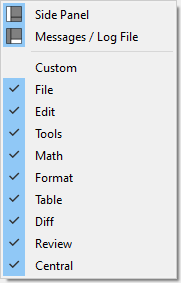

The custom toolbar will be discussed in [Configuring the Custom Toolbar](#configuring-the-custom-toolbar-advanced-option). The toolbars in the main toolbar can be
rearranged, moved somewhere in the window or even disconnected from the
window at all. All toolbars are scalable, s. option GUI scaling (needs
advanced options) in the config dialog.

## Configuring the editor

You may change the default encoding for new files (\"Configure
TeXstudio\" -\> \"Editor\" -\> \"Editor Font Encoding\") if you don\'t
want utf8 as encoding. Don\'t forget to set the same encoding in the
preamble of your documents. (e.g. `\usepackage[utf8]{inputenc}`, if you
use utf-8).\
TeXstudio can auto detect utf-8 and latin1 encoded files, but if you use
a different encoding in your existing documents you have to specify it
in the configuration dialog before opening them. (and then you also have
to disable the auto detection)

-   \"Folding\" toggles the editors code-folding capability (hide
    sections of the text).
-   The selection box \"Indentation mode\" lets you select, whether
    indented lines are followed by lines of the same indentation after
    pressing Enter or letting TeXstudio do automatic indentation.

## Configuring the latex related commands

LaTeX comes with a number of command line tools to compile and
manipulate LaTeX documents. The commands section defines there location
and arguments.

The default settings should work with the recent and standard LaTeX
distributions, but you could have to modify them (\"Configure
TeXstudio\" -\> \"Commands\"). To change a command, just click on the
button at the end of the corresponding line and select the command in
the file browser : TeXstudio will automatically adapt the syntax of the
command.

You can use a number of special characters / character sequences to
address the context of the current document. They are expanded at
runtime:

|  Special Character                  |  Expands to |
|  ---------------------------        | ----------- |
|  `%`                                | filename of the root document for of current document without extension |
|  `@`                                | current line number |
|  `?` followed by further characters | See the instruction at the bottom of the configuration dialog. |
|  `[txs-app-dir]`                    | Location of the TeXstudio executable (useful for portable settings) |
|  `[txs-settings-dir]`               | Location of the settings file (texstudio.ini) |

You can always restore the original settings using the revert button to
the right.

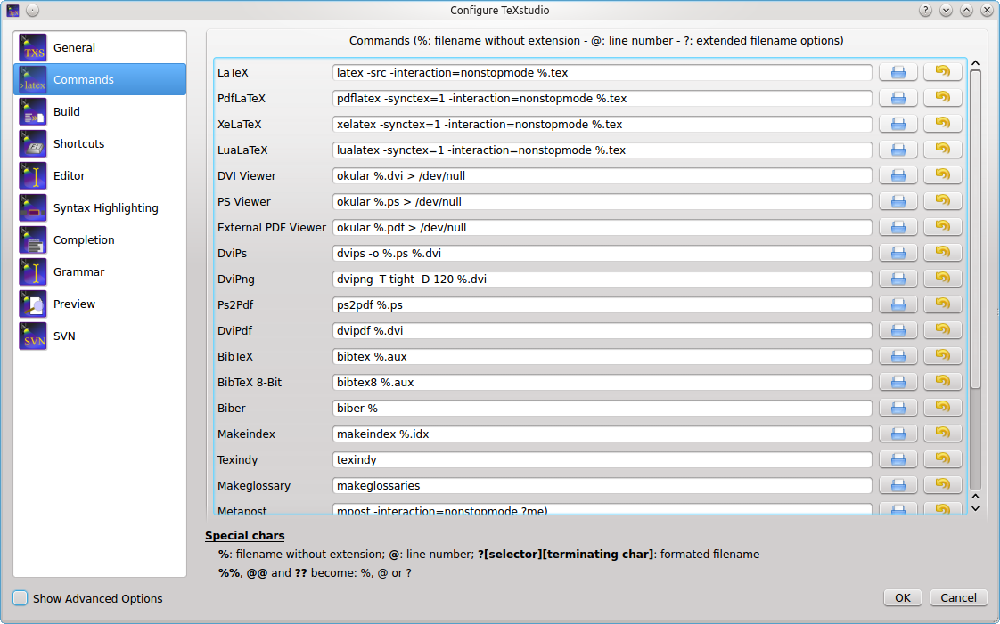

### Command syntax in detail

Before an external command is executed the command line undergoes
expansion where the following tokens are recognized and replaced by
TeXstudio:

-   **%** is replaced by the absolute pathname of the root (master)
    document up to but excluding the file extension.
-   **%%** is replaced by the % symbol.
-   **@** is replaced by the current line number at the moment when the
    corresponding external command was run.
-   **@@** is replaced by the @ symbol.
-   **?\[selector\]\[pathname parts\]\[terminating char\]** is replaced
    by a formatted filename where:
    -   **\[selector\]** selects the pathname that is used by
        **\[pathname parts\]**. It can be one of the following:
        -   **No selector** used at all. In this case the root (master)
            document is selected.
        -   **c:** selects the current document which can be different
            from the root document. Note that the trailing colon is a
            part of the selector.
        -   **p{ext}:** searches for a file with same basename as the
            root document and extension **ext**. The search is done in
            the dictory containing the root (master) document and in the
            additional PDF search paths. If a matching file is found
            then it selected for further processing by \[pathname
            parts\]. If no matching file is found then TeXstudio selects
            a default pathname which is the master file with its
            extension replaced by **ext**. Note that the trailing colon
            is a part of the selector.
    -   **\[pathname parts\]** selects which parts of the selected
        pathname are placed in the expanded command line. It can be one
        or more of the following characters:
        -   **a** expands to the absolute path of the selected pathname.
            This absolute path is up to but excluding the filename of
            the selected pathname.
        -   **r** expands to the relative path of the selected pathname.
            This relative path is up to but excluding the filename of
            the selected pathname.
        -   **m** expands to the complete basename of the selected
            pathname. The complete basename is the filename part up to
            but excluding the last dot in the filename.
        -   **e** expands to the extension of the selected pathname.
    -   **\[terminating char\]** specifies the prefix and/or suffix
        characters that enclose the expanded **\[pathname parts\]**. It
        can be one of the following:
        -   **)** Do not add characters before or after the expanded
            **\[pathname parts\]**. Used to mark the end of the
            expansion token.
        -   **\"** to enclose the expanded **\[pathname parts\]** in
            double quotes.
        -   **.** to add a dot after the expanded **\[pathname
            parts\]**.
        -   **(space)** to add a space after the expanded **\[pathname
            parts\]**.
-   **?\*.ext** causes the external command to be expanded once for each
    .ext file.
-   **??** is replaced by the ? symbol.

Examples:

-   **?ame\"** expands to the absolute pathname of the root document
    enclosed in double-quotes (e.g. /some/directory/mydocument.tex).
-   **?e)** expands to the extension of the root document without
    leading dot (e.g. tex).
-   **?m** expands to the double-quoted complete basename of the root
    document (identical to **%**).
-   **?me** expands to the filename of the root document (e.g.
    example.tex).
-   **?p{pdf}:ame** expands to the absolute pathname of the output PDF
    file (e.g. /some/directory/mydocument.pdf).
-   ?\*.aux expands once for each .aux file in the current directory.

### Set-up for external viewers

Some viewers can jump to (and visually highlight) a position in
the DVI/PDF file that corresponds to a certain line number in the (La)TeX
source file.
To enable this forward search, you can enter the command line of the
corresponding viewer either as command line for an user tool in the User
menu (User/User Commands/Edit\...) or in the viewer command line in the
config dialog (\"Options/Configure TeXstudio\" -\> \"Commands\"). When
the viewer is launched, the **@**-placeholder will be replaced by the
current line number and **?c:ame** by the complete absolute filename of
the current file. If your PDF file is not in the same directory as your
.tex file you can use the **?p{pdf}:ame** placeholder. For details see
[External Commands](#command-syntax-in-detail).\
\
On Windows, you can execute DDE commands by inserting a command of the
form: [dde:///service/control/\[commands\...\]]{.command} or (since
TeXstudio 1.9.9) also
[dde:///programpath:service/control/\[commands\...\]]{.command} to start
the program if necessary.\
\
Below you can find a list of commands for some common viewers. Of
course, you have to replace *(your program path)* with the path of the
program on your computer, if you want to use a command.\

#### Sumatra

Launch Sumatra from TeXstudio and configure Sumatra for inverse search:
[\"*(your sumatra path)*\" -reuse-instance -inverse-search \"\\\"*(your
TeXstudio path)*\\\" \\\"%%f\\\" -line %%l\" \"?am.pdf\"]{.command}\
\
Jump to a line in a running Sumatra (Windows only):
[dde:///SUMATRA/control/\[ForwardSearch(\"?am.pdf\",\"?c:am.tex\",@,0,0,1)\]]{.command}\
\
Launch Sumatra if it is not running and jump to a line in it (Windows
only): [dde:///*(your sumatra
path)*:SUMATRA/control/\[ForwardSearch(\"?am.pdf\",\"?c:am.tex\",@,0,0,1)\]]{.command}\
\
Launch TeXstudio from Sumatra: [\"*(your TeXstudio path)*\" \"%f\" -line
%l ]{.command}\
\
A possible value for *(your Sumatra path)* is [C:/Program
Files/SumatraPDF/SumatraPDF.exe]{.command}

#### Foxit Reader

Launch Foxit Reader from TeXstudio: [\"*(your Reader path)\"*
\"?am.pdf\"]{.command}\
\

#### Acrobat Reader

Launch Acrobat Reader from TeXstudio: [\"*(your Reader path)\"*
\"?am.pdf\"]{.command}\
\
Naviation and closing are achieved via DDE commands. Since version 10 of
the adobe products the DDE service name contains a letter for the
Product and the version number.

  Product            Service name
  ------------------ --------------
  Adobe Reader 9     acroview
  Adobe Acrobat 9    acroview
  Adobe Reader 10    acroviewR10
  Adobe Acrobat 10   acroviewA10
  Adobe Reader 11    acroviewR11
  Adobe Acrobat 11   acroviewA11
  Adobe Reader DC    acroviewR15
  Adobe Acrobat DC   acroviewA15

The following example is for Adobe Reader DC:\
Jump to a position in a running Adobe Reader (Windows only):
[dde:///acroviewR15/control/\[DocOpen(\"?am.pdf\")\]\[FileOpen(\"?am.pdf\")\]\[DocGotoNameDest(\"?am.pdf\",\"jump-position\")\]]{.command}
        *jump-position can be defined with the hyperref package*\
If you have the problem that Adobe Reader does not open, you have to add
the program path like this: [ dde:///\"C:\\Program Files
(x86)\\Adobe\\Acrobat Reader
DC\\Reader\\AcroRd32.exe\":acroviewR15/control/\[DocOpen(\"?am.pdf\")\]\[FileOpen(\"?am.pdf\")\]\[DocGotoNameDest(\"?am.pdf\",\"jump-position\")\]]{.command}\
\
Close the document in a running Adobe Reader (Windows only):
[dde:///acroviewR15/control/\[DocOpen(\"?am.pdf\")\]\[FileOpen(\"?am.pdf\")\]\[DocClose(\"?am.pdf\")\]]{.command}\
\
Note: Since Adobe Reader blocks writing to PDFs which are open in the
Reader, you have to close the PDF before recompiling. You can define a
User Command for the above DDE-command and call it at the beginning of
your build chain. This ensures that the file will be closed and thus is
writable when compiling.

#### Yap (Yet Another Previewer)

Launch Yap from TeXstudio: [\"*(your Yap path)*\" -1 -s @?c:m.tex
%.dvi]{.command}\
\
Launch TeXstudio from Yap: [\"*(your TeXstudio path)*\" \"%f\" -line %l
]{.command}\
\
A possible value for *(your Yap path)* is [C:\\Program Files\\MiKTeX
2.7\\miktex\\bin\\yap.exe]{.command}

#### xdvi

Launch xdvi from TeXstudio: [xdvi %.dvi -sourceposition
@:?c:m.tex]{.command}\
\
Launch xdvi from TeXstudio and enable inverse search: [xdvi -editor
\"texstudio %f -line\" %.dvi -sourceposition @:%.tex]{.command}

#### kdvi

Launch kdvi from TeXstudio: [kdvi \"file:%.dvi\#src:@
?c:m.tex\"]{.command}

#### Okular

Launch okular from TeXstudio: [okular \--unique
%.dvi\#src:@?c:m.tex]{.command}\
\
Launch TeXstudio from Okular: [texstudio %f -line %l]{.command}

#### Skim

Launch Skim from TeXstudio: [(your Skim
path)/Contents/SharedSupport/displayline @ ?am.pdf ?c:ame]{.command}\
\
Launch TeXstudio from skim: Command:
[/applications/texstudio.app/contents/macos/texstudio]{.command} with
arguments: [\"%file\" -line %line ]{.command}\
\
A possible value for *(your Skim path)* is
[/Applications/Skim.app]{.command}

#### qpdfview

Launch qpdfview from TeXstudio: [qpdfview \--unique
?am.pdf\#src:?c:am.tex:@:0 2\> /dev/null]{.command}\
\
Launch TeXstudio from qpdfview: [texstudio \"%1\" -line %2]{.command}

## Configuring the build system

TeXstudio provides general commands for translating latex.\
The default settings use \"pdflatex\" and the internal pdf viewer. Other
commands and viewer can be selected as well as a different bibliography
translator.\
The \"embedded pdf viewer\" does not open a new window for viewing the
pdf document but presents it directly next to the text in the editor.\
A useful alternative might be using the \"latexmk\" as compile command
(if the command is installed on your system), as it handles dependencies
with biblatex and index very well.\
The advanced options allows finer customization which is in general not
necessary.\

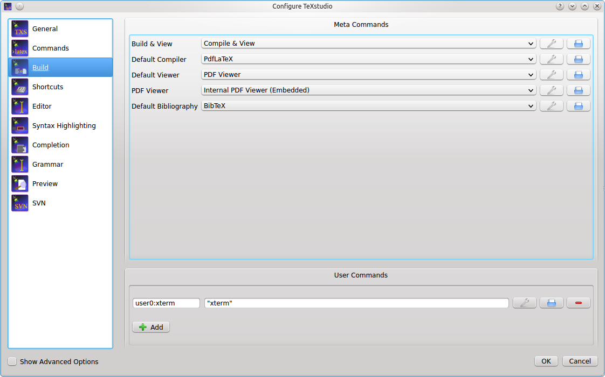

User commands can be defined here by \"adding\" them. Each user command
has a name with a pattern `<command id>:<display name>`, e.g.
`user0:User Command 0`. The command id has to be unique and must not
contain spaces. In [advanced mode](#advanced-configuration-of-the-build-system), you can reference it
using `txs:///"<command id>`. The display name will be shown in the
tools menu. The user commands can be activated either by short cut
(alt+shift+F%n) or by the tools menu (Tools/User).\
User commands can either consist of a combination of known commands by
selecting them from a list of available commands. This is triggered by
clicking the spanner-symbol.\
Alternatively a command can be directly selected through the file
system.

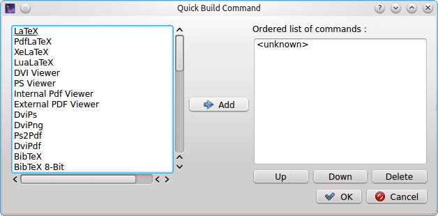

### Advanced configuration of the build system

If you enable the advanced options, you can configure the build system
in more detail.

Every txs-command is a list of external programs/latex-commands and
other txs-commands to call. An external program can be called with its
usual command line, while a txs-command with id \"foobar\" is called by
txs:///foobar.\
The commands in the list are separated by \|, which is just a separator
(i.e. it will *not* pass the stdout from one program to the stdin of the
next).

Note: Use command lists only for the meta and user commands listed at
`Options -> Build`. Do not use then at `Options -> Commands`. The latter
should just be single commands (i.e. do not use \| there). While it\'s
currently working in some cases, generally we do not guarantee this
behavior. It can have surprising side effects such abortion of
compilation in some cases. Also, the use of \| at `Commands` may be
prohibited completely without further notice in the future.

Each of these txs-command has a unique id, which is shown as tooltip of
the displayed name for \"normal\" commands and in the edit box for user
commands. Some important commands are usual: txs:///quick (Build & View,
the old quickbuild), txs:///compile (Default compiler), txs:///view
(Default viewer), txs:///latex (latex), txs:///pdflatex (pdflatex),
txs:///view-pdf (Default Pdf Viewer), txs:///view-pdf-external (External
pdf viewer).

For example, in a typical build configuration you might call
txs:///quick by pressing F1, which calls txs:///compile, which first
calls txs:///pdflatex that calls the actual pdflatey, and then calls
txs:///view, which calls txs:///view-pdf, which calls
txs:///view-pdf-internal, which displays the pdf.

There is no difference between commands defined as command on the
command config page, commands defined as build on the build config page,
or commands defined as user commands. They are just separated in the GUI
to simplify the interface.\
This also means that you can change every command as you want, ignoring
its old definition (you could even change its id, when editing the ini
file.).

There are however three always defined internal commands, which can only
be called and not modified:

| command | description |
| --- | --- |
|  txs:///internal-pdf-viewer                  |  Opens the internal viewer for the current document |
|  txs:///view-log                             |  Views the log file for the current document |
|  txs:///conditionally-recompile-bibliography |  Checks if the bib files have been modified, and calls txs:///recompile-bibliography, iff that is the case |

The internal pdf viewer also accepts the following options
(txs:///internal-pdf-viewer) to modify its behaviour:\
\

| option | description |
| --- | --- |
|  \--embedded                        |  Opens the viewer embedded|
|  \--windowed                        |  Opens the viewer windowed (default if no option is given)|
|  \--close-(all\|windowed\|embedded) |  Close all open viewers, or just viewers of a specific kind|
|  \--preserve-existing               |  Does not change any existing viewers (i.e. always opens a new one)|
|  \--preserve-(embedded\|windowed)   |  Does not change any existing embedded/windowed viewers|
|  \--preserve-duplicates             |  Only opens the pdf in the first opened viewer|
|  \--(no-)auto-close                 |  Determines whether the viewer should be closed, when the corresponding tex file is closed (default: auto-close iff embedded)|
|  \--(no-)focus                      |  Determines whether the viewer should be focused (default: focus iff windowed)|
|  \--(no-)foreground                 |  Determines whether the viewer should be brought to front (default: foreground)|
|  filename                           |  Determines the file to open. Like in other commands, [file patterns](#configuring-the-latex-related-commands) are supported. If this parameter is not provided, TXS uses `"?am.pdf"`, i.e. the absolute path of the main file. If the parameter is not an absolute filename, it is searched for in the directory of the main file as well as in `Options -> Build -> Build Options -> Additional Search Paths -> PDF Files` |
  

It is also possible to modify the arguments of called subcommands with
argument modifiers or by adding a new argument . These modifiers are
passed through called lists, so it will always change the arguments of
the finally called program, even if the directly called subcommand is
just a wrapper around another command:

| command | description |
| --- | --- |
| txs:///foobar \--xyz        | This will add the xyz option |
| txs:///foobar\[\--xyz=123\] | This will change the value of the xyz option to 123 (i.e. removing any xyz option defined in foobar) |
| txs:///foobar{\--xyz=123}   | This will remove \--xyz=123 from the foobar command line, ignoring xyz options with other values |
| txs:///foobar{\--xyz}       | This will remove any \--xyz option from the foobar command line, regardless of its value |
| txs:///foobar{}             | This will remove all options from the foobar command line, leaving only the name of the executable |

Finally, there are also hidden options, which can only be changed by
modifying the ini-file: Tools/Kind/LaTeX, Tools/Kind/Rerunnable,
Tools/Kind/Pdf, Tools/Kind/Stdout, Tools/Kind/Viewer, which give a list
of commands that are treated as latex compiler (e.g. show the log
afterwards), rerunnable (repeat command call, if there are warnings),
pdf generators (e.g. pdflatex), commands that prints to stdout (e.g.
bibtex), and viewers (e.g. only open once).

### Details of the execution environment

#### Environment Variables

The environment variables available within the execution are the same as
the ones that are available in the context in which TeXstudio was
started. In particular this is true for the PATH. On Linux/OS X the PATH
may depend on the way you started TeXstudio. Programs started from the
GUI may have a different PATH setting than programs started from a shell
(because some variables may only defined in the context of a shell (e.g.
via \~/.bashrc).

By default, TeXstudio parses environment variables in your commands. The
syntax is adapted to the according operating system. A variable MYVAR
would be written as `%MYVAR%` on Windows and `$MYVAR` on Linux and OS X.
Windows environment variables are case-insensitive, whereas they are
case-sensitive on Linux and OS X. Parsing of environment variables can
be deactivated in the Build section of the options.

#### Working Directory

The working directory is set to the path of root document.

#### Shell Functionality

All commands specified in the configuration (i.e. Commands and User
Commands) are executed directly. There is no shell involved. So most
shell functionality does not work.

##### Output Redirection

TeXstudio provides limited output redirection capabilities. You can only
output to the message panel (`> txs:///messages`) or suppress output
(`> /dev/null`). The default setting depends on the command. The same
targets are allowed for stderr: `2> txs:///messages`, `2> /dev/null`.
Additionally, you can redirect to the same target as stdout by using
`2>&1`.

A typical usecase would be to suppress all output of a command:
`>/dev/null 2>&1`

Note: Instead of the Linux/Unix notation `> /dev/null`, you may
alternatively use the Windows notation `> nul`. Because these commands
are directly interpreted by TXS, both variants work on all operating
systems.

##### Using other shell functionality

If you need shell functionality, you have to explicitly run a shell. You
can either do this directly in the user command:

    sh -c "/path/to/testscript foo > bar"Configuring

or on Windows:

    cmd /C "/path/to/testscript.bat foo > bar"

Alternatively, you can call a wrapper script in the user command

    /path/to/wrapperscript foo bar

and do the actual work inside the wrapper script:

    #!/bin/sh
    # I am wrapperscript
    /path/to/testscript $1 > $2

## Configuring some general issues

This panel allows the setting of some general aspects.

-   The \"style\" and \"color scheme\" of TeXstudio can be selected. The
    modern variant is closer to texmaker 1.9.
-   The symbol list can either appear \"tabbed\" (old behaviour, tabbed
    activated) or can have small symbol tabs besides the symbol lists
    which leaves more room for the symbols.
-   Also the log viewer can appear tabbed which allows faster change
    between error table, log view and previewer \...
-   The language of the menus can be changed directly to ignore system
    settings.

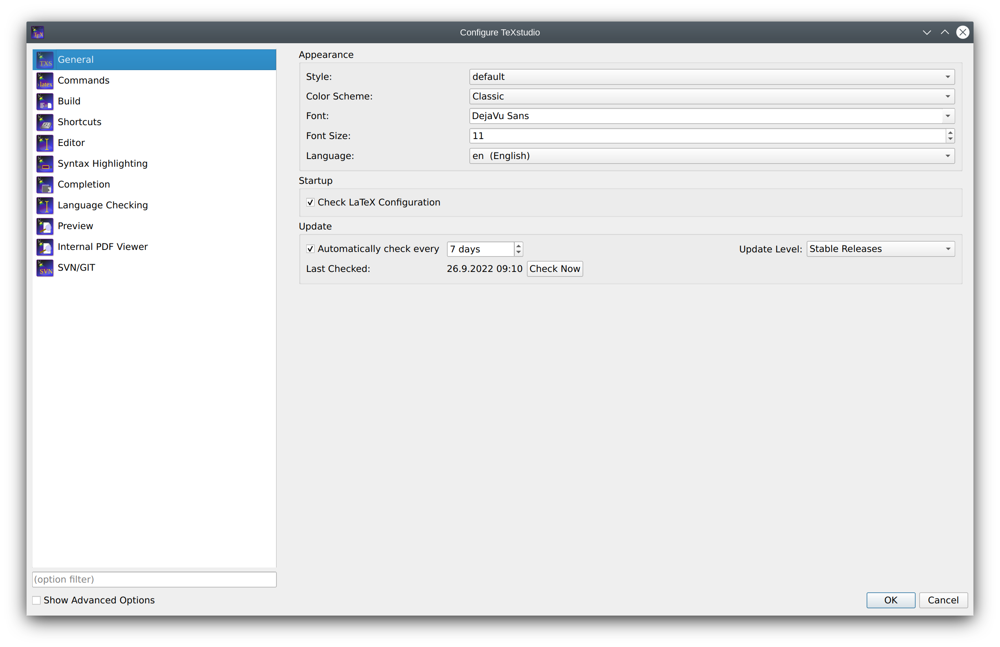

### Configuring the spell checker

TeXstudio offers an integrated spellchecker which can be used either via
a dialog or directly while typing. All text outside of LaTeX commands is
checked. Additionally, text in options of LaTeX commands is also
checked. TeXstudio determines if an option contains natural text and
thus should be spell checked by looking up its definition in the
completion word lists. For more information on completion word lists see
the section on [completion](#configuring-the-autocompletion) and the [description of the cwl format](background.md#description-of-the-cwl-format).

The spell checker uses the Hunspell dictionary format, which is widely
used, e.g. in OpenOffice, LibreOffice and Firefox. Each dictionary
consists of two files (`.dic` and `.aff`). French, British and German
dictionaries are distributed with TeXstudio. You can add additional
dictionaries yourself by placing them in the dictionary path. A
particularly convenient way to get additional dictionaries is
downloading a dictionary extension of
[http://wiki.services.openoffice.org/wiki/Dictionaries](http://extensions.openoffice.org/)
or
[LibreOffice](https://extensions.libreoffice.org/extensions?getCategories=Dictionary&getCompatibility=any)
and importing them using the button *Import Dictionary* in the options.

You can specify one or more search paths for the dictionaries in the
options. Multiple paths need to be separated by a semicolon. With the
paths you can use the special strings `[txs-app-dir]` and
`[txs-settings-dir]`. These are expanded to the path of the executable
and the config file (`texstudio.ini`) respectively. This expansion is
particularly useful if you use a portable version on a USB stick in
which the actual location of the program may depend on the computer you
are using.

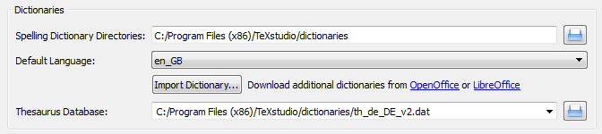

To make life easy TeXstudio lets you choose a preferred language for the
spell checker. However, if you frequently work with files in different
languages you may want to override the default behavior. This can be
done in two ways. First you can specify the language of the file via the
language menu in the status line. This setting will be lost as soon as
the file is closed. To permanently save the language of the file,
TeXstudio supports a special \"magic comment\"
`% !TeX spellcheck = de_DE`. If this comment is present in a file, its
language is automatically set when the file is loaded.

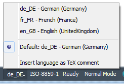

Please note: spell checking with Ctrl+Shift+F7 starts at the cursor
position and not at the beginning of the document.

If the interactive spell checker is enabled (default), any incorrectly
spelled word is underlined with a red wave. Right-click on the word to
open a menu with a list of possible corrections. In this context menu
you can also add the word to the ignore list. If your dictionary is very
large (\> 5MB), opening the context menu and showing possible
suggestions can take some seconds. If you don\'t need the suggestion,
you can press shift while right clicking and don\'t have to wait.

Since the internal structure of the dictionaries is complex (e.g.
contains rules on how to generate a word with different inflections), it
is not possible to simply add words to the dictionary. Instead if a word
is missing in the dictionary, you can add it to an ignore list, so that
the spell checker won\'t complain about it. The ignore list is normally
saved in the same directory as the dictionary. It\'s a plain text file
with the extension .ign. If this isn\'t possible (e.g. missing access
rights) the list is stored in the user configuration directory.

### Configuring the thesaurus

The thesaurus uses OpenOffice.org 2.x databases. Only GPL French and
US-English and German databases are distributed with TeXstudio.\
Users can download others databases here :
<http://wiki.services.openoffice.org/wiki/Dictionaries>\

### Configuring the latex syntax checker

The latex syntax checker takes the list of possible completion commands
to determine if a command is correct. Furthermore the completion list
contains partially additional information to determine in which context
a command is valid, whether it is valid only in math-mode or only in
tabular-mode.\

### Configuring the grammar checker

The grammar checker is based on the standard http API of
[LanguageTool](http://www.languagetool.org/), and requires a separate
installation of LanguageTool and java.

Once LanguageTool is installed, you can try it by starting the
LanguageTool standalone application, and start TeXstudio afterward.
LanguageTool then creates a locally running server at the address
http://localhost:8081/ and TeXstudio automatically connects to it at
startup. When the connection is established, all typed paragraphs are
send to LT and after a short delay the possible grammar errors are
highlighted.

To automatically start LanguageTool with TeXstudio, you need to enter
the path to LT jar in the grammar page of the config dialog. If the java
executable is not in the default PATH, you also need to set the path to
it there.

In the advanced config mode, you can also mark certain LT rules as
\"special\" whose matches will then be highlighted in a
different/customizable way. This can be useful to do a stylistic
analysis, e.g. by creating a own rule in LT highlighting all verbs or
all adverbs.

Independent from LanguageTool, TeXstudio also checks for repeated and
bad (imprecise/slang) words. The repetition check looks several words
behind and marks repetition of short words in the immediate vicinity and
repetition of long words up to 10 words before. These distances and
lengths can be changed in the advanced grammar config page.

## Configuring the autocompletion

TeXstudio has taken up completion word lists from kile which extended
the number of known commands for completion considerably. TeXstudio
understands the use of \\documentclass and \\usepackage in order to
select valid lists of commands for completion as well as syntax
checking. However TeXstudio allows one to select the additional word
lists under \"Configure TeXstudio\" -\> \"Editor\" -\> \"\". The names
of the word lists corresponds to the package for which they are made.
The list latex.cwl contains the standard latex commands.\
Concerning auto completion, TeXstudio allows one to adapt the behaviour
to your liking. The following options are available:

-   Completion enabled: self explanatory
-   Case sensitive: lets you complete e.g. \\Large from \\la \...
-   in first character: ?
-   Auto Complete Common Prefix: if only one item is in the list or all
    items in the completion list share common starting characters, the
    common characters are directly inserted, like pressing the key Tab.
-   Complete selected text when non-word character is pressed: when in
    completion mode, pressing a non-word character like space, leads to
    accepting the selected word. This may speed up typing.
-   Enable ToolTip-Help: show tool tips on selected latex commands in
    the completion list.
-   Use Placeholders: if the completed commands have options which need
    to be filled out, placeholders are put at these positions and they
    can be jumped to by using Ctrl+Right/Ctrl+Left.

If your favorite package is not yet present for completion (and syntax
checking), you can provide a list of your own by placing a file
\"packagename.cwl\" in the [config directory](https://github.com/texstudio-org/texstudio/wiki/Frequently-Asked-Questions#where-are-the-settings-stored).
This directory is placed in \~/.config/texstudio under Linux and usually
\"c:\\Documents and Settings/User/AppData/Roaming/texstudio\" under
Windows. Basically the file contains a list of valid commands. A
description of the exact format and an example are given in the
[appendix](background.md#description-of-the-cwl-format).

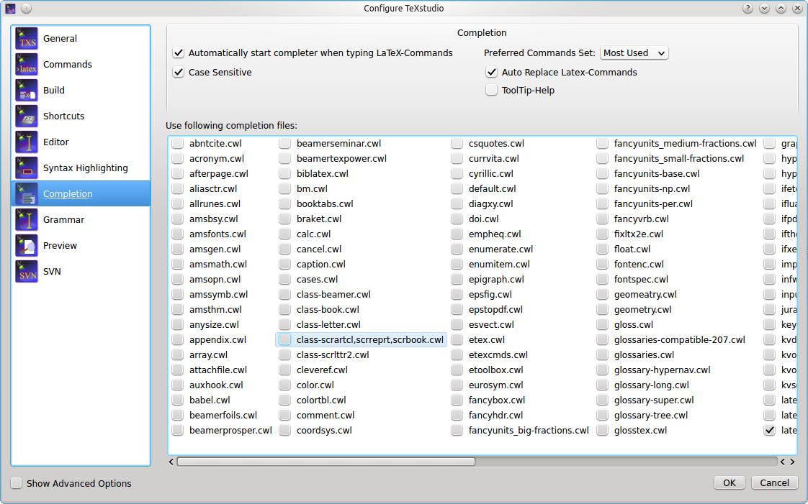

## Configuring shortcuts

Shortcuts can be changed by double clicking on \"Current Shortcut\" or
\"Additional Shortcut\". Then you can set up a new shortcut by one of
the following ways (a tooltip will show this information): (1) Select
from the drop down list, (2) hit the shortcut combination, or (3) type
the string of the shortcut. A shortcut can be assigned a multiple
keystroke combinations, for example `CTRL+M,CTRL+A` (either upper or
lower case is allowed, but the comma is important). If a shortcut should
be set to default value or removed completely, the items \"\<default\>\"
or \"\<none\>\" at the top of the list can be selected respectively.

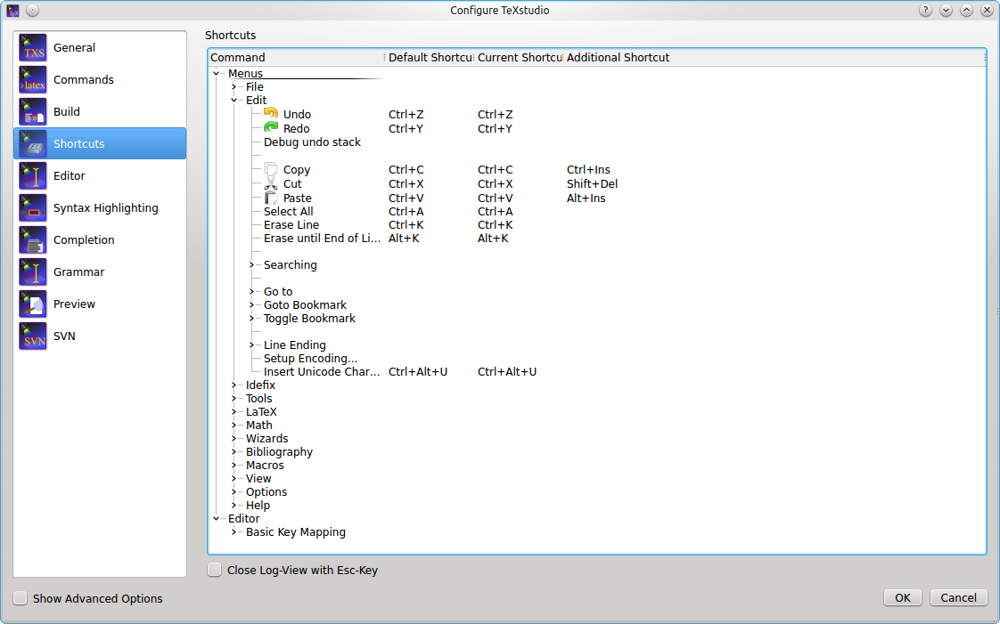

## Configuring the Latex/Math-Menu (Advanced option)

The Math/Latex-Menu can be adapted to user likings. For this menu items
can be renamed and a new Latex-Code can be placed. The appropriate item
can be be directly edited by doubleclicking on them.

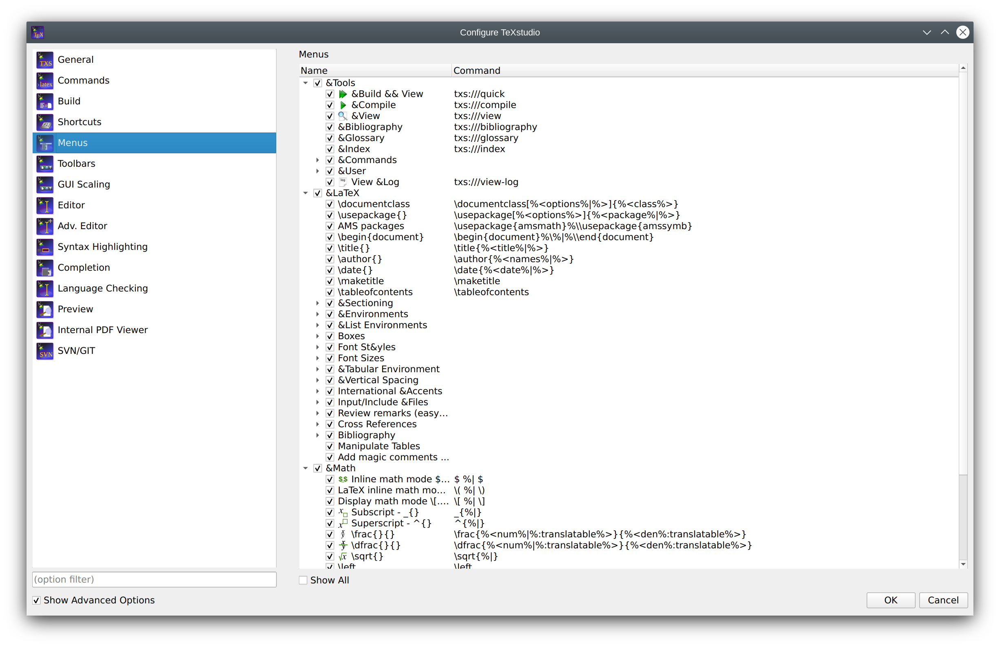

## Configuring the Custom Toolbar (Advanced option)

One Custom Toolbar is present in TMX. This toolbar can be filled with
actions from the Latex-, Math- and User-Menu. Since many of those item
don\'t have icons, user icons can be loaded as well. This is achieved by
applying \"load other icon\" from the context menu on a item in the
custom toolbar list in the configure dialog.

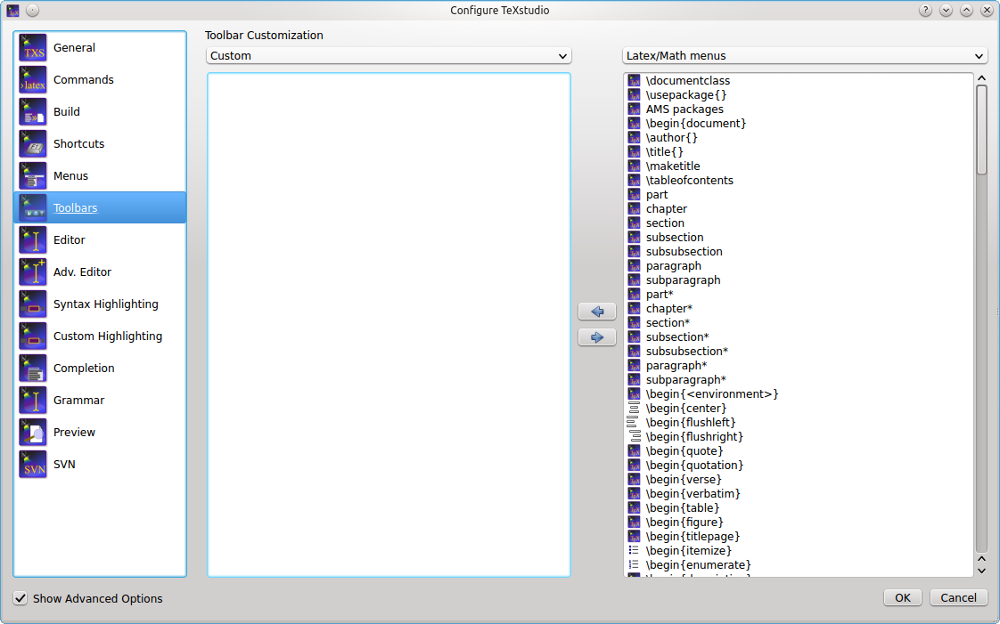

## Configuring SVN support

To supports SVN (subversion) for document versioning. To make use of it,
the SVN command line tools need to be installed. Linux and Mac OSX
normally provide already SVN tools, for Windows, the installation of
\"SlikSVN\" is recommended.

The complete path to the command \"svn\" and \"svnadmin\" need to be
adjusted in the aprioriate field of the Commands page in the options. On
the SVN page you can can choose the degree of automation (see below)
WSVN, see below.

Note: You cannot checkout a repository via TeXstudio. Just use the
normal tools for this (either SVN checkout on the command line or the
GUI of your choice). Once you have a working copy, TeXstudio can operate
on it.

\"Automatically check in after save\" allows TeXstudio to perform an SVN
check in after every save of a document, thus providing a very complete
history of the creation of a document. Since text documents are rather
small compared to disk spaces, size of the SVN database should not be a
problem. In addition newly saved files (save as) are automatically added
to SVN control,provided that the directory is already under SVN control.
If that is not the case, TeXstudio searches in \"SVN Directory Search
Depth\" directory above the current diorectory for a SVN controlled
directory to which the subdirectories and the TeX-Document will be
added. If no appropriate directory is found, a repository is
automatically generated in a directory called \"./repo\" and the
document is added. Thus the user does not need to look up the necessary
commands to set up a repository. This functionality is only activated
when \"Auto checkin in\" is enabled !

With \"User SVN revisions to undo before last save\" TeXstudio will
perform undo as usually, but if there are no further undoable commands
in the internal storage, the document will be changed to the previous
version in SVN history. Further undo commands allows one to back further
to older revisions, whereas a redo goes forward to more recent versions.
This is a more interactive approach than choosing SVN revisions directly
via a menu command, see [here](advanced.md#svn-support).

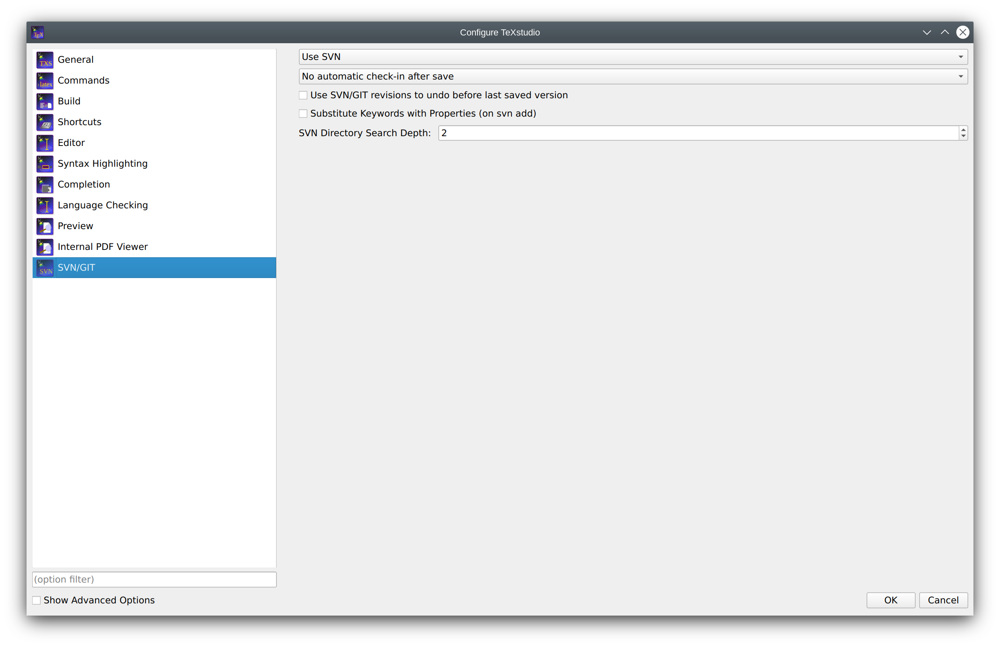
