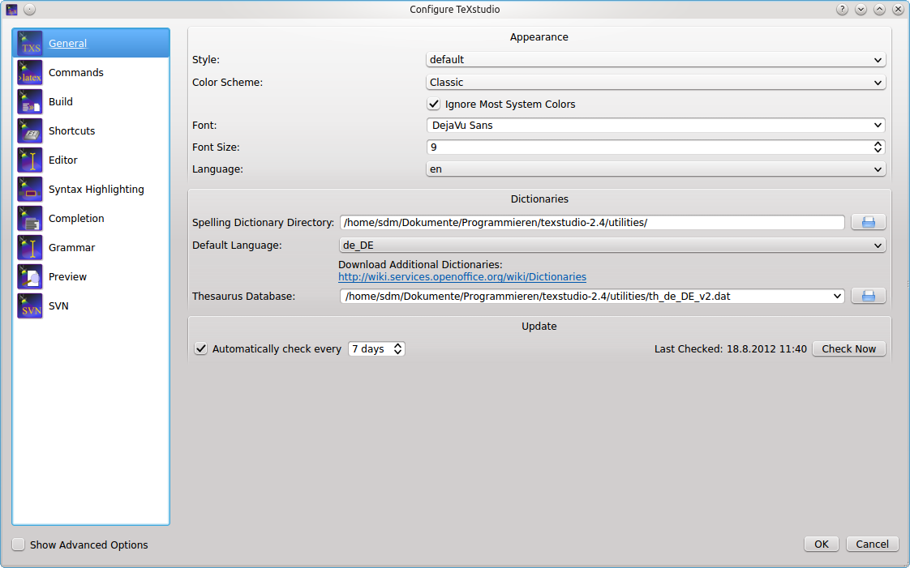
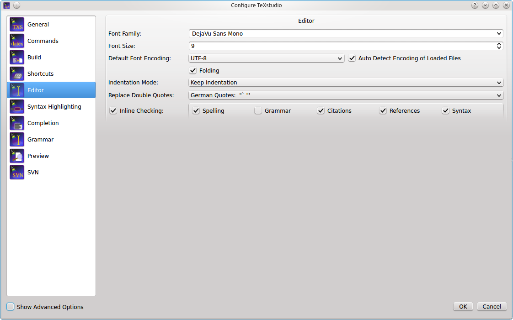
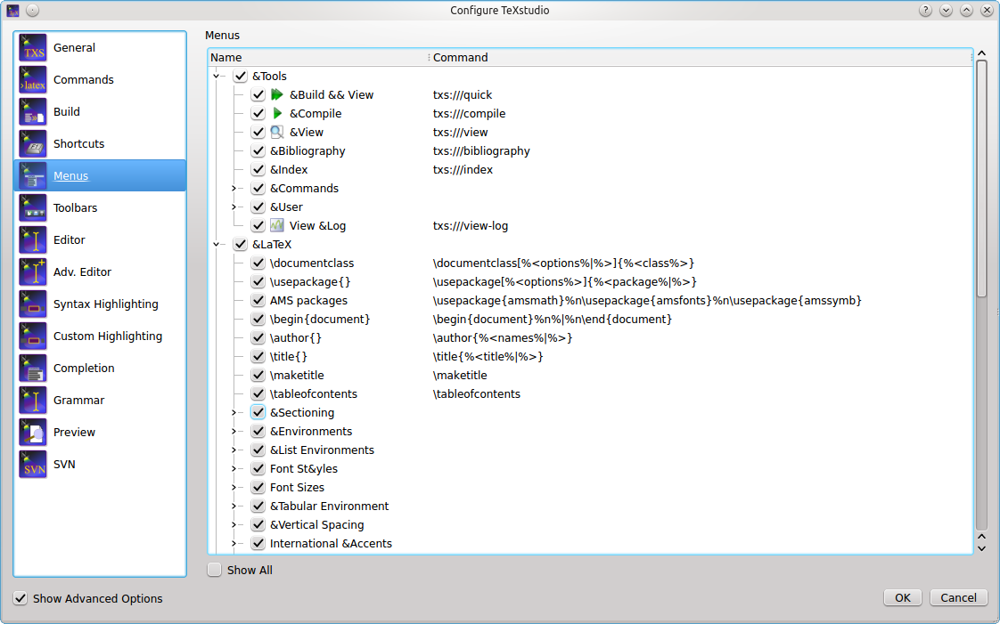
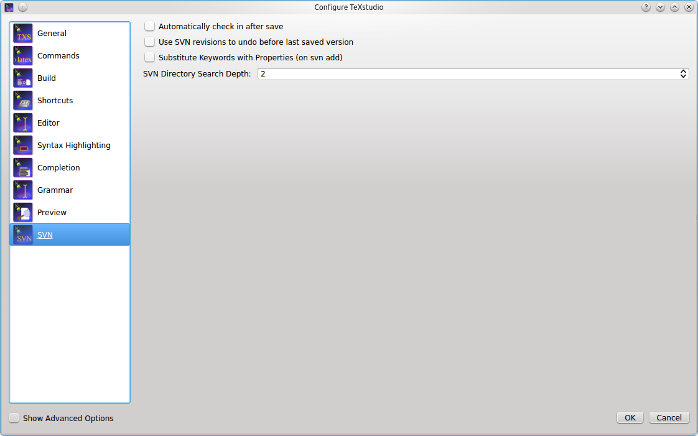

# Configuring TeXstudio

TeXstudio can be adapted in a wide range. Some options are directly available in the GUI via context menus, see [here](#adapting-the-main-gui), others are available with the \"Configure TeXstudio\" command in the
\"Options\" menu (\"Preferences\" under Mac OS X). Note that there are
two levels of detail. More advanced or less often used options are only
visible if you toggle \"Show advanced options\" in the lower left
corner.

## Adapting the main GUI
The side panel and the log panel may be hidden with a control on the lower-left edge of the main window.


The toolbars can be hidden by a right click anywhere on the toolbar area.


They can be moved by dragging the handler on the left-hand side.


## Configuring some general aspects


This panel allows the setting of some general aspects.

-   The \"style\" and \"color scheme\" of TeXstudio can be selected. The
    modern variant is closer to texmaker, "Orion Dark" and "Adwaita Dark" provide a dark mode.
-   The language of the menus can be changed directly to ignore system settings.



The advanced options allow:

-   Limit the number of recent files
-   The use of system dialog instead of the qt dialog
-   show always the structure of the "master" document if one is set
-   automatically restore the previous session
-   and to store session paths relatively which allows easier moving of files/projects


## Configuring the editor


You may change the default encoding for new files (\"Configure
TeXstudio\" -\> \"Editor\" -\> \"Editor Font Encoding\") if you don\'t
want utf8 as encoding. Don\'t forget to set the same encoding in the
preamble of your documents. (e.g. `\usepackage[utf8]{inputenc}`, if you
use utf-8).

TeXstudio can auto detect utf-8 and latin1 encoded files, but if you use
a different encoding in your existing documents you have to specify it
in the configuration dialog before opening them. (and then you also have
to disable the auto detection)

-   \"Folding\" toggles the editors code-folding capability (hide
    sections of the text).
-   The selection box \"Indentation mode\" lets you select, whether
    indented lines are followed by lines of the same indentation after
    pressing Enter or letting TeXstudio do automatic indentation.
-   Double quotes can be automatically replaced by language specific ones when typing `"`
-   The editor can show line numbers left of the text if desired.
-   The shown inline checking results can be selected with some granularity.



The advanced options allow among others:

Automatically load all included files of a LaTeX document
:   This load all child document and scans them. This is necessary to provide a complete set of available references, bibID and possibly used packages if they are defined in a child document

Scan LaTeX distribution for installed packages
:   This scan allows txs to determine if the given packages are valid and also to provide proposal for package name completion


## Configuring the advanced editor settings (Advanced option)
The advanced editor option allow fine control over many different aspects.
The overview here is incomplete and concentrates on commonly used changes.

Show image tooltip on images in files
:   when hovering over an image filename (e.g. in a \includegraphics command), a tooltip with the graphics content is shown

Show help as tooltip on text in editor
:   when hovering over a LaTeX command in the editor, txs can show a tooltip on that command if it is described in some latex command reference.

Line Wrapping
:   This allows to change the line wrapping mechanism. By default all lines are wrapped at the window edge.
    They can also be wrapped after a defined number of characters which is not always the same horizontal width if the characters are not monospaced.
    Or hard line wrapping after a number of characters can be selected. This inserts a new line when the number of characters exceeds a defined values. This insertion is done when saving a document and only for changed lines.

Auto save all files
:   txs allows to automatically save all files every few minutes


The section for the structure panel offers:

Reference command in context menu
:   use this command when inserting a reference with command from a context menu

Regular expression for TODO comment
:   define what comment is considered as TODO comment (which are highlighted and collected specifically )

Use color in global TOC
:   The global TOC can use colored background to distinguish between different included files. Different color schemes and no color are possible.


The table autoformatting affects the [manipulate table tools](editing.md#manipulating-tables).

Special commands
:   Are special commands which do not add cell content and need to handled specially, e.g. `\hline` at the end of a row.

Special commands position
:   where to place them when reformating a table.

One line per cell
:   when reformating a table, just put each cell in an individual line


## Configuring the latex related commands

LaTeX comes with a number of command line tools to compile and
manipulate LaTeX documents. The commands section defines there location
and arguments.

The default settings should work with the recent and standard LaTeX
distributions, but you could have to modify them (\"Configure
TeXstudio\" -\> \"Commands\"). To change a command, just click on the
button at the end of the corresponding line and select the command in
the file browser : TeXstudio will automatically adapt the syntax of the
command.

You can use a number of special characters / character sequences to
address the context of the current document. They are expanded at
runtime:

|  Special Character                  |  Expands to |
|  ---------------------------        | ----------- |
|  `%`                                | filename of the root document for of current document without extension |
|  `@`                                | current line number |
|  `?` followed by further characters | See the instruction at the bottom of the configuration dialog. |
|  `[txs-app-dir]`                    | Location of the TeXstudio executable (useful for portable settings) |
|  `[txs-settings-dir]`               | Location of the settings file (texstudio.ini) |

You can always restore the original settings using the revert button to
the right.


### Command syntax in detail

Before an external command is executed the command line undergoes
expansion where the following tokens are recognized and replaced by
TeXstudio:

-   **%** is replaced by the absolute pathname of the root (master)
    document up to but excluding the file extension.
-   **%%** is replaced by the % symbol.
-   **@** is replaced by the current line number at the moment when the
    corresponding external command was run.
-   **@@** is replaced by the @ symbol.
-   **?\[selector\]\[pathname parts\]\[terminating char\]** is replaced
    by a formatted filename where:
    -   **\[selector\]** selects the pathname that is used by
        **\[pathname parts\]**. It can be one of the following:
        -   **No selector** used at all. In this case the root (master)
            document is selected.
        -   **c:** selects the current document which can be different
            from the root document. Note that the trailing colon is a
            part of the selector.
        -   **p{ext}:** searches for a file with same basename as the
            root document and extension **ext**. The search is done in
            the directory containing the root (master) document and in the
            additional PDF search paths. If a matching file is found
            then it selected for further processing by \[pathname
            parts\]. If no matching file is found then TeXstudio selects
            a default pathname which is the master file with its
            extension replaced by **ext**. Note that the trailing colon
            is a part of the selector.
    -   **\[pathname parts\]** selects which parts of the selected
        pathname are placed in the expanded command line. It can be one
        or more of the following characters:
        -   **a** expands to the absolute path of the selected pathname.
            This absolute path is up to but excluding the filename of
            the selected pathname.
        -   **r** expands to the relative path of the selected pathname.
            This relative path is up to but excluding the filename of
            the selected pathname.
        -   **m** expands to the complete basename of the selected
            pathname. The complete basename is the filename part up to
            but excluding the last dot in the filename.
        -   **e** expands to the extension of the selected pathname.
    -   **\[terminating char\]** specifies the prefix and/or suffix
        characters that enclose the expanded **\[pathname parts\]**. It
        can be one of the following:
        -   **)** Do not add characters before or after the expanded
            **\[pathname parts\]**. Used to mark the end of the
            expansion token.
        -   **\"** to enclose the expanded **\[pathname parts\]** in
            double quotes.
        -   **.** to add a dot after the expanded **\[pathname
            parts\]**.
        -   **(space)** to add a space after the expanded **\[pathname
            parts\]**.
-   **?\*.ext** causes the external command to be expanded once for each
    .ext file.
-   **??** is replaced by the ? symbol.

Examples:

-   **?ame\"** expands to the absolute pathname of the root document
    enclosed in double-quotes (e.g. /some/directory/mydocument.tex).
-   **?e)** expands to the extension of the root document without
    leading dot (e.g. tex).
-   **?m** expands to the double-quoted complete basename of the root
    document (identical to **%**).
-   **?me** expands to the filename of the root document (e.g.
    example.tex).
-   **?p{pdf}:ame** expands to the absolute pathname of the output PDF
    file (e.g. /some/directory/mydocument.pdf).
-   ?\*.aux expands once for each .aux file in the current directory.

### Set-up for external viewers

Some viewers can jump to (and visually highlight) a position in
the DVI/PDF file that corresponds to a certain line number in the (La)TeX
source file.
To enable this forward search, you can enter the command line of the
corresponding viewer either as command line for an user tool in the User
menu (User/User Commands/Edit\...) or in the viewer command line in the
config dialog (\"Options/Configure TeXstudio\" -\> \"Commands\"). When
the viewer is launched, the **@**-placeholder will be replaced by the
current line number and **?c:ame** by the complete absolute filename of
the current file. If your PDF file is not in the same directory as your
.tex file you can use the **?p{pdf}:ame** placeholder. For details see
[External Commands](#command-syntax-in-detail).

On Windows, you can execute DDE commands by inserting a command of the
form: `dde:///service/control/[commands...]` or
`dde:///programpath:service/control/[commands...]` to start
the program if necessary.

Below you can find a list of commands for some common viewers. Of
course, you have to replace *(your program path)* with the path of the
program on your computer, if you want to use a command.

#### Sumatra

Launch Sumatra from TeXstudio and configure Sumatra for inverse search
: `"(your sumatra path)" -reuse-instance -inverse-search "\"*(your TeXstudio path)*\" \"%%f\" -line %%l" "?am.pdf"`

Jump to a line in a running Sumatra (Windows only):
: `dde:///SUMATRA/control/[ForwardSearch("?am.pdf","?c:am.tex",@,0,0,1)]`

Launch Sumatra if it is not running and jump to a line in it (Windows only)
: `dde:///(your sumatra path):SUMATRA/control/[ForwardSearch("?am.pdf","?c:am.tex",@,0,0,1)]`

Launch TeXstudio from Sumatra
: `"(your TeXstudio path)" "%f" -line %l`

```{note}
A possible value for *(your Sumatra path)* is `C:\Program Files\SumatraPDF\SumatraPDF.exe`
```

#### Foxit Reader

Launch Foxit Reader from TeXstudio
: `"(your Reader path)" "?am.pdf"`

#### Acrobat Reader

Launch Acrobat Reader from TeXstudio
: `"*(your Reader path)*" "?am.pdf"`

Navigation and closing are achieved via DDE commands. Since version 10 of
the adobe products the DDE service name contains a letter for the
Product and the version number.

| Product           | Service name |
| --- | --- |
| Adobe Reader 9    | acroview |
| Adobe Acrobat 9   | acroview |
| Adobe Reader 10   | acroviewR10 |
| Adobe Acrobat 10  | acroviewA10 |
| Adobe Reader 11   | acroviewR11 |
| Adobe Acrobat 11  | acroviewA11 |
| Adobe Reader DC   | acroviewR15 |
| Adobe Acrobat DC  | acroviewA15 |

The following example is for Adobe Reader DC:

Jump to a position in a running Adobe Reader (Windows only)
: `dde:///acroviewR15/control/\[DocOpen(\"?am.pdf\")\]\[FileOpen(\"?am.pdf\")\]\[DocGotoNameDest(\"?am.pdf\",\"jump-position\")\]`
  *jump-position can be defined with the hyperref package*

If you have the problem that Adobe Reader does not open, you have to add
the program path like this: `dde:///"C:\Program Files (x86)\Adobe\Acrobat Reader DC\Reader\AcroRd32.exe":acroviewR15/control/[DocOpen("?am.pdf")][FileOpen("?am.pdf")][DocGotoNameDest("?am.pdf","jump-position")]`

Close the document in a running Adobe Reader (Windows only)
: `dde:///acroviewR15/control/[DocOpen("?am.pdf")][FileOpen("?am.pdf")][DocClose("?am.pdf")]`

```{note}
Since Adobe Reader blocks writing to PDFs which are open in the
Reader, you have to close the PDF before recompiling. You can define a
User Command for the above DDE-command and call it at the beginning of
your build chain. This ensures that the file will be closed and thus is
writable when compiling.
```

#### Yap (Yet Another Previewer)

Launch Yap from TeXstudio
: `"(your Yap path)" -1 -s @?c:m.tex %.dvi`

Launch TeXstudio from Yap
: `"(your TeXstudio path)" "%f" -line %l`

```{note}
A possible value for *(your Yap path)* is `C:\\Program Files\\MiKTeX 2.7\\miktex\\bin\\yap.exe`
```

#### xdvi

Launch xdvi from TeXstudio
: `xdvi %.dvi -sourceposition @:?c:m.tex`

Launch xdvi from TeXstudio and enable inverse search
: `xdvi -editor "texstudio %f -line\" %.dvi -sourceposition @:%.tex`

#### kdvi

Launch kdvi from TeXstudio
: `kdvi "file:%.dvi#src:@ ?c:m.tex"`

#### Okular

Launch okular from TeXstudio
: `okular --unique %.dvi#src:@ ?c:m.tex`

Launch TeXstudio from Okular
: `texstudio %f -line %l`

#### Skim

Launch Skim from TeXstudio
: `(your Skim path)/Contents/SharedSupport/displayline @ ?am.pdf ?c:ame`

Launch TeXstudio from skim
: Command `/applications/texstudio.app/contents/macos/texstudio`
  with arguments: `"%file" -line %line`

```{note}
A possible value for *(your Skim path)* is `/Applications/Skim.app`
```

#### qpdfview

Launch qpdfview from TeXstudio
: `qpdfview --unique ?am.pdf#src:?c:am.tex:@:0 2> /dev/null`

Launch TeXstudio from qpdfview
: `texstudio "%1" -line %2`

## Configuring the build system

TeXstudio provides general commands for translating latex.

The default settings use \"pdflatex\" and the internal pdf viewer. Other
commands and viewer can be selected as well as a different bibliography
translator.

The \"embedded pdf viewer\" does not open a new window for viewing the
pdf document but presents it directly next to the text in the editor.

A useful alternative might be using the \"latexmk\" as compile command
(if the command is installed on your system), as it handles dependencies
with biblatex and index very well.

The advanced options allows finer customization which is in general not
necessary.


User commands can be defined here by \"adding\" them. Each user command
has a name with a pattern `<command id>:<display name>`, e.g.
`user0:User Command 0`. The command id has to be unique and must not
contain spaces. In [advanced mode](#advanced-configuration-of-the-build-system), you can reference it
using `txs:///<command id>`. The display name will be shown in the
tools menu. The user commands can be activated either by short cut
(`alt+shift+F%n`) or by the tools menu (Tools/User).

User commands can either consist of a combination of known commands by
selecting them from a list of available commands. This is triggered by
clicking the spanner-symbol.

Alternatively a command can be directly selected through the file
system.


### Advanced configuration of the build system

If you enable the advanced options, you can configure the build system
in more detail.

Every txs-command is a list of external programs/latex-commands and
other txs-commands to call. An external program can be called with its
usual command line, while a txs-command with id \"foobar\" is called by
`txs:///foobar`.

The commands in the list are separated by `|`, which is just a separator
(i.e. it will **not** pass the stdout from one program to the stdin of the
next).

```{note}
Use command lists only for the meta and user commands listed at
*Options -> Build*. Do not use them at *Options -> Commands*. The latter
should just be single commands (i.e. do not use `|` there). While it\'s
currently working in some cases, generally we do not guarantee this
behavior. It can have surprising side effects such abortion of
compilation in some cases. Also, the use of `|` in *Commands* may be
prohibited completely without further notice in the future.
```

Each of these txs-command has a unique id, which is shown as tooltip of
the displayed name for \"normal\" commands and in the edit box for user
commands. Some important commands are usual: `txs:///quick` (Build & View,
the old quickbuild), `txs:///compile` (Default compiler), `txs:///view`
(Default viewer), `txs:///latex` (latex), `txs:///pdflatex` (pdflatex),
`txs:///view-pdf` (Default Pdf Viewer), `txs:///view-pdf-external` (External
pdf viewer).

For example, in a typical build configuration you might call
`txs:///quick` by pressing F1, which calls `txs:///compile`, which first
calls `txs:///pdflatex` that calls the actual pdflatex, and then calls
`txs:///view`, which calls `txs:///view-pdf`, which calls
`txs:///view-pdf-internal`, which displays the pdf.

There is no difference between commands defined as command on the
command config page, commands defined as build on the build config page,
or commands defined as user commands. They are just separated in the GUI
to simplify the interface.

This also means that you can change every command as you want, ignoring
its old definition (you could even change its id, when editing the ini
file.).

There are however three always defined internal commands, which can only
be called and not modified:

| command | description |
| --- | --- |
|  `txs:///internal-pdf-viewer`                  |  Opens the internal viewer for the current document |
|  `txs:///view-log`                             |  Views the log file for the current document |
|  `txs:///conditionally-recompile-bibliography` |  Checks if the bib files have been modified, and calls `txs:///recompile-bibliography`, if that is the case |

The internal pdf viewer also accepts the following options
(txs:///internal-pdf-viewer) to modify its behavior:

| option | description |
| --- | --- |
|  `--embedded`                        |  Opens the viewer embedded|
|  `--windowed`                        |  Opens the viewer windowed (default if no option is given)|
|  `--close-(all\|windowed\|embedded)` |  Close all open viewers, or just viewers of a specific kind|
|  `--preserve-existing`               |  Does not change any existing viewers (i.e. always opens a new one)|
|  `--preserve-(embedded\|windowed)`   |  Does not change any existing embedded/windowed viewers|
|  `--preserve-duplicates`             |  Only opens the pdf in the first opened viewer|
|  `--(no-)auto-close`                 |  Determines whether the viewer should be closed, when the corresponding tex file is closed (default: auto-close iff embedded)|
|  `--(no-)focus`                      |  Determines whether the viewer should be focused (default: focus iff windowed)|
|  `--(no-)foreground`                 |  Determines whether the viewer should be brought to front (default: foreground)|
|  *filename*                           |  Determines the file to open. Like in other commands, [file patterns](#configuring-the-latex-related-commands) are supported. If this parameter is not provided, TXS uses `"?am.pdf"`, i.e. the absolute path of the main file. If the parameter is not an absolute filename, it is searched for in the directory of the main file as well as in `Options -> Build -> Build Options -> Additional Search Paths -> PDF Files` |
  

It is also possible to modify the arguments of called subcommands with
argument modifiers or by adding a new argument . These modifiers are
passed through called lists, so it will always change the arguments of
the finally called program, even if the directly called subcommand is
just a wrapper around another command:

| command | description |
| --- | --- |
| `txs:///foobar --xyz`        | This will add the xyz option |
| `txs:///foobar[--xyz=123]` | This will change the value of the xyz option to 123 (i.e. removing any xyz option defined in foobar) |
| `txs:///foobar{--xyz=123}`   | This will remove `--xyz=123` from the foobar command line, ignoring xyz options with other values |
| `txs:///foobar{--xyz}`       | This will remove any `--xyz` option from the foobar command line, regardless of its value |
| `txs:///foobar{}`             | This will remove all options from the foobar command line, leaving only the name of the executable |

Finally, there are also hidden options, which can only be changed by
modifying the ini-file: Tools/Kind/LaTeX, Tools/Kind/Rerunnable,
Tools/Kind/Pdf, Tools/Kind/Stdout, Tools/Kind/Viewer, which give a list
of commands that are treated as latex compiler (e.g. show the log
afterwards), re-runnable (repeat command call, if there are warnings),
pdf generators (e.g. pdflatex), commands that prints to stdout (e.g.
bibtex), and viewers (e.g. only open once).

### Details of the execution environment

#### Environment Variables

The environment variables available within the execution are the same as
the ones that are available in the context in which TeXstudio was
started. In particular this is true for the PATH. On Linux/OS X the PATH
may depend on the way you started TeXstudio. Programs started from the
GUI may have a different PATH setting than programs started from a shell
(because some variables may only defined in the context of a shell (e.g.
via `~/.bashrc`).

By default, TeXstudio parses environment variables in your commands. The
syntax is adapted to the according operating system. A variable MYVAR
would be written as `%MYVAR%` on Windows and `$MYVAR` on Linux and OS X.
Windows environment variables are case-insensitive, whereas they are
case-sensitive on Linux and OS X. Parsing of environment variables can
be deactivated in the Build section of the options.

#### Working Directory

The working directory is set to the path of root document.

#### Shell Functionality

All commands specified in the configuration (i.e. Commands and User
Commands) are executed directly. There is no shell involved. So most
shell functionality does not work.

##### Output Redirection

TeXstudio provides limited output redirection capabilities. You can only
output to the message panel (`> txs:///messages`) or suppress output
(`> /dev/null`). The default setting depends on the command. The same
targets are allowed for stderr: `2> txs:///messages`, `2> /dev/null`.
Additionally, you can redirect to the same target as stdout by using
`2>&1`.

A typical use-case would be to suppress all output of a command:
`>/dev/null 2>&1`

Note: Instead of the Linux/Unix notation `> /dev/null`, you may
alternatively use the Windows notation `> nul`. Because these commands
are directly interpreted by TXS, both variants work on all operating
systems.

##### Using other shell functionality

If you need shell functionality, you have to explicitly run a shell. You
can either do this directly in the user command:

    sh -c "/path/to/testscript foo > bar"

or on Windows:

    cmd /C "/path/to/testscript.bat foo > bar"

Alternatively, you can call a wrapper script in the user command

    /path/to/wrapperscript foo bar

and do the actual work inside the wrapper script:

    #!/bin/sh
    # I am wrapperscript
    /path/to/testscript $1 > $2


## Configuring the language set-up
TeXstudio supports language checking for spell-checking and grammar checking.
Further more a thesaurus is offered for selected languages.


### Configuring the spell checker

TeXstudio offers an integrated spellchecker which can be used either via
a dialog or directly while typing. All text outside of LaTeX commands is
checked. Additionally, text in options of LaTeX commands is also
checked. TeXstudio determines if an option contains natural text and
thus should be spell checked by looking up its definition in the
completion word lists. For more information on completion word lists see
the section on [completion](#configuring-the-autocompletion) and the [description of the cwl format](background.md#description-of-the-cwl-format).

The spell checker uses the Hunspell dictionary format, which is widely
used, e.g. in OpenOffice, LibreOffice and Firefox. Each dictionary
consists of two files (`.dic` and `.aff`). French, British and German
dictionaries are distributed with TeXstudio, on windows a large number of languages is provided. You can add additional dictionaries yourself by placing them in the dictionary path. A
particularly convenient way to get additional dictionaries is
downloading a dictionary extension of
[OpenOffice](https://extensions.openoffice.org/de/search?f%5B0%5D=field_project_tags%3A157)
or
[LibreOffice](https://extensions.libreoffice.org/?Tag%5B0%5D=50&q=&Tags%5B%5D=50)
and importing them using the button *Import Dictionary* in the options.
```{note}
Linux distributions usually offer a wide range of hunspell dictionaries which can be used.
The actual dictionaries are usually stored under `/usr/share/hunspell`
```

You can specify one or more search paths for the dictionaries in the
options. Multiple paths need to be separated by a semicolon. With the
paths you can use the special strings `[txs-app-dir]` and
`[txs-settings-dir]`. These are expanded to the path of the executable
and the config file (`texstudio.ini`) respectively. This expansion is
particularly useful if you use a portable version on a USB stick in
which the actual location of the program may depend on the computer you
are using.


To make life easy TeXstudio lets you choose a preferred language for the
spell checker. However, if you frequently work with files in different
languages you may want to override the default behavior. This can be
done in two ways. First you can specify the language of the file via the
language menu in the status line. This setting will be lost as soon as
the file is closed. To permanently save the language of the file,
TeXstudio supports a special \"magic comment\"
`% !TeX spellcheck = de_DE`. If this comment is present in a file, its
language is automatically set when the file is loaded.


Since the internal structure of the dictionaries is complex (e.g.
contains rules on how to generate a word with different inflections), it
is not possible to simply add words to the dictionary. Instead if a word
is missing in the dictionary, you can add it to an ignore list, so that
the spell checker won\'t complain about it. The ignore list is normally
saved in the same directory as the dictionary. It\'s a plain text file
with the extension .ign. If this isn\'t possible (e.g. missing access
rights) the list is stored in the user configuration directory.

### Configuring the thesaurus

The thesaurus uses OpenOffice.org 2.x databases. Only GPL French and
US-English and German databases are distributed with TeXstudio.

Users can download others databases here :
<http://wiki.services.openoffice.org/wiki/Dictionaries>

The active thesaurus needs to be directly selected here. It does not synchronize with the selected spelling language.


### Configuring the grammar checker

The grammar checker is based on the standard http API of
[LanguageTool](http://www.languagetool.org/), and requires a separate
[installation of LanguageTool](https://dev.languagetool.org/http-server) and java.

Once LanguageTool is installed, you can try it by starting the
LanguageTool standalone application, and start TeXstudio afterward.
LanguageTool then creates a locally running server at the address
`http://localhost:8081/` and TeXstudio automatically connects to it at
startup. When the connection is established, all typed paragraphs are
send to LT and after a short delay the possible grammar errors are
highlighted.

To automatically start LanguageTool with TeXstudio, you need to enter
the path to LT jar in the grammar page of the config dialog. If the java
executable is not in the default PATH, you also need to set the path to
it there.


In the advanced config mode, you can also mark certain LT rules as
\"special\" whose matches will then be highlighted in a
different/customizable way. This can be useful to do a stylistic
analysis, e.g. by creating an own rule in LT highlighting all verbs or
all adverbs.


Independent from LanguageTool, TeXstudio also checks for repeated and
bad (imprecise/slang) words. For this it needs a list of those words which need to be provided in the "Wordlist Directory" with the name "*language_code*.badWords"

The repetition check looks several words behind and marks repetition of short words in the immediate vicinity and repetition of long words up to 10 words before. These distances and
lengths can be changed in the advanced grammar config page.


## Configuring the autocompletion

TeXstudio has taken up completion word lists from Kile which extended
the number of known commands for completion considerably. TeXstudio
understands the use of `\documentclass` and `\usepackage` in order to
select valid lists of commands for completion as well as syntax
checking. 

Concerning auto completion, TeXstudio allows one to adapt the behavior
to your liking. The following options are available:

-   Automatically start completer ...: the completer is automatically invoked when \\*letter* is typed.
-   Auto replace Latex-Commands: when completing a command on a command, i.e. there are letters behind the cursor, these letters are removed and replaced by the new command completely.
-   Enable ToolTip-Help: show tool tips on selected latex commands in
    the completion list.
-   Enable ToolTip-Preview: show tool tips with a preview of the completion, e.g. images in case of filenames, the surrounding text in case of references, etc.
-   Auto insert Math... : when inserting a math-symbol (e.g. a greek symbol) outside a math environment, txs automatically adds $ before and after that command.
-   Preferred command set: selects the tab of the completer when opening it anew, see [section](editing.md#auto-completion). 

If your favorite package is not yet present for completion (and syntax
checking), you can provide a list of your own by placing a file
\"packagename.cwl\" in the [config directory](https://github.com/texstudio-org/texstudio/wiki/Frequently-Asked-Questions#where-are-the-settings-stored).
This directory is placed in \~/.config/texstudio under Linux and usually
\"c:\\Documents and Settings/User/AppData/Roaming/texstudio\" under
Windows. Basically the file contains a list of valid commands. A
description of the exact format and an example are given in the
[appendix](background.md#description-of-the-cwl-format).


The advanced mode offers some additional options:

-   Auto Complete Common Prefix: if only one item is in the list or all
    items in the completion list share common starting characters, the
    common characters are directly inserted, like pressing the key Tab.
-   Complete selected text when non-word character is pressed: when in
    completion mode, pressing a non-word character like space, leads to
    accepting the selected word. This may speed up typing.
-   Arguments as placeholders: if the completed commands have options which need
    to be filled out, placeholders are put at these positions and they
    can be jumped to by using `Ctrl+Right`/`Ctrl+Left`.
-   Insert Arguments: Insert the typical argument names like *num* & *den* in case of `\frac{num}{den}`

Usually the auto-detection mechanism works reliably. In rare cases, you may want to force the use of predetermined completion lists.

TeXstudio allows to select the additional word
lists under \"Configure TeXstudio\" -\> \"Completion\" in *advanced mode*. The names
of the word lists corresponds to the package for which they are made.
The list latex.cwl contains the standard latex commands. Classes are provided as class-*name*, though some classes put in the same file, thus the name is a composition of those class-names.

As the number of provided files has become quite large, a filter box has been added to filter available files for easier selection.


## Configuring Preview

The [preview](viewing.md#preview) allows to compile a small part of the text to compile and show the result.
By default `pdflatex` is used and the result is shown `inline`.
If an inline preview is performed, the preview is automatically updated if the original text is changed.
Tooltips on formulas/math also show a preview of said formula.


## Configuring Highlight Colors
TeXstudio allows the adaptation of editor syntax highlight colors for personal taste.
Color, font modification, as well as font family and size can be set.

The priority setting determines which highlight is shown if more than one is active.
A higher number means higher priority.

```{caution}
Changing font family or size may lead to distorted text output in the editor and is discouraged.
```


## Configuring GUI scaling
When using TeXstudio with high-resolution monitors, aspects of the GUI may be too small or large for personal taste. TeXstudio allows to scale the upper toolbar, the central (secondary) toolbar, the embedded pdf viewer toolbar and the symbol grid of the symbol panel independently. The change is performed immediately so that the result can be observed directly.


## Configuring shortcuts

Shortcuts can be changed by double clicking on \"Current Shortcut\" or
\"Additional Shortcut\". Then you can set up a new shortcut by one of
the following ways (a tooltip will show this information): (1) Select
from the drop down list, (2) hit the shortcut combination, or (3) type
the string of the shortcut. A shortcut can be assigned a multiple
keystroke combinations, for example `CTRL+M,CTRL+A` (either upper or
lower case is allowed, but the comma is important). If a shortcut should
be set to default value or removed completely, the items \"\<default\>\"
or \"\<none\>\" at the top of the list can be selected respectively.

Additional some function of the `ESC` key can be set. It can close the log-view, the embedded pdf viewer or leave the full-screen mode.

Show Shortcuts in Tooltips
:  Show shortcuts in tooltips on toolbar actions or not.


```{note}
Editor/Basic Key Mapping allows only changing of the "current shortcut". "Additional shortcut" is not supported in this context.
```

## Configuring the Menu (Advanced option)

The Tools/Math/Latex-Menu can be adapted to user likings by default. For this menu items
can be renamed and a new Latex-Code, or in case of the tools menu, new tool commands can be placed. The appropriate item can be directly edited by double-clicking on them.



The "show all" check box allows to see the complete menu structure of the main window of TeXstudio.
```{warning}
Changes to the Slots are discouraged unless you really know what you are doing. No support for changes here is given.
```

In [script macros](advanced.md#script-macros), the command `app.loadManagedMenu()` loads a file that contains your additional [definitions](background.md#menu-definitions) for menus.
These definitions may extend current menus, but it may also redefine them:

```javascript
    %SCRIPT
    app.loadManagedMenu('C:/..../menu.xml');
```

Use macro trigger `?txs-start` in order to automatically load this menu definition at start-up.

## Configuring the Toolbar (Advanced option)

TeXstudio can adapt all toolbars with actions from the menus. A "user toolbar" is empty by default and may be used as desired.
Since many of those item don\'t have icons, user icons can be loaded as well. This is achieved by
applying \"load other icon\" from the context menu on an item in the
custom toolbar list in the configure dialog.


## Configuring SVN/GIT support

TeXstudio supports some simple actions for subversion/git. Here svn or git can be selected.

\"Automatically check in after save\" allows TeXstudio to perform a SVN
check in after every save of a document, thus providing a very complete
history of the creation of a document. Since text documents are rather
small compared to disk spaces, size of the SVN/GIT database should not be a
problem. In addition newly saved files (save as) are automatically added
to SVN/GIT control,provided that the directory is already under SVN/GIT control.
If that is not the case, TeXstudio searches in \"SVN Directory Search
Depth\" directory above the current directory for a SVN/GIT controlled
directory to which the subdirectories and the TeX-Document will be
added. If no appropriate directory is found, a repository is
automatically generated in a directory called \"./repo\" and the
document is added. Thus the user does not need to look up the necessary
commands to set up a repository. This functionality is only activated
when \"Auto checkin in\" is enabled !

With \"User SVN revisions to undo before last save\" TeXstudio will
perform undo as usually, but if there are no further undoable commands
in the internal storage, the document will be changed to the previous
version in SVN/GIT history. Further undo commands allows one to back further
to older revisions, whereas a redo goes forward to more recent versions.
This is a more interactive approach than choosing SVN revisions directly
via a menu command, see [here](advanced.md#gitsvn-support).


