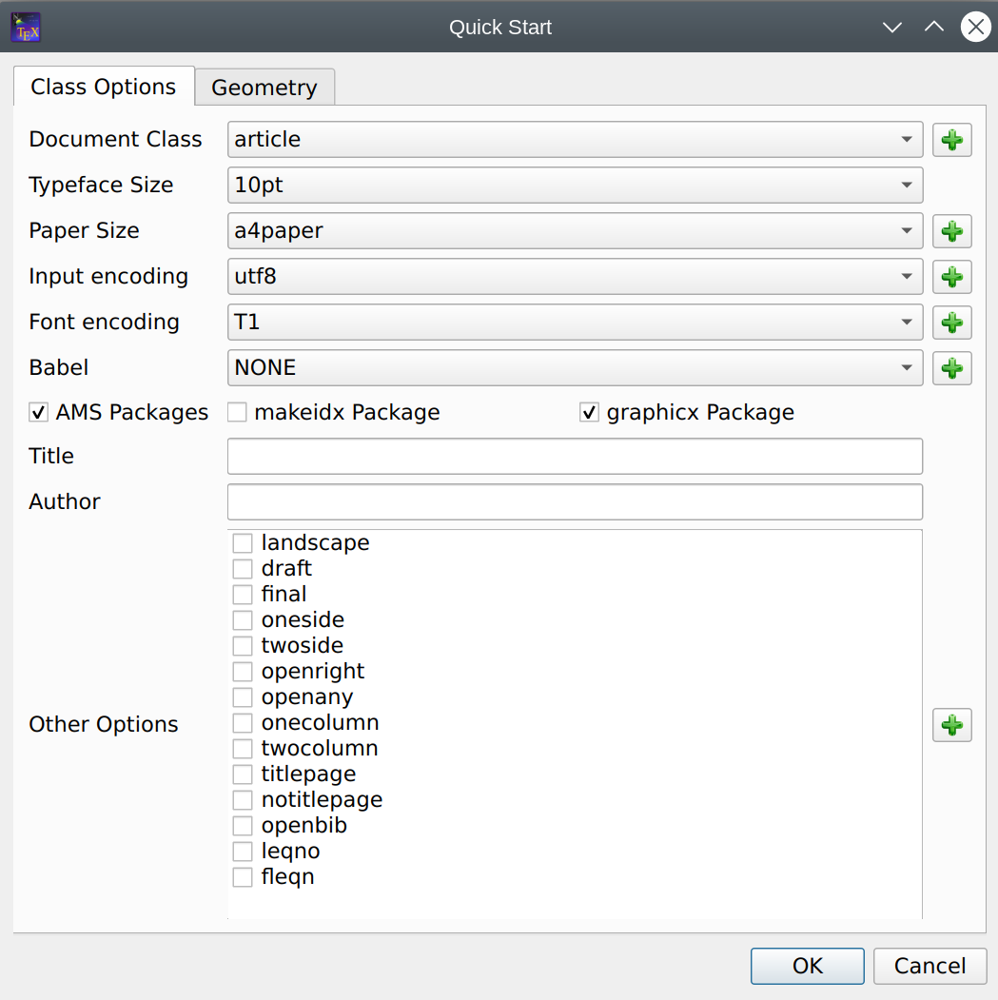
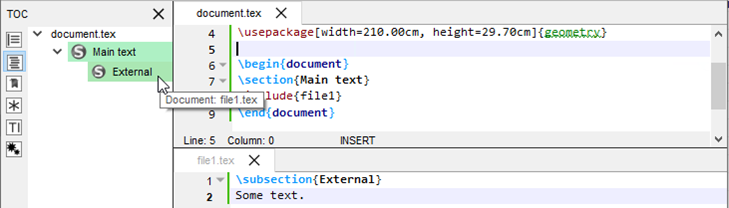
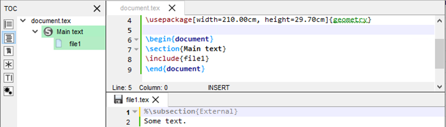
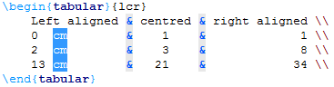
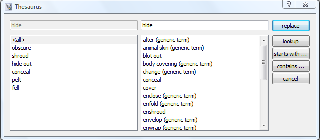
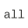

# Editing a TeX document

## Creating a new document

There are two different ways to create a new document that are described
in the following subsections:

### Setting the preamble of a TeX document

To define the preamble of your document, you can use the \"Quick start\"
wizard (\"Wizard\" menu).



This dialog allows you to set the main features of your document (class,
paper size, encoding\...).
Note : You can add other options by clicking the \"+\" buttons. All your
settings are recorded.

You can also type your own preamble model in the editor : with the
\"Copy/paste\" or \"Save As\" commands, you can use it for a new
document.

### Using Templates to start a new document

For new documents, templates can be used by using the command \"File/New
from template\". A dialogue gives a selection of templates.


You can either create a new editor document from the template or create
it as file(s) on disk and open these in the editor. The former option is
not available for multi-file templates.

New templates can be created by using the command \"File/Make Template\"
on an opened document which you like to have has a template. Note that
this dialog currently does not support the full capabilities of the
template system. In particular you cannot supply a preview image or
create a multi-file template with it. You\'ll have to do this manually
(s. [The template format](background.md#the-document-template-format) below).

User added templates can be edited or deleted by using the context menu
in the template selection dialogue. Built-in templates can not be
changed.

User templates are saved in the `/templates/user/` subdirectory of the
config directory.

## Structure your document

To define a new part in your document (part, section, subsection, \...)
with TeXstudio, just use this combo box button in the format toolbar of
the main toolbar:


## Browsing your document

### The Structure View

The \"Structure View\" (left panel) lets you quickly reach any part of
your document. All you need to do is to click on any item (label,
section\...) and you will be taken to the beginning of the corresponding
area in the editor. The mechanism for jumping to a line does not anymore
only consider line numbers but really remembers text lines. Thus adding
and removing lines will not lead to jumps to wrong locations.

A light-blue background shows the present cursor position in the text in the
structure view as well. A greenish background denotes sections which are
in the appendix.


The \"Structure View\" is automatically updated as you type. You can
also use the \"Refresh Structure\" (menu \"Idefix\") command at any
moment.

The structure view shows labels, sections, includes and beamer blocks
and todos.

There are two kind of todos that will be listed a) todos from a
todo-like command, e.g. \\todo{} from the package todonotes. b)
todo-comments: This is a comment with a \"% TODO\" or \"%todo\". You can
adapt the regular expression for other comments to be marked as
todo-comment in *options/advanced editor/Regular Expression for TODO
comment*, e.g \"%\\s?\[A-Z\]\[A-Z\_\\-\]+\" for any comment starting
with at least two capital letter only comment.

The structure view also offers a context menu which allows one to
copy/cut all text which belongs to a section (including subsection) and
paste it before or after a section. Section can be indented/unindented
which means that the hierarchy level is changed by one, i.e. \\section
is changed to \\subsection, and all subsections are treated accordingly

### The TOC View

The side panel on the left offers a TOC view. The TOC shows the structure of your
whole document by means of section commands (part, section, subsection,
...). A mouse over shows you, in which file the section actually is.



The image shows this: A root file named document.tex that includes the
file named file1.tex. The root file contains the section „Main text",
while file1.tex contains the subsection „External". By placing the mouse
pointer over this subsection in the TOC view, you find the file name
file1.tex in the mouse over. This works even if the file is not open
(but the document must be loaded by TeXstudio, s. Automatically load
included files in editor settings). In this case a mouse click on the
subsection in the TOC will open the file for you. Notice the different
shades of color that indicate the sections are in different files. It
can happen, that an included file doesn't contain any sections. Then the
file name itself appears in the TOC (without file extension):



The mouse over now would show the name of the file that includes
file1.tex (namely document.tex). The indentation shows that the text of
file1.tex is part of the section "Main text". You may like to choose a
different color in the configuration dialog (s. option Use color in
global TOC in [advanced editor settings](configuration.md#configuring-the-advanced-editor-settings-advanced-option)).

### Using Bookmarks

You can use bookmarks in the editor of TeXstudio. This can help keep
text lines in mind and speed up navigation between them. To the left of
the editor\'s text area is a bookmark column that displays the bookmark
icons. Here you can open a context menu (s. image below) and select the
bookmark you want to set for a text line. Each of the ten numbered
bookmarks can be used only once (when you set it a second time in the
same editor, then the first one is removed), while the unnamed bookmark
can be used many times. Also you can remove bookmarks with the first
entry in the menu. A faster way setting bookmarks is clicking with the
left mouse button in the bookmark column and TeXstudio will choose a
bookmark or remove an existing one.


You may choose the Bookmarks view of the left side panel, which shows
the text for each line with a bookmark of all editors. With the ease of
a mouse click you can jump to the text line in the editor. A tooltip
shows the surrounding context of the line (s. left image below). The
lines are ordered in the order you created the bookmarks. A context menu
allows you to change the order of lines or remove bookmarks (s. right
image below).

  

You probably noticed the three buttons (placed in the status line) on
the lower right side of the TeXstudio window, which look like bookmarks
1, 2, and 3 (s. image Bookmarks above). With a click you can jump to the
corresponding bookmark in the current editor. In fact this is a subset
of the actions you can find in the menu Edit/Goto Bookmark shown in the
following image in the middle. This menu also shows you the shortcuts
you can use (you may miss Ctrl+0 at the end of the list, but this
shortcut resets the zoom level of the editor). From the Edit/Go to menu
you can choose entry Line to jump to a line with a given line number.
You may want to use Previous mark or Next mark to find unnamed
bookmarks. For the sake of completeness it should be said that bookmark
is one of several types of markers (s. [The log files](compiling.md#the-log-files)).
You can toggle the bookmark of the line with the text cursor using the
actions from the menu Edit/Toggle Bookmark, which can be seen in the
following image on the right.


  


## Formatting your text

You can quickly set the format of a part of your text with the format part of the central toolbar.
More options are available in the "LaTeX" menu. Commonly used formatting commands like `\textbf` are also available as shortcuts, here `CTRL+B`.


```{note}
A selected text can be directly framed by certain
environments. Example: while clicking on the button \"Bold\" or pressing `CTRL+B` after
having selected the word \"Hello\" , you will obtain the code:
`\textbf{Hello}`.
```

### Capitalisation

The menu \"Edit\" -\> \"Text Operations\" contains a few methods for
changing the capitalization of selected text:

-   To Lowercase
-   To Uppercase
-   To Titlecase (strict)
-   To Titlecase (smart)

Both variants of \"To Titlecase\" leave small words like a, the, of etc.
in lowercase. Additionally, \"To Titlecase (smart)\" does not convert
any words containing capital letters, assuming they are acronyms which
require a fixed capitalization (e.g. \"TeXstudio\").

### Escaping reserved characters

If you have text containing reserved TeX characters and want the text to
appear literally in your document, you have to escape the reserved
characters to prevent LaTeX from interpreting them. The following
functions take care of that (Menu: Idefix or context menu on the editor)

-   Paste to LaTeX: Takes the text from the clipboard and escapes
    reserved characters prior to pasting into the editor.
-   Convert to LaTeX: Escapes the reserved characters in the current
    selection.

For example: \"Less than 10% of computer users know the meaning of
\$PATH.\" will be converted to \"Less than 10\\% of computer users know
the meaning of \\\$PATH.\"

## Inserting a list

The usual list environments code can be insert quickly via the
\"LaTeX-List\" menu. ALternatively you can use the [environment completion](#environment-completion).
```{note}
The shortcut for the \\item command is `Ctrl+Shift+I`.
```

## Inserting a table

With the \"Tabular\" wizard (\"Wizard\" menu), the LaTeX code for a
tabular environment can be quickly generated.

The cells can be filled manually. Copy and paste from a spreadsheet program works as well.
The wizard allows some tabular manipulation for border, cell merge and column alignment.
Once the code is generated, it can not be changed again with the wizard.


### Manipulating tables

TeXstudio provides some commands to ease handling of tables. The
commands are located at LaTeX → Manipulate Table and in the Table
toolbar. Please be aware that some unexpected results may arise, if the
table constructing commands get too complex. Following commands are
offered:

| Function | Description |
| --- | ------ |
|  | Add Row after the current row  |
|  |  removes the table row in which the cursor |
|  | add a column in the complete table after current cursor position. If the cursor is positioned at start of line,first column,the column is added as new first column. |
|  | paste a column in the complete table after current cursor position. If the cursor is positioned at start of line,first column,the column is added as new first column. |
|  | remove current column |
|  | remove current column and store in clipboard. Use with *paste column* |
|  | Aligns the column separators (ampersand) by introducing whitespace. The text in the cells is aligned according to the specification in the table header. This helps reading the table source. |

The following functions are only accessible via the "Latex/Table Manipulation" menu.

-   Add/Remove \\hline: add/remove `\hline` in all rows following the
    current row. If already a command `\hline` is present, no second
    command is placed.
-   Remodel the table after a template,see [below](#using-table-templates).

TeXstudio also allows block cursors. Press `Ctrl+Alt`
and drag the cursor with the mouse. The [block cursor](#block-cursor) works like a set of
normal cursors. You can copy and paste text as usual. Also you can type
in new text, which will be added in every row.
Pressing `esc` or clicking somewhere into the text leaves this mode.



### Using table templates

TeXstudio offers the possibility to reformat an existing latex table
after a table template.

For example, you have entered following table into txs:

```latex
\begin{tabular}{ll}
a&b\\
c&d\\
\end{tabular}
```

Place the cursor inside the table and select the menu \"Latex/Manipulate
Tables/Remodel Table Using Template\".

Now you can select a template which defines the formatting of the table.
A number of templates are predefined by txs:

-   fullyframed\_firstBold
-   fullyframed\_longtable
-   plain\_tabular
-   plain\_tabularx
-   rowcolors\_tabular

By selecting the first entry, the table is reformated to:

```latex
\begin{tabular}{|l|l|}
\hline
\textbf{a}&\textbf{b}\\ \hline
c&d\\ \hline
\end{tabular}
```

These templates give the opportunity to easily reformat tables after a
predefined fashion, thus achieving a uniform table style in a document,
even if the tables are entered in a very simple style.

The definition of new templates is described [here](background.md#creating-table-templates).

## Inserting a "tabbing" environment

To help you to insert a "tabbing" code, you can use the "Tabbing"
wizard (\"Wizard\" menu) :


## Inserting a picture
TeXstudio offers various ways to insert picture into the LaTeX code.

### Inserting picture via menu

To insert a picture in your document, just use the
command in the "LaTeX/include/\\includegraphics{file}" menu. Then, click on the \"browser\" button in
the dialog to select the graphic file.


```{note}
You can insert a \"figure\" LaTeX environment (\"LaTeX -
Environments\" menu) before inserting the picture.
```
### Inserting a picture using a \"wizard\"

TeXstudio offers a wizard for handling graphics insertion code in your document. \"Graphics
options\" defines the optional parameter of
`\includegraphics[options]{file}`. While the most used width/height
attributes can be easily set, alternatively you have full control with
the user defined setting.

The code is placed inside a `figure` environment with the given position suggestions.

By pressing the \"Save as default\" button the current settings (except
file, caption and label) are stored and will hence be used as default
when you open the wizard.

The wizard also comes into play when you drag drop an image file to your
document or use copy in explorer and paste in TeXstudio. Together with
the adjustable default parameters this makes insertion of new pictures
very fast. Furthermore, if you start the wizard while the cursor is on
picture code, the wizard is used to manipulate the existing picture
settings.


## Cross References and notes

This toolbox in the toolbar allows you to insert quickly the label,
cite, ref, footnote\... code.


Selecting "reference" open a dialog which let's you select a reference and inserts the complete code.
All other commands will be inserted with empty arguments.


The labels used in your documents are displayed in the "Structure View".
A right click on a label there allows you to insert it as reference or with a reference command at the current cursor position.


Another option is to use the [auto completer](#referencebibid-completion).

### Finding reference use
The context menu on labels in the structure view (see above) offers to "find usage".
This searches in all source files of the document (see [root file](background.md#about-documents-separated-in-several-files)) and finds the occurrence of that particular reference.
Here all the references may be changed by changing "Replace by" and clicking "Replace All".


```{note}
If references in hidden documents are changed, they will be saved automatically when a compilation run is started. Otherwise you will be asked if you want to save when closing TeXstudio or closing all files which belong to that document.
```


## Inserting math formula

You can toggle \"in-line math\" environment with the \"\$..\$\"
button in the toolbar (`Ctrl+Shift+M`) or with the \"Math\" menu.
The shortcut for the \"display math\" environment is `Alt+Shift+M`.

The math part of the \"Central\" toolbar allows you to insert the most current mathematical
forms (frac, sqrt\...) , the "Math" toolbar allows entering delimiter tags like \\left and \\right.

  

The \"symbols panel\" in the side panel offers the insertion of hundreds of mathematical symbols and special characters.
The list can be sorted by categories like "all","greek","operators", etc.
You can also directly search for parts of the command.
A right click on the symbol allows to declare it as favorite, insert the command or if available, insert the unicode character into the text.
TeXstudio keeps track which symbols have been used here, so the most used will be listed as well.


You can also define the format of your mathematical text via the
\"Math\" menu.

For the \"array\" environments, a wizard (like the \"Tabular\" wizard)
is available in the \"Wizard\" menu. With this wizard, you can select
the environment : array, matrix, pmatrix\....

The cells can be edited directly.


## Auto Completion

### Command completion

Whenever you press `\` followed by a letter, a list of possible LaTeX
tags is shown. If you type additional
letters, the list is filtered, so that only the tags starting with the
already written text are shown. If the list contains words which all
start with the same letter combination, you can press `Tab` to complete
all common letters. If only one element is present in the list, `Tab`
selects this one to do the completion, like `Enter`. This behavior is
similar to tab completion in bash shells. You can also press `Ctrl+Space`
to open this completer whenever you want.


If a tag has different options, a short descriptive text is inserted
into your text, telling you the meaning of each option. You can press
`Ctrl+Left`, `Ctrl+Right` to select all positions.

If you change a command by completing a new command, only the command
name is substituted. The same is true for environments, where the
environment is changed in the `\begin`- and `\end`-command.

The completer has several operation modes which are shown in the tabs
below the command list. You can switch to the next mode by pressing `Shift+Space`.

-   Typical: list only typical commands and filter out rather unusual
    commands.
-   Most used: list only commands which have already been used in the
    completer by the user. This Is empty if txs has not been used before.
-   Fuzzy: search the command in a fuzzy way. The command needs to
    contain all given letters in the same order though with an arbitrary
    of letters between them. E.g. `\bf` lists, among others,
    \\**b**egin{**f**igure}
-   All: list all known commands.

### Text completion
Furthermore normal text can be completed by starting to type a word and
pressing `Ctrl+Space`. All appropriate words in the current document are
used as possible suggestions.


### Environment completion
If an environment is to be inserted, typing in the beginning of the
environment name and pressing `Ctrl+Alt+Space` gives suggestions for
adequate environments which are inserted completely with
`\\begin{env}..\\end{env}`.

```{tab} Entering env-name

```

```{tab} Completing env-name

```
### Reference/BibID completion
When entering reference commands, the completer offers those commands prefilled with potential references.

If a reference is changed or the command offers to enter several references, the completer can suggest  available references.

It works the same for *bibIDs*

```{tab} Reference command completion

```

```{tab} Reference completion

```


### KeyVal completion
TeXstudio knows the possible keys and values for a number of commands.
The completer opens automatically when entering keys or pressing `,` to start the next key.
It also treats length specifically to offer only these when appropriate.

```{tab} Complete key

```

```{tab} Complete length value

```

### Filename completion
TeXstudio can also complete filenames, mainly for `\include`- and `\includegraphics`-commands.

If the completer selection is on an image file, that image is previewed as a tooltip.

```{tab} File name completion

```

```{tab} File name completion with preview

```


### User tags completion
And finally, user tags can be assigned an abbreviation which can also be
used with completion. Just type in the start of the abbreviation and
start the completion with `Ctrl+Space`. The abbreviation should show up in
the completion list, especially marked with "abbreviation (Usertag)".
They can be defined in the [personal macros](advanced.md#personal-macros).
The abbreviation may start with a backslash (`\`) allowing autostart of the completer.

```{tab} Abbreviation

```

```{tab} Abbreviation starting with backslash

```


## Spell check
TeXstudio checks the spelling as you type.
Right-click on the word to
open a menu with a list of possible corrections. In this context menu
you can also add the word to the ignore list.


```{note}
If your dictionary is very
large (\> 5MB), opening the context menu and showing possible
suggestions can take some seconds. If you don\'t need the suggestion,
you can press shift while right clicking and don\'t have to wait.
```
The active language is shown at the bottom of the main window.
You can directly select a different language by clicking on the language code, see [also](configuration.md#configuring-the-spell-checker).


```{note}
More languages may be available in the configuration dialog, as txs filters the available language here to a predefined set plus all previously used languages.
```
The spell checking dialog, which can be open from the menu *tools/check spelling..* or with `CTRL+:`,
allows searching for these underlined spelling mistakes starting from the current cursor position.

Scrolls and selects the next misspelled word and offers suggestions to correct it. You may choose one of the suggestions, type something on your own in the `replace with field` or choose to ignore it.
`Adding` means to permanently add the found word as correct in the spell checker. The `Show User Words` button allows to check that list and also to remove mistakenly added words.


## Syntax check
TeXstudio tries to determine if a command is correct by an internal list of valid commands.
It also tries to understand command context to some degree, so to see that math commands outside a math environment are not correct.


A tool tip on the error marking states the reason, why txs thinks that there is an error.

The supported error types are:

-   Unrecognized commands
-   Commands outside the proper environment, especially math-commands
-   Missing `\begin`/`\end` commands
-   Unrecognized key/value in some key/value options, e.g. `\includegraphics[*keyval option*]...`
-   Mismatch in defined/realized column number in tabular-like environments


```{caution}
LaTeX commands and especially LaTeX syntax are too complex to successfully check them completely.
Marked errors are probably real errors except in special environments, but that does **not** guarantee an error free document.
However the syntax marking may help to find issue significantly, especially in tabular environments.
```
## Thesaurus

TeXstudio has integrated a simple thesaurus. OpenOffice 2.x databases
are used for this. By placing the cursor on a word and activating the
thesaurus (`Ctrl+Shift+F8` or Edit/Thesaurus), it tries to find synonyms
for this word. Please be patient if you start the thesaurus at first
time since loading the database just occurs then and can take a few
moments.



The first line to the left contains the word, for which a synonym is
searched for. The list below gives a list of word classes. The can be
chosen to reduce the number of suggestions. The column to the right
contains the list of suggested synonyms. A selected word from this list
appears in the first line to the right as proposition for replacement of
the text. This word can be changed manually. It is also used to do
further investigations for words and their synonyms which \"start with\"
or \"contain\" that word. With \"lookup\" it can be directly used to
look for a synonym for that word.

The thesaurus can be selected in the [configuration](configuration.md#configuring-the-thesaurus).

## Searching in the document
As any editor, TeXstudio offers to search (and replace) text within an open file.

### Searching text
The search is performed in a search panel below the actual text, activated either with `Ctrl+F` or edit/searching/find. Options can be chosen by enabling/disabling the option next to the search text box.

| Icon | function |
| ---- | -------- |
|  | find next |
|    | find previous |
|    | count matches |
|  | select case sensitivity (activated, case sensitive) |
|    | find only complete words |
|    | use regular expression, see below |
|    | highlight all matches |
|    | start search from cursor/start of document |
|    | limit search on previous selected text |
|    | filter search results like 'all','math",'non-math',etc. |
|    | extended search, see [here](#extended-search) |

Regular expression follows perl regex syntax, see also [Perl's regular expression documentation](http://perldoc.perl.org/perlre.html) and [Perl's regular expression tutorial](http://perldoc.perl.org/perlretut.html).

### Replacing text
The search-panel extends to offer a replacement when pressing `Ctrl+R` or edit/Searching/replace.

| Icon | function |
| ---- | -------- |
|  | replace and find next |
|    | replace and find previous |
|    | replace all remaining matches |
|  | ask every time before replacing |
|    | use escaped number to insert found groups, see perl regex above |


### Extended search
The extended search allows searching on all files of a document.
The search word is updated when pressing "+" again on the search panel. "Update search" search with the given search word again through all specified files.
The drop down menu allows to search within a "Project",i.e. all files containing to one document, "All doc", i.e. all open documents in TeXstudio or a single "Current Document".

In the list of search results, a double-click on a match jumps to the location in the file. The matches can be selected/deselected to limit the results which are replaced by the replacement text by pressing "Replace all".


## Special Commands

### Delete word/command/environment

With the shortcut Alt+Del, the word under the cursor is deleted. If it
is a command, the command is deleted including opening and closing
braces. E.g. `\textbf{text}` leave `text`. If it is an environment,
the enclosing `\begin`/`\end` are removed.

### Rename environment

If you place the cursor on an environment name, after a moment a
mirror-cursor is activated on the environment name which allows
synchronous change of the environment name in the begin- and
end-command. So if you want to change a
`\begin{tabular}...\end{tabular}` construction to
`\begin{tabularx}...\end{tabularx}`, place the text cursor on
`tabular`, wait for a second and then, after the mirror-cursor
appears, change `tabular` to `tabularx`.
```{note}
You can also double-click on the environment name to activate the mirror-cursor.
```

### Cut Buffer

If you select something and then start to type in a command and complete
it, the selection is put in as first argument. E.g. you have a `text`,
select it and start typing `\textbf`, command which is completed. The
resulting text is `\textbf{text}`.

### Block cursor
TeXstudio supports block cursors (or multiple cursors).
Cursors can be added by `Ctrl+Alt`+left click.
ALternatively pressing `Ctrl+alt+Up/down` also add block cursors.
The cursors can jointly move, add and remove text and select characters.
Pressing `esc` or clicking into the text ends the block cursor mode.


By clicking `Ctrl+Shift`+left click a block from the current cursor to the mouse position is selected.

