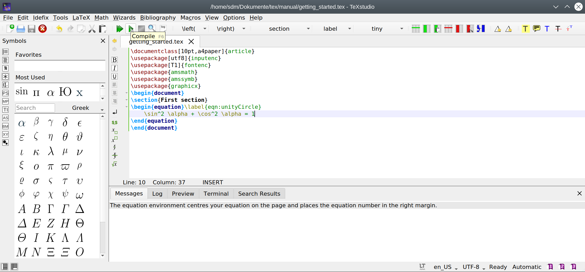

# Getting started

## Requirements
TeXstudio is a specialized LaTeX-editor. It helps to type [LaTeX-documents](https://www.latex-project.org/about/) more comfortable by helping to find the right commands, supporting error analysis and providing an easy way to view the results.

The actual latex system needs to be [installed separately](https://www.latex-project.org/get/) and is **not** provided by TeXstudio.

Here we assume that TeXstudio and a LaTeX-system are already installed on your system.

## Start TeXstudio
<!--
This needs to be refined
-->


On the left we have the *side panel* which is currently showing an empty structure view.
On the lower right you see the *messages panel* which can be switched to the [*log panel*](compiling.md#the-log-files), the *preview panel*, or the *search results panel*. The toolbar allows easy access to some often needed functions, three of them are marked as we will use them soon.
The central toolbar offers access to some common latex commands as we will see.

## Create a first document
LaTeX needs some configuartion code in the document. The [Quick Start Wizard](editing.md#setting-the-preamble-of-a-tex-document) offers an easy way to set up a typical document.


Select `Wizards/Quick Start...` and confirm the dialog with `OK`.
This will lead to this basic document:
```latex
    \documentclass[10pt,a4paper]{article}
    \usepackage[utf8]{inputenc}
    \usepackage[T1]{fontenc}
    \usepackage{amsmath}
    \usepackage{amssymb}
    \usepackage{graphicx}
    \begin{document}
        
    \end{document}
```

We will not go over the content of the document in detail, that is for the LaTeX-tutorial, as our focus is the editor.

The file needs to be saved on the computer to be useful.
So next we click the save button (or use `CTRL+S`) and save it with a sensible name like "getting_started.tex".

## Fill in content
### Insert a section
We can select `\section` from the section button in order to insert the section command and add a title text.


### Insert an equation environment
We can insert an equation environment via the menu `Math/Math equations/env equation` or by pressing `CTRL+SHIFT+N`


### Insert symbols
LaTeX offers a huge number of mathematical and other symbols. A convenient way of selecting the right one is using the symbol pane on the left side. Symbols can be declared as favorites and the most used symbols are collected as well to allow faster navigation.


## Compile 
Compiling a document means translating it from the LaTeX source code into a pdf file.
This can be performed by clicking on the compile button or using the key `F6`.



This calls the actual LaTeX-system (pdflatex by default) to compile the document on the disk.
The `Message Pane` shows results from that run and will jump to the [log-view](compiling.md#the-log-files) in case of errors.

## View your pdf document
Now we like to see the results. For this, click the view button or press `F7`.


The pdf document is presented right of the text within TeXstudio.
You can scroll and zoom to examine the result. 
`CTRL+left click` on text or images within the pdf will jump to the corresponding source code.

Pressing `F7` or clicking the view button actually scrolls the pdf to same position in the document where the cursor is in the source document, see [here for details](viewing.md#forward-and-inverse-searching).

<!--
label/ref
navigation (structure)
insert commands
completer
syntax check
-->

