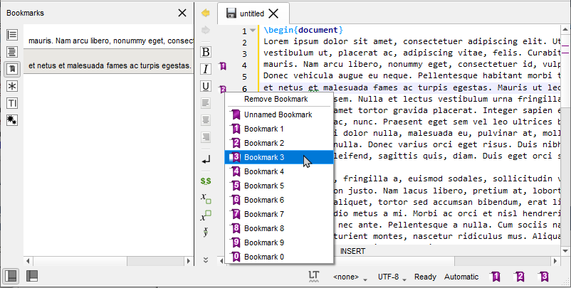
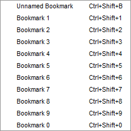
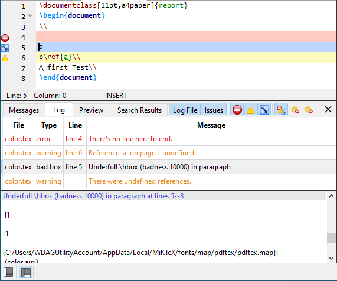

% TeXstudio : User manual {#top align="center"}

# Getting started

*  create first doc **TODO**
*  fill in stuff **TODO**
*  compile **TODO**
*  view **TODO**
*  troubleshoot ? **TODO**

# Editing a TeX document {#SECTION1}

## Creating a new document {#SECTION12}

There are two different ways to create a new document that are described
in the following subsections:

### Setting the preamble of a TeX document {#SECTION12a}

To define the preamble of your document, you can use the \"Quick start\"
wizard (\"Wizard\" menu).

This dialog allows you to set the main features of your document (class,
paper size, encoding\...).\
Note : You can add other options by clicking the \"+\" buttons. All your
settings are recorded.

You can also type your own preamble model in the editor : with the
\"Copy/paste\" or \"Save As\" commands, you can use it for a new
document.

### Using Templates to start a new document {#SECTION12b}

For new documents, templates can be used by using the command \"File/New
from template\". A dialogue gives a selection of templates.

You can either create a new editor document from the template or create
it as file(s) on disk and open these in the editor. The former option is
not available for multi-file templates.

New templates can be created by using the command \"File/Make Template\"
on a opened document which you like to have has a template. Note that
this dialog currently does not support the full capabilities of the
template system. In particular you cannot supply a preview image or
create a multi-file template with it. You\'ll have to do this manually
(s. [The template format](#SECTION12ba) below).

User added templates can be edited or deleted by using the context menu
in the template selection dialogue. Built-in templates can not be
changed.

User templates are saved in the `/templates/user/` subdirectory of the
config directory.

#### The Template Format {#SECTION12ba}

In its simplest form, a template is only a .tex file. Multi-file
templates can be created by packaging all .tex files in a zip archive.
Optionally, meta data can be stored in JSON format in a separate file
with the same name, but extension \".json\" instead of \".tex\" or
\".zip\". Currently the following entries are supported in the meta
data:

    {
    "Name"        : "Book",
    "Author"      : "TXS built-in",
    "Date"        : "04.01.2013",
    "Version"     : "1.1",
    "Description" : "Default LaTeX class for books using separate files for each chapter.",
    "License"     : "Public Domain",
    "FilesToOpen" : "./TeX_files/chapter01.tex;main.tex"
    }

FilesToOpen only has an effect for mutli-file documents. You may add a
preview image next to the template file. Again, it must have the same
name, but extension \".png\".

## Structure your document {#SECTION13}

To define a new part in your document (part, section, subsection, \...)
with TeXstudio, just use this combo box button in the format toolbar of
the main toolbar:

## Browsing your document {#SECTION14}

### The Structure View {#SECTION141}

The \"Structure View\" (left panel) lets you quickly reach any part of
your document. All you need to do is to click on any item (label,
section\...) and you will be taken to the beginning of the corresponding
area in the editor. The mechanism for jumping to a line does not anymore
only consider line numbers but really remembers text lines. Thus adding
and removing lines will not lead to jumps to wrong locations.

A grey background shows the present cursor position in the text in the
structure view as well. A greenish background denotes sections which are
in the appendix.

The \"Structure View\" is automatically updated as you type. You can
also use the \"Refresh Structure\" (menu \"Idefix\") command at any
moment.

The structure view shows labels, sections, includes and beamer blocks
and todos.

There are two kind of todos that will be listed a) todos from a
todo-like command, e.g. \\todo{} from the package todonotes. b)
todo-comments: This is a comment with a \"% TODO\" or \"%todo\". You can
adapt the regular expression for other comments to be marked as
todo-comment in *options/advanced editor/Regular Expression for TODO
comment*, e.g \"%\\s?\[A-Z\]\[A-Z\_\\-\]+\" for any comment starting
with at least two capital letter only comment.

The structure view also offers a context menu which allows one to
copy/cut all text which belongs to a section (including subsection) and
paste it before or after a section. Section can be indented/unindented
which means that the hierarchy level is changed by one, i.e. \\section
is changed to \\subsection, and all subsections are treated accordingly

### The TOC View {#SECTION142}

The side panel on the left offers a TOC view (if not, s. [0. A first
look at TeXstudio](#SECTION00)). The TOC shows the structure of your
whole document by means of section commands (part, section, subsection,
...). A mouse over shows you, in which file the section actually is.

The image shows this: A root file named document.tex that includes the
file named file1.tex. The root file contains the section „Main text",
while file1.tex contains the subsection „External". By placing the mouse
pointer over this subsection in the TOC view, you find the file name
file1.tex in the mouse over. This works even if the file is not open
(but the document must be loaded by TeXstudio, s. Automatically load
included files in editor settings). In this case a mouse click on the
subsection in the TOC will open the file for you. Notice the different
shades of color that indicate the sections are in different files. It
can happen, that an included file doesn't contain any sections. Then the
file name itself appears in the TOC (without file extension):

The mouse over now would show the name of the file that includes
file1.tex (namely document.tex). The indentation shows that the text of
file1.tex is part of the section "Main text". You may like to choose a
different color in the configuration dialog (s. option Use color in
global TOC in advanced editor settings).

### Using Bookmarks {#SECTION143}

You can use bookmarks in the editor of Texstudio. This can help keep
text lines in mind and speed up navigation between them. To the left of
the editor\'s text area is a bookmark column that displays the bookmark
icons. Here you can open a context menu (s. image below) and select the
bookmark you want to set for a text line. Each of the ten numbered
bookmarks can be used only once (when you set it a second time in the
same editor, then the first one is removed), while the unnamed bookmark
can be used many times. Also you can remove bookmarks with the first
entry in the menu. A faster way setting bookmarks is clicking with the
left mouse button in the bookmark column and Texstudio will choose a
bookmark or remove an existing one.

You may choose the Bookmarks view of the left side panel, which shows
the text for each line with a bookmark of all editors. With the ease of
a mouse click you can jump to the text line in the editor. A tooltip
shows the surrounding context of the line (s. left image below). The
lines are ordered in the order you created the bookmarks. A context menu
allows you to change the order of lines or remove bookmarks (s. right
image below).

  

You probably noticed the three buttons (placed in the status line) on
the lower right side of the TeXstudio window, which look like bookmarks
1, 2, and 3 (s. image Bookmarks above). With a click you can jump to the
corresponding bookmark in the current editor. In fact this is a subset
of the actions you can find in the menu Edit/Goto Bookmark shown in the
following image in the middle. This menu also shows you the shortcuts
you can use (you may miss Ctrl+0 at the end of the list, but this
shortcut resets the zoom level of the editor). From the Edit/Go to menu
you can choose entry Line to jump to a line with a given line number.
You may want to use Previous mark or Next mark to find unnamed
bookmarks. For the sake of completeness it should be said that bookmark
is one of several types of markers (s. [The log files](#SECTION23)).
You can toggle the bookmark of the line with the text cursor using the
actions from the menu Edit/Toggle Bookmark, which can be seen in the
following image on the right.

  

## Formatting your text {#SECTION15}

You can quickly set the format of a part of your text with this tool bar
:

**Additional option:** a selected text can be directly framed by certain
environments. Example: while clicking on the button \"Bold\" after
having selected the word \"Hello\" , you will obtain the code:
\\textbf{Hello}.\
This option is available for all the environments indicated by
\"\[selection\]\" in the \"LaTeX\" menu.

### Capitalisation

The menu \"Edit\" -\> \"Text Operations\" contains a few methods for
changing the capitalization of selected text:

-   To Lowercase
-   To Uppercase
-   To Titlecase (strict)
-   To Titlecase (smart)

Both variants of \"To Titlecase\" leave small words like a, the, of etc.
in lowercase. Additionally, \"To Titlecase (smart)\" does not convert
any words containing capital letters, assuming they are acronymes which
require a fixed capitalization (e.g. \"TeXstudio\").

### Escaping reserved characters

If you have text containing reserved TeX characters and want the text to
appear literally in your document, you have to escape the reserved
characters to prevent LaTeX from interpreting them. The following
functions take care of that (Menu: Idefix)

-   Paste to LaTeX: Takes the text from the clipboard and escapes
    reserved characters prior to pasting into the editor.
-   Convert to LaTeX: Escapes the reserved characters in the current
    selection.

For example: \"Less than 10% of computer users know the meaning of
\$PATH.\" will be converted to \"Less than 10\\% of computer users know
the meaning of \\\$PATH.\"

## Spacings {#SECTION16}

The usual \"spacing\" commands are available in the \"LaTeX\" and
\"Math\" menus.

## Inserting a list {#SECTION17}

The usual list environments code can be insert quickly via the
\"LaTeX-List\" menu.\
Note : the shortcut for the \\item command is Ctrl+Shift+I.

## Inserting a table {#SECTION18}

With the \"Tabular\" wizard (\"Wizard\" menu), the LaTeX code for a
tabular environment can be quickly inserted :

You can set the main features of your table.\
Note : this dialog allows you to type directly the code in the cells.\
The corresponding LaTeX code is automatically inserted in the editor.

### Manipulating tables {#SECTION18a}

TeXstudio provides some commands to ease handling of tables. The
commands are located at LaTeX → Manipulate Table and in the Table
toolbar. Please be aware that some unexpected results may arise, if the
table constructing commands get too complex. Following commands are
offered:

-   Add Row after the current row
-   Remove Row: removes the table row in which the cursor
-   Add Column: add a column in the complete table after current cursor
    position. If the cursor is positioned at start of line,first column,
    the column is added as new first column.
-   Remove Column: remove current column
-   Add/Remove \\hline: add/remove \\hline in all rows following the
    current row. If already a command \\hline is present, no second
    command is placed.
-   Align Columns: Aligns the column separators (ampersand) by
    introducing whitespace. The text in the cells is aligned according
    to the specification in the table header. This helps reading the
    table source.
-   Remodel the table after a template. This allows one to force uniform
    table set-up in a document. Some templates are predefined, more can
    be added though it needs some programming in java script. This
    command is only present in the menu (math/tables)

TeXstudio also allows block cursors. Press \<Ctrl\>+\<Alt\>+\<Shift\>
and drag the cursor with the mouse. The block cursor works like a set of
normal cursors. You can copy and paste text as usual. Also you can type
in new text, which will be added in every row.

## Inserting a \"tabbing\" environment {#SECTION19}

To help you to insert a \"tabbing\" code, you can use the \"Tabbing\"
wizard (\"Wizard\" menu) :

## Inserting a picture {#SECTION110}

To insert a picture in your document, just use the \"\\includegraphics\"
command in the \"LaTeX\" menu. Then, click on the \"browser\" button in
the dialog to select the graphic file.\
Note : you can insert a \"figure\" LaTeX environment (\"LaTeX -
Environments\" menu) before inserting the picture.

### Inserting a picture using a \"wizard\" {#SECTION110a}

Properly inserting figures is a challenge for LaTeX beginners and still
quite a bit of text to type for the expert. Therefore TeXstudio offers a
wizard for handling graphics insertion code in your document. \"Graphics
options\" defines the optional parameter of
`\includegraphics[options]{file}`. While the most used width/height
attributes can be easily set, alternatively you have full control with
the user defined setting.\
Place the graphic inside a `figure` environment if it does not have to
be at an exact position in the text. Then LaTeX will determine an
optimal position on the page.\
By pressing the \"Save as default\" button the current settings (except
file, caption and label) are stored and will hence be used as default
when you open the wizard.\
The wizard also comes into play when you drag drop an image file to your
document or use copy in explorer and paste in TeXstudio. Together with
the adjustable default parameters this makes insertion of new pictures
very fast. Furthermore, if you start the wizard while the cursor is on
picture code, the wizard is used to manipulate the existing picture
settings.

## Cross References and notes {#SECTION111}

This toolbox in the toolbar allows you to insert quickly the label,
cite, ref, footnote\... code.\
Note : the labels used in your documents are displayed in the
\"Structure View\".

**Additional option:**for the \\ref command, a dialog box allows you to
select directly the label.

## Inserting math formula {#SECTION112}

You can toggle in the \"in-line math\" environment with the \"f(x)\"
button in the toolbar (shortcut : Ctrl+Alt+M) or with the \"Math\" menu.
The shortcut for the \"display math\" environment is : Alt+Shift+M.\
The \"Math\" toolbar allows you to insert the most currents mathematical
forms (frac, sqrt\...) like the \\left and \\right tags.

With the \"symbols panels\" in the structure view, you can insert the
code of 400 mathematical symbols.

You can also define the format of your mathematical text via the
\"Math\" menu.\
For the \"array\" environments, a wizard (like the \"Tabular\" wizard)
is available in the \"Wizard\" menu. With this wizard, you can select
the environment : array, matrix, pmatrix\.... The cells can be directly
completed.

## Auto Completion {#SECTION113}

Whenever you press \\ followed by a letter, a list of possible LaTeX
tags is shown where you select the right one. If you type additional
letters, the list is filtered, so that only the tags starting with the
already written text are shown. If the list contains words which all
start with the same letter combination, you can press Tab to complete
all common letters. If only one element is present in the list, Tab
selects this one to do the completion, like Enter. This behaviour is
similar to tab completion in bash shells. You can also press Ctrl+Space
to open this list whenever you want.\
If a tag has different options, a short descriptive text is inserted
into your text, telling you the meaning of each option. You can press
Ctrl+Left, Ctrl+Right to select all positions.\
Furthermore normal text can be completed by starting to type a word and
pressing Ctrl+Space. All appropriate words in the current document are
used as possible suggestions.\
If an environment is to be inserted, typing in the beginning of the
environment name and pressing Ctrl+Alt+Space gives suggestions for
adequate environments which are inserted completely with
\\begin{env}..\\end{env}.\
And finally, user tags can be assigned an abbreviation which can also be
used with completion. Just type in the start of the abbreviation and
start the completion with Ctrl+Space. The abbreviation should show up in
the completion list, especially marked with "abbreviation (template)".\
If you change a command by completing a new command, only the command
name is substituted. The same is true for environments, where the
environment is changed in the \\begin- and \\end-command.\
\
The completer has several operation modes which are shown in the tabs
below the command list.\

-   Typical: list only typical commands and filter out rather unusual
    commands.
-   Most used: list only commands which have already been used in the
    completer by the user. Is empty if txs has not been used before.
-   Fuzzy: search the command in a fuzzy way. The command needs to
    contain all given letters in the same order though with a arbitrary
    of letters between them. E.g. \\bf lists, among others,
    \\**b**egin{**f**igure}
-   All: list all known commands.

## Thesaurus {#SECTION114}

TeXstudio has integrated a simple thesaurus. OpenOffice 2.x databases
are used for this. By placing the cursor on a word and activating the
thesaurus (Ctrl+Shift+F8 or Edit/Thesaurus), it tries to find synonyms
for this word. Please be patient if you start the thesaurus at first
time since loading the database just occurs then and can take a few
moments.

The first line to the left contains the word, for which a synonym is
searched for. The list below gives a list of word classes. The can be
chosen to reduce the number of suggestions. The column to the right
contains the list of suggested synonyms. A selected word from this list
apears in the first line to the right as proposition for replacement of
the text. This word can be changed manually. It is also used to do
further investigations for words and their synonyms which \"start with\"
or \"contain\" that word. With \"lookup\" it can be directly used to
look for a synonym for that word.

## Special Commands {#SECTION115}

### Delete word/command/environment {#SPECIALDELETING}

With the shortcut Alt+Del, the word under the cursor is deleted. If it
is a command, the command is deleted including opening and closing
braces. E.g. \"\\textbf{text}\" leave \"text\". If it is an environment,
the enclosing begin/end are removed.

### Rename environment {#SPECIALRENAMING}

If you place the cursor on an environment name, after a moment a
mirror-cursor is activated on the environment name which allows
synchronous change of the environment name in the begin- and
end-command. So if you want to change a
\"\\begin{tabular}\...\\end{tabular}\" construction to
\"\\begin{tabularx}\...\\end{tabularx}\", place the text cursor on
\"tabular\", wait for a second and then, after the mirror-cursor
appears, change \"tabular\" to \"tabularx\".

### Cut Buffer {#SPECIALCUTBUFFER}

If you select something and then start to type in a command and complete
it, the selection is put in as first argument. E.g. you have a \"text\",
select it and start typing \"\\textbf\", command which is completed. The
resulting text is \"\\textbf{text}\".

# Compiling a document {#SECTION2}

## Compiling {#SECTION22}

The easiest way to compile a document is to use the \"Compile\" command
or the \"Build&View\" command (\"Compile\" button - shortcut : F6). You
can select the default command via the \"Configure TeXstudio\" dialog.\
(You can also launch each command one by one in the \"Tools\" menu).\
Note : the \"Clean\" command in the \"Tools menu\" allows you to erase
the files (dvi, toc, aux\...) generated by a LaTeX compilation (except
the ps and pdf files).

**Warning:** all your files must have an extension.

## The log files {#SECTION23}

The log panel gives you insight to all the informations output to the
log file by the command processing your LaTeX file. This panel can show
the log file in two ways: First the log file, highlighted at important
messages, and second as a table, that extracts the error and warning
messages aswell as messages for bad boxes from the log file for easier
overview. The buttons *Log File* and *Issues* let you show or hide the
two representations (but you can\'t hide both at the same time). If you
choose to show both of them then the log panel will be split vertically
into two parts.

Use the buttons *Show Error*, *Show Warning*, *Show BadBox* (see
tooltips) to choose whether error messages (red), warning messages
(yellow) or messages for bad boxes (blue) will be shown or hidden. Use
the button *Show Log Markers* to display or hide log marker icons left
to the lines in the editor. The tooltips for the log markers show
message details.

In case that the log file contains error messages the log panel is
opened automatically (check option *Show log in case of compile error*,
s. Build settings) and log markers are activated. The editor\'s cursor
will be placed in the first line which has an error marker (check option
*Go to error when displaying log*, s. Adv. Editor settings).

You may use the buttons *Previous Error* and *Next Error* to jump back
or forth to the previous or next error. The shortcuts for this are
Ctrl+Shift+Up/Down, accordingly Ctrl+Alt+Up/Down (these you have to set
up on your own, s. Shortcut options for actions in menu Idefix/Go to)
and Alt+Shift+Up/Down are used for warnings and bad boxes respectively.
You can jump between markers of any type with Ctrl+Up/Down.

When you select an entry in the table then the editor (and the log file)
scrolls to the corresponding location. The log markers will be activated
(check option *Show log markers when clicking log entry*, s. Adv. Editor
settings). The log file informations can be shown or hidden by clicking
on the Log File button. The Issues button offers a similar function for
the table with the messages.

# Viewing a document (pdf) {#VIEWING}
**TODO** internal/external 

## Internal pdf viewer {#SECTION24}

TeXstudio has an internal (built-in) pdf viewer that lets you view your
pdf documents. The viewer can be embedded or window-based (in a separate
window). The former uses an area to the right of the editor, the latter
uses its own window and gives the user more options. The viewer can be
opened by clicking the View button or by pressing the F7 key.

You may want to change otions in the config dialog (s. Internal PDF
Viewer). For forward and inverse searching, scrolling follows cursor,
and cursor follows scrolling see *[Forward and Inverse
searching](#SECTION37)*.

### Modes and mouse actions {#SUBSECTION241}

You can choose main mode *Magnify* or *Scroll* from the toolbar. The
mouse cursor used is a magnifier glass, or an open hand. These offer
following actions:

Magnify mode only

-   left mouse button click opens magnifier showing enlarged part of the
    text, or follows a link
-   Shift + left mouse button click increases zoom level
-   Alt + left mouse button click decreases zoom level

Scroll mode only

-   left mouse button click grabs the document so you can scroll it
    around, or follows a link
-   double left mouse button click opens magnifier showing enlarged part
    of the text
-   Shift + left mouse button click sets grid page offset (s. *[3.3.2
    Special features](#SUBSECTION242)*)

Magnify and Scroll mode

-   Ctrl + left mouse button click jumps to the source (inverse search)
-   Ctrl + Shift + left mouse button click copies coordinates to
    clipboard (s. *[Special features](#SUBSECTION242)*)

Remarks:

-   All actions above are available for the embedded pdf viewer. Even so
    changing grid page offset is not applicable, since embedded pdf
    viewer always uses a grid with one column.
-   When you set option Presentation (menu View, or key F5), the
    windowed pdf viewer only uses left and right mouse button click to
    scroll pages forth and back, and pressing the mouse wheel button
    changes the cursor into a red laser dot.
-   With option Full Screen set (menu View, or key Ctrl+Shift+F) the
    windowed pdf viewer\'s behaviour is that of Scroll Mode.
-   The mouse cursor hot spot of the magnifier glass lies in the center
    of the glass, that of the open hand is marked with a small cross
    outside the hand. This may help improve accuracy of inverse search.

### Special features {#SUBSECTION242}

#### Changing the grid page offset

The windowed pdf viewer arranges the pages in a customizable grid of
columns and rows (s. menu View/Grid) in which the pages are placed. The
first page may be placed on the left in the first row (i.e. a grid page
offset of 0) and the following pages fill the row and so on:

A grid page offset of 0 may not be suitable in all cases. For example,
if you are working on a book, since books have odd pages on the right.
The first page of the document shown in the previous image should be
positioned in the second or forth column (i.e. a grid page offset of 1
or 3). Thus each grid row starts with an even (left) page and ends with
an odd (right) page (if appropriate):

To meet this requirement, you can manually change the offset for the
first page in any grid. To do this, use Shift + left mouse button click
on any place of the grid while in Scroll mode. The first page will be
moved to the place that is in the first row and in the same column as
the place you selected with the mouse. You may frequently use grid 2x1
with 2 columns to view books. In this case, for the sake of simplicity,
the first page is automatically shifted to the right (i.e. an offset of
1 is set).

Hint: When option Single Page Step (menu View/Grid) is set, a manually
set grid page offset gets ignored.

#### Copy page coordinates to the clipboard

You can also use the pdf viewer to get the x and y coordinates of a
point on a page by performing Ctrl + Shift + left mouse button click
(the mouse cursor changes to a cross) at that point. By doing so, the x
and y coordinates of the mouse position (in centimeters) with respect to
the bottom left corner of the current page are copied into your
clipboard.

Example for x, y copied to clipboard: 10.16, 12.8372

This becomes particularly useful when adjusting margins or working with
TikZ.

# A first look at TeXstudio {#SECTION00}
**TODO** this will move into getting started

Before we take a closer look at all the possibilities of TeXstudio,
let\'s look at the application window first. After start of TeXstudio we
see a lot of things. Some elements in the image are framed in different
colors for further explanations:

The main window is divided into three parts (blue): On the left we have
a \"side panel\" (currently showing an empty Structure) that provides
many different functions. On the lower right you see a *messages panel*.
You can switch to the *[log panel](#SECTION23)*, the *preview panel*, or
the *search results panel* there. The third area is left to the editor.
You can have multiple editors open, which you select using tabs. You may
increase the area for editors by turning off the side panel or the
messages panel. This can be done easily via the two icons in the lower
left corner (marked orange). They are in the status bar, which can be
hidden (s. menu View/Show).

The information presented in the side bar depends on the icon you select
from the vertical toolbar on the left side of the panel. These icons can
be understood as vertically aligned tabs. A click with the right mouse
button allows you to select which icons are presented:

TeXstudio offers a lot of toolbars (marked red), many of which are
arranged in a row above the side panel and the editor area (called the
main toolbar, the vertical toolbars are called secondary toolbars). One
vertical aligend toolbar (the central one, s. image below) resides to
the left of the editor area. You can choose which ones to show with a
click of the right mouse button on any of them:

The custom toolbar will be discussed in [Configuring the Custom
Toolbar](#SECTION07). The toolbars in the main toolbar can be
rearranged, moved somewhere in the window or even disconnected from the
window at all. All toolbars are scalable, s. option GUI scaling (needs
advanced options) in the config dialog.

# Advanced features {#SECTION3}

## User Fold Marker {#FOLDMARKER}
**TODO** fill in

-   Mark an extra foldable range

## Syntax Check {#SECTION32a}

The latex syntax checker takes the list of possible completion commands
to determine if a command is correct. The completion list contains
partially additional information to determine in which context a command
is valid, whether it is valid only in math-mode or only in
tabular-mode.\
Furthermore the correctness of tabulars is checked in a little more
detail. The number of columns is analyzed and checked in the subsequent
rows. If more or less columns are given in a row, a warning maker is
shown.\

## Bibliography {#SECTION32}

For the \"bib\" files , the \"Bibliography\" menu enables you to
directly insert the entries corresponding to the standard types of
document.\
Note: the optional fields can be automatically deleted with the
\"Clean\" command of the \"Bibliography\" menu.

## SVN Support {#SVNSUPPORT}

Apart from the supported SVN features already describes in section 1.8,
TeXstudio supports two more commands.

\"File/Checkin\" performs an explicit save and check in, with a input
dialog which asks for an checkin in message which is stored in the SVN
history.

\"File/Show old Revisions\" pops up a dialog, which shows all available
revisions. A selection of an older revision leads to instantaneous
change of the current document to that older revision. You can select
and copy old parts to transfer them to the most recent version of your
document, by copying the parts and then going back to most recent
version. If you start editing that document directly, the dialog is
closed and the present text will be your new most recent version though
yet unsaved.

## Using table templates {#TABLETEMPLATE}

Texstudio offers the possibility to reformat an existing latex table
after a table template.\
For example, you have entered following table into txs:

    \begin{tabular}{ll}
    a&b\\
    c&d\\
    \end{tabular}

Place the cursor inside the table and select the menu \"Latex/Manipulate
Tables/Remodel Table Using Template\".\
Now you can select a template which defines the formatting of the table.
A number of templates are predefined by txs:

-   fullyframed\_firstBold
-   fullyframed\_longtable
-   plain\_tabular
-   plain\_tabularx
-   rowcolors\_tabular

By selecting the first entry, the table is reformated to:

    \begin{tabular}{|l|l|}
    \hline
    \textbf{a}&\textbf{b}\\ \hline
    c&d\\ \hline
    \end{tabular}

These templates give the opportunity to easily reformat tables after a
predefined fashion, thus achieving a uniform table style in a document,
even if the tables are entered in a very simple style.

The definition of new templates is described [here](#TABLETEMPLATECREATION).

## Personal macros {#SECTION33}

TeXstudio allows you to insert your own macros. These macros are defined
with the \"Macros - Edit Macros\" menu. Macros can consist of simple
text which is directly placed into txs. It can also be an
\"environment\" which are automatically extended by begin/end or it can
be a java script. The needed functionality can be selected by checkbox.\
The \"abbreviation\" is a pseudo-command for the latex completer. If the
pseudo-command is completed, the macro will be inserted instead. Note
that the pseudo-command needs to start with a backslash (\"\\\").\
\"Trigger\" is a regular expression which triggers the inclusion of the
macro: When the last written characters match this expression, they are
removed and the macro is inserted/executed. (see
[below](#sectionTriggers) for more details).\
Some macros can be directly downloaded from an internet repository. The
dialog is started with the button \"Browse\". For easier data exchange,
macros can be im- and exported to a file. If you want to add a macro of
your own to that repository, you can hand it in as a feature request on
[Github](https://github.com/texstudio-org/texstudio/issues).\
Each macro can be assigned a fixed shortcut in the \"Shortcut\" box.\
The list of macros on the left-hand side represents the macro ordering
in the macro-menu. It is rearranged with the
\"up\"/\"down\"/\"add\"/\"remove\" buttons or with drag and drop.
Folders can be added to sort a larger number of macros sensibly. To move
macros into/from folders, only drag and drop works.\
The \"run script\" button directly executes a script in the editor for
testing.\
\

### Text macros {#sec_textmacros}

Apart from normal text, some special codes are recognized and replaced
on insertion.\

-   If you write %\| somewhere the cursor will be placed at that place
    in the inserted text. (A second %\| will select everything between
    them).
-   Write %\<something%\> to mark it as placeholder which is highlighted
    in the text and can be selected by Ctrl+Left/Right.\
    Additional properties of the placeholder can be set after a %:, e.g.
    %\<something%:persistent,id:123,mirror%\>. The available properties
    are:
    -   select: The placeholder will be selected (similar to %\|)
    -   multiline: The placeholder is used for multiline text. If a
        macro insertion replaces an existing text, the replaced text is
        again inserted into a placeholder in the macro. If the original
        text spans more than one line, it will be inserted into a
        placeholder with the multiline property. Otherwise in a
        placeholder with the select-property.
    -   persistent: The placeholder is not automatically removed, when
        its text is changed in the editor
    -   mirror: The placeholder is a mirror of another placeholder in
        the macro and thus will always have the same content as the
        original placeholder. You should set an id, so it knows which
        placeholders are connected
    -   id:123: The id of the placeholder
    -   columnShift:-12: The placeholder is not placed where the %\<
        markers are, but some columns to the left of it
    -   translatable: The text of the placeholder should be added to
        translations (only applicable to macros that are known during
        the compilation of texstudio).
    -   cutInsert: The text of the placeholder is replaced by cut buffer
        (selected text when the snippet is inserted). This code is only
        necessary if not the first placeholder is intended to take the
        cut buffer, e.g. generate env (ctrl+e).
-   The option %(*filefilter*%) will be replaced by a filename which is
    asked for in a file dialog. The file filter is the standard
    Qt-Filefilterformat. For example \"Images (\*.png \*.xpm
    \*.jpg);;Text files (\*.txt);;XML files (\*.xml)\", see also
    [Qt-Doc](https://doc.qt.io/qt-6/qfiledialog.html)

### Environment macros {#SECTION33c}

The text will be used as environment-name, thus \"%environment\" will be
inserted as:\
\\begin{environment }\
\
\\end{environment }\
\
Note: texstudio needs that the env-name starts with \"%\", though that
character is not placed on insertion.

### Script Macros {#JAVASCRIPT-MACROS}

Instead of using code snippets, you can also make use of scripting with
QJS, an application scripting language based on
[ECMAScript](https://doc.qt.io/qt-6/qtqml-javascript-functionlist.html). 

Put \"%SCRIPT\" in the first line to declare a macro as a script. Here
are the objects that provide the interface to the TeXstudio internals:

-   \"editor\" allows some top level operations like
    searching/save/load. in the current document
-   \"cursor\" gives access to cursor operations like moving, inserting
    and deleting texts.
-   \"fileChooser\" gives access to the filechooser dialog, a very
    simple file selection dialog
-   \"app\" to access application wide things like the clipboard or the
    menus

The following table gives an overview on the provided commands.

| Command | Description |
| --- | --- |
| alert(str), information(str), warning(str) or critical(str) | shows str in a messagebox with a certain icon |
| confirm(str) or confirmWarning(str) | shows str as a yes/no question in a messagebox |
| debug(str) | prints str to stdout |
| writeFile(name, value) | Writes value to file name (requires write privileges) |
| readFile(name) | Reads the entire file name (requires read privileges) |
| system(cmd, workingDirectory=\"\") | Calls an external command **cmd**, which includes the program name and its arguments. **cmd** may undergo command-line expansion as follows: If **cmd** contains the string **txs:///** or if it does **not** contain any pipe (\|) characters, then **cmd** undergoes standard command-line expansion like any other [external command](#SECTION33a). When expanding any tokens the current file is assumed to be the empty string, so any tokens that use the current file (e.g. **%** or **?**) will expand to the empty string too. If **cmd** does not contain the string **txs:///** and it contains at least one pipe character, then it is executed without any string expansion or replacement. If **workingDirectory** is not set, the working directory will be inherited from the TeXstudio executable. This command returns a ProcessX object which has the following methods:  -   waitForFinished: Wait until the process is finished -   readAllStandardOutputStr: Returns the stdout -   readAllStandardErrorStr: Returns the stderr -   exitCode: The exit code -   exitStatus: The qt exit status -   terminate or kill: Stops the process If the script does is not granted permission to run the external command, then **system()** returns **null**.  Examples  List all the files in the Subversion repository /usr/local/svnrepository The command contains the string **txs:///**, so it undergoes the expansion as an [external command](#SECTION33a). %SCRIPT cmd = system("txs:///svn ls /usr/local/svnrepository")   cmd.waitForFinished() output = cmd.readAllStandardOutputStr() alert (output)  Download the web page from **http://www.my-website.com??arg1=abc&arg2=def** and save it as the local file **/home/john/page.html**. The command does not contain any pipe characters (\|), so it undergoes the expansion as an [external command](#SECTION33a). Note that we have doubled the character **?** in the URL, otherwise it would be expanded to current file which in our case would be the empty string.  %SCRIPT cmd = system ("wget -O /home/john/page.html http://www.my-website.com??arg1=abc&arg2=def") cmd.waitForFinished() |
| ~~setGlobal(name, value)~~ | Unsuppoted since txs 4.x. Sets a temporary, global variable |
| ~~getGlobal(name)~~ | Unsuppoted since txs 4.x. Reads a global variable |
| ~~hasGlobal(name)~~ | Unsuppoted since txs 4.x. Checks for the existence of a global variable |
| setPersistent(name, value) | Sets a global configuration variable. (can change the values of the ini file, requires write privileges) |
| getPersistent(name) | Reads a global configuration variable. (can read all values of the ini file, requires read privileges) |
| hasPersistent(name) | Checks if a global configuration variable exists. (requires read privileges) |
| hasReadPrivileges() | Checks if the script has read privileges |
| hasWritePrivileges() | Checks if the script has write privileges |
| registerAsBackgroundScript(\[id\]) | Allows the script to run in the background (necessary iff the script should handle events/signals) |
| triggerMatches | Matches of the regular trigger expression, if the script was called by an editor [trigger](#sectionTriggers). |
| triggerId | Numeric id of the trigger, if the script was called by an event [trigger](#sectionTriggers). |
| ~~include(script)~~ | Unsuppoted since txs 4.x. Includes another script. Can be a filename or the name of a macro. |
| pdfs | List of all open, internal pdf viewers . |
| editor.search(searchFor, \[options\], \[scope\], \[callback\]) | Searches something in the editor. -   searchFor is the text which is searched. It can be either a string (e.g. \"..\") or a regexp (e.g. /\[.\]{2}/).  -   options is a string and a combination of \"i\", \"g\", \"w\" to specify a case-*i*nsensitive search, a *g*lobal search (continue after the first match) or a whole-*w*ord-only search. -   scope is a cursor constraining the search scope (see editor.document().cursor). -   callback is a function which is called for every match. A cursor describing the position of the match is passed as first argument. All arguments except searchFor are optional, and the order may be changed (which may not be future compatible). The function returns the number of found matches.|
| editor.replace(searchFor, \[options\], \[scope\], \[replaceWith\]) | This function searches and replaces something in the editor. It behaves like editor.search apart from the replaceWith argument which can be a simple string or a callback function. If it is a function the return value of replaceWith is used to replace the match described by the cursor passed to replaceWith. |
| editor.replaceSelectedText(newText, \[options\]) | This function replaces the current selections with newText or inserts newText, if nothing is selected. If newText is a function, it will be called with the selected text and corresponding cursor, and the return value will be the newText. It is recommended to use this function for all text replacements/insertions, since it is the easiest way to handle multiple cursors/block selections correctly. Options is an object that can have the following properties: -   `{"noEmpty": true}` only replaces; does not insert anything if the selection is empty -   `{"onlyEmpty": true}` only inserts at the cursor position; does not change non empty selected text -   `{"append": true}` appends newText to the current selection, does not remove the old text -   `{"prepend": true}` prepends newText to the current selection, does not remove the old text -   `{"macro": true}` Treats newText as normal macro text, e.g. inserting %\< %\> placeholders  Examples: `editor.replaceSelectedText("world", {"append": true} )` Appends \"world\" to the current selections. `editor.replaceSelectedText(function(s){return s.toUpperCase();})` Converts the current selection to uppercase. |
| editor.insertSnippet(text); | Inserts a text snippet into the editor. For a list of extended features and syntax see [Text Macros](#sec_textmacros). |
| editor.undo(); | undo last command in editor |
| editor.redo(); | redo last command in editor |
| editor.cut(); | cut selection to clipboard |
| editor.copy(); | copy selection to clipboard |
| editor.paste(); | paste clipboard contents |
| editor.selectAll(); | select all |
| editor.selectNothing(); | select nothing (clear selections) |
| editor.cutBuffer | If a macro was triggered by a key press and there was a selection previous to the key press, the content of the selection is stored in the cutBuffer. The selection and its content is removed before the macro is entered. |
| editor.find(); | activate \"find panel\" |
| editor.find(QString text, bool highlight, bool regex, bool word=false,bool caseSensitive=false); | activate \"find panel\" with predefined values |
| editor.find(QString text, bool highlight, bool regex, bool word, bool caseSensitive, bool fromCursor, bool selection); | activate \"find panel\" with predefined values |
| editor.findNext(); | find next |
| editor.replacePanel(); | replace (if find panel open and something is selected) |
| editor.gotoLine(); | activate \"goto line panel\" |
| editor.indentSelection(); | indent selection |
| editor.unindentSelection(); | unindent selection |
| editor.commentSelection(); | comment selection |
| editor.uncommentSelection(); | uncomment selection |
|editor.clearPlaceHolders(); |clear place holders |
| editor.nextPlaceHolder(); | jump to next place holder |
| editor.previousPlaceHolder() | jump to previous place holder |
| editor.setPlaceHolder(int i, bool selectCursors=true); | set Placeholder |
| editor.setFileName(f); | set filename to *f*|
| editor.write(str) | inserts str at the current cursors position (if there are cursor mirrors, str will be inserted by all of them) |
| editor.insertText(str) | inserts str at the current cursor position (cursor mirrors are ignored,so it is preferable to use replaceSelectedText or write instead) |
| editor.setText(*text*) | replace the whole text of the current document by *text* |
| editor.text() | return the text of the complete document |
| editor.text(int line) | return text of *line* |
|editor.document().lineCount() | Returns the number of lines |
| editor.document().visualLineCount() |Returns the number of visual lines (counting wrapped lines) |
| ~~editor.document().cursor(line, \[column = 0\], \[lineTo = -1\],\[columnTo = length of lineTo\])~~ |Unsupported in txs 4.x. Use new QDocumentCursor(\...) instead, see section cursor. |
| editor.document().text(\[removeTrailing = false\], \[preserveIndent = true\]) | Returns the complete text of the document |
| editor.document().textLines() | Returns an array of all text lines |
| editor.document().lineEndingString() | Returns a string containing the ending of a line (\\n or \\n\\r) |
| ~~editor.document().getLineTokens(lineNr)~~ | Unsupported in txs 4.x. |
| editor.document().canUndo() | Returns true if undo is possible |
| editor.document().canRedo() | Returns true if redo is possible |
| editor.document().expand(lineNr) | Unfold the line in editor |
| editor.document().collapse(lineNr) | Fold the line in editor |
| editor.document().expandParents(lineNr) | Expand all parents of the line until it is visible |
| editor.document().foldBlockAt(bool unFold, lineNr); | Collapses or expands the first block before lineNr |
| editor.document().getMasterDocument(); | Returns the open document which directly includes this document |
| ~~editor.document().getTopMasterDocument();~~ | *Deprecated:* Use getRootDocument() instead |
| editor.document().getRootDocument(); | Returns the open document which indireclty includes this document and is not itself included by any other document |
| editor.document().getMagicComment(name); | Returns the content of a magic comment, if it exists |
| editor.document().updateMagicComment(name, value, \[create = false\]); | Changes a magic comment |
| editor.document().labelItems/refItems/bibItems | Returns the ids of all labels/references or included bibliography files. |
| editor.document().getLastEnvName(lineNr) |Returns the name of the current environment (at the end of the line). |
| documentManager.currentDocument | Current document (usually the same as editor.document(), unless the script is running in background mode) |
| documents.masterDocument | Master document if defined |
| \[documentManager.\]documents | Array of all open documents |
| documentManager.findDocument(fileName) | Returns the open document with a certain file name |
| documentManager.singleMode() | Returns true if there is no explicit master document |
| ~~documentManager.getMasterDocumentForDoc(document)~~ | *Deprecated:* Use getRootDocumentForDoc(document) instead |
| documentManager.getRootDocumentForDoc(document) | Returns the open document (possibly indirectly) including the given document |
| documentManager.findFileFromBibId(id) | Returns the file name of the bib file containing an entry with the given id |
| new QDocumentCursor(editor.document(),line, \[column = 0\], \[lineTo = -1\], \[columnTo = length of lineTo\]) | Returns a cursor object. If lineTo is given the cursor has a selection from line:column to lineTo:columnTo, otherwise not. |
| cursor.atEnd() | returns whether the cursor is at the end of the document |
| cursor.atStart() | returns whether the cursor is at the start of the document |
| cursor.atBlockEnd() | returns whether the cursor is at the end of a block |
| cursor.atBlockStart() | returns whether the cursor is at the start of a block |
| cursor.atLineEnd() | returns whether the cursor is at the end of a line |
| cursor.atLineStart() | returns whether the cursor is at the start of a line |
| cursor.hasSelection() | return whether the cursor has a selection |
| cursor.lineNumber() | returns the line number of the cursor |
| cursor.columnNumber() | returns the column of the cursor |
| cursor.anchorLineNumber() | returns the line number of the anchor. |
| cursor.anchorColumnNumber() | returns the column of the anchor. |
| cursor.shift(int offset) | Shift cursor position (text column) by a number of columns (characters) |
| cursor.setPosition(int pos, MoveMode m = MoveAnchor) | set the cursor position after pos-characters counted from document start (very slow)|
| cursor.movePosition(int offset, MoveOperation op = NextCharacter, MoveMode m = MoveAnchor); |move cursor *offset* times. MoveOperations may be:  -   cursorEnums.NoMove -   cursorEnums.Up -   cursorEnums.Down -   cursorEnums.Left -   cursorEnums.PreviousCharacter = Left -   cursorEnums.Right -   cursorEnums.NextCharacter = Right -   cursorEnums.Start -   cursorEnums.StartOfLine -   cursorEnums.StartOfBlock = StartOfLine -   cursorEnums.StartOfWord -   cursorEnums.StartOfWordOrCommand -   cursorEnums.PreviousBlock -   cursorEnums.PreviousLine = PreviousBlock -   cursorEnums.PreviousWord -   cursorEnums.WordLeft -   cursorEnums.WordRight -   cursorEnums.End -   cursorEnums.EndOfLine -   cursorEnums.EndOfBlock = EndOfLine -   cursorEnums.EndOfWord -   cursorEnums.EndOfWordOrCommand -   cursorEnums.NextWord -   cursorEnums.NextBlock -   cursorEnums.NextLine = NextBlock  Options for MoveMode are:  -   cursorEnums.MoveAnchor -   cursorEnums.KeepAnchor -   cursorEnums.ThroughWrap |
| cursor.moveTo(int line, int column); | move cursor to *line* and *column* |
| cursor.eraseLine(); | remove current line |
| cursor.insertLine(bool keepAnchor = false); | insert empty line |
| cursor.insertText(text, bool keepAnchor = false) | insert *text* text at cursor (this function will ignore indentations and mirrors, see editor.write and editor.insertText)
| cursor.selectedText() | return the selected text |
| cursor.clearSelection(); | clears selection |
| cursor.removeSelectedText(); | removes selected text |
| cursor.replaceSelectedText(text); | replace selected text with *text* |
| cursor.deleteChar(); | removes char right to the cursor |
| cursor.deletePreviousChar(); | removes char left to the cursor |
| cursor.beginEditBlock(); | begins a new edit block. All cursor operations encapsulated in an edit block are undone/redone at once. |
| cursor.endEditBlock(); | ends an edit block |
| app.getVersion() | Current version (0xMMmm00) |
| app.clipboard | Property to read/write to the clipboard |
| app.getCurrentFileName() | File name of currently edited file |
| app.getAbsoluteFilePath(rel, ext = \"\") | Converts a relative filename to an absolute one |
| app.load(file) | Loads an file |
| app.fileOpen/Save/Close/\.../editUndo/\.../QuickBuild/\... | All menu commands (i.e. all slots in the texmaker.h file). You can view a list of all currently existing slots on the \"menu\" page of the config dialog. |
| app.completerIsVisible() | check if completer is visible. |
| app.newManagedMenu(\[parent menu,\] id, caption) | Creates a new menu and returns it |
| app.getManagedMenu(id) | Returns a [QMenu](https://doc.qt.io/qt-6/qmenu.html) with a certain id |
| app.newManagedAction(menu, id, caption) | Creates a new action and returns it  -   menu: Parent menu -   id: Id of the new action (the final, unique id will be *menu id/action id*) -   caption: Visible text  You can use action.triggered.connect(function(){ \... }); to link a function to the returned action (for details see the [qt signal/slot](https://doc.qt.io/qt-6/signalsandslots.html) documentation). |
| app.getManagedAction(\[id\]) | Returns an [QAction](https://doc.qt.io/qt-6/qaction.html) with a certain id (all ids have the form main/menu1/menu2/\.../menuN/action, with usually one menu, e.g. \"main/edit/undo\", see texmaker.cpp) |
| app.createUI(file, \[parent\]) | Loads a certain ui file and creates a QWidget\* from it |
| app.createUIFromString(string, \[parent\]) | Creates a QWidget\* described in the string |
| app.slowOperationStarted()/slowOperationEnded() | Notify txs about the start/end of a slow operation to temporary disable the endless loop detection. |
| app.simulateKeyPress(shortcut) | Trigger a KeyPress event for the given shortcut, e.g. `app.simulateKeyPress("Shift+Up")`. *Note*: this is mainly intended for shortcuts and navigation. Currently, it does not support all functions of a KeyPress event. In particular, you cannot type any text. |
| new UniversalInputDialog() | Creates a new dialog |
| dialog.add(defaultValue, \[description, \[id\]\]) | Adds a new variable with the given default value, optional description and id to the dialog; and returns the corresponding qt component. A string default value becomes a QLineEdit, a number a QSpinBox and an array a QComboBox. |
| dialog.get(nr/id) | Returns the current value of the nr-th added variable or the variable with a certain id. |
| dialog.getAll() | Returns the value of all variables as combined numerical/associative array. You can use returnvalue\[i\] to get the i-th variable, and returnvalue.id to get the variable with a certain id. |
| dialog.exec() | Displays the dialog. Returns 1 if the user accepted the dialog, 0 if it was canceled. |
| dialog.show() | Displays the dialog asynchronously. |
| ~~UniversalInputDialog(\[\[defaultValue\_0, description\_0, id\_0\],\[defaultValue\_1, description\_1, id\_1\], \...\])~~ | Not working in txs 4.0.0. ~~Short form: Creates a new dialog, adds all variables of the array and call exec on it.~~ |
| fileChooser.exec() | show dialog and wait until it is closed again |
| fileChooser.setDir(dir) | set directory in the dialog to *dir* |
| fileChooser.setFilter(filter) | set file filter to *filter*, using the QT-format, see above |
| fileChooser.fileName() | return selected filename (after exec) |

Some examples:

-   Copy current file name to clipboard:

        %SCRIPT
        app.clipboard = editor.fileName();

-   Execution of editor text:

        %SCRIPT
        eval(editor.text());

-   Show all properties of an object:

        %SCRIPT
        function write_properties(obj) {
            app.fileNew();
            newEditor = documentManager.currentDocument.editorView.editor;   //access the newly created document
            newEditor.setText(Object.getOwnPropertyNames(obj).join("\n"));   //print the properties
        }

        obj = editor;                                                        //object to show (e.g. the current editor)
        write_properties(obj)

-   Additional action in the edit menu

        %SCRIPT
        var menu = app.getManagedMenu("main/edit");                   //get edit menu
        var act = app.newManagedAction(menu, "script", "scripttest"); //add action
        act.triggered.connect(function(){alert("called");});          //register simple handler
        registerAsBackgroundScript("test");                           //keep handler valid

-   Asynchronous dialog:

        %SCRIPT
        var ui = createUI(" ... path to your ui file ...");  //load dialog
        ui.accepted.connect(function(){alert("x");})         //react to dialog closing
        registerAsBackgroundScript("abc");                   //keep function valid
        ui.show();                                           //show dialog

    The dialog is described in an ui file which can be created with the
    Qt Designer.

More examples can be found in the
[Wiki](https://github.com/texstudio-org/texstudio/wiki/Scripts).

### Triggers {#sectionTriggers}

#### Regular Expressions

In its simplest form, the trigger is simply a text, which is replaced by
the macro. E.g. trigger=\"eg\" macro=\"example given\", \"eg\" in \"the
leg\" is replaced on pressing \"g\" by \"example given\"\
As the trigger is a regular expression, more elaborate triggers can be
created. TXS makes use of look-behind searching: \"(?\<=\\s)%\" is used
to replace a \"%\" if the previous character is a space. More help on
regular expressions can be found on the internet.

You can access the matched expression in the script via the global
variable `triggerMatches`. `triggerMatches` is an array. It\'s zero-th
component is the match to the complete regexp. The following elements
are matches to groups (if groups are defined).

Example:

    Trigger: #([a-z])
    Typed text: #a

    triggerMatches[0] == '#a'
    triggerMatches[1] == 'a'

Note: Triggers are inactive while the completer is active. For example
you cannot trigger on `\\sec` if the completer is open suggesting to
complete `\section`.

#### Limitation of Scope

To the scope in which a macro will be active, you can prepend an
expression of the pattern `(?[scope-type]:...)`.

| Scope Limiting Expression | Meaning |
| --- | --- |
| `(?language:...)`       | The macro is only active if the highlighting of the document matches the given language.  Example: `(?language:latex)` |
| `(?highlighted-as:...)` | Restrict the macro to certain highlighted environments. The possible values correspond to the list on the syntax highlighting config page. Example: `(?highlighted-as:numbers,math-delimiter,math-keyword)` |
| `(?not-highlighted-as:...)` |  Similar to `(?highlighted-as:...)`, but the macro is deactivated in the given environments. |

You may combine `(?language:...)` and `(?highlighted-as:...)`
expressions. However, combing `(?highlighted-as:...)` and
`(?not-highlighted-as:...)` does not make sense logically and has
undefined behavior.

Note that you still need the regular expression of the trigger itself.
Here\'s a full complex example:
`(?language:latex)(?highlighted-as:comment,commentTodo)FIXME`. This
trigger responds to typing \"FIXME\", but only in comments and
todo-notes of latex documents.

#### Event Triggers

Additionally the following special trigger terms (without parentheses)
can be used to execute the script when the corresponding event occurs:\
\

| Special Trigger | Executed on Event |
|  --- | --- |
|  ?txs-start  | TeXstudio is started. |
|  ?new-file   | A new file is created |
|  ?new-from-template | A new file is created from a template |
|  ?load-file  | A file is loaded |
|  ?load-this-file | The file containing the macro is loaded (only makes sense, if the script is defined as [magic comment](#TEXCOM)) |
|  ?save-file      | A file is saved |
|  ?close-file     | A file is closed |
|  ?master-changed | A document is un/defined as master document |
|  ?after-typeset  | A latex-like command has ended |
|  ?after-command-run |  A command run has ended (e.g. a compile command that calls latex twice and opens the viewer, will trigger this event once, but after-typeset twice) |

Multiple of these special triggers can be combined by \| symbols.

## The \"Convert to Html\" command {#SECTION36}

This command (from the \"Tools\" menu ) produces a set of html pages
from a LaTeX source file with one image for each html page. Each page in
the slide presentation corresponds to one of the postscript pages you
would obtain running LaTeX.\
The command also produces an index page corresponding to the table of
contents you would obtain with LaTeX. Each item of the index page
includes a link to the corresponding html page.

You can create links in the html pages by using the \\ttwplink{}{}
command in the tex file.\
Synopsis :\
\\ttwplink{http://www.mylink.com}{my text} (external link)\
\\ttwplink{page3.html}{my text} (internal link)\
\\ttwplink{name\_of\_a\_label}{my text} (internal link)\
**Warning :** You can\'t use this command with the hyperref package (and
some others packages). This command can only be used with the \"Convert
to html\" tool.

## Forward and Inverse searching {#SECTION37}

In this section you will not learn how to find a specific text, as you
know it from other editors. Searching is different: If you see something
in your pdf document that you want to change, then you need to figure
out where to change your LaTeX document in the editor (inverse search).
Or you want to figure out where your changed text will be displayed in
the pdf (forward search). This is discussed in the following sections
for different pdf-viewers.

### Internal pdf-viewer {#FORWORDSEARCHINTERNAL}

TeXstudio provides an internal pdf-viewer (s. [Internal pdf
viewer](#SECTION24)) which offers forward and inverse search. Make sure
that synctex is activated in the pdflatex command (option -synctex=1
needs to be added), though TeXstudio will ask you if it can correct the
command itself if it is not set correctly.

Forward search is automatically done every time the pdf-viewer is
opened. TeXstudio will jump to the position where your cursor is
currently positioned. Additionally you can use CTRL+left mouse button
click on a word in the text editor to jump to the pdf or use the context
menu and select \"Go To PDF\".

Inverse search can be activated by clicking in the pdf with CTRL+left
mouse button or by selecting \"jump to source\" in the context menu,
which is activated with a right mouse button click.

Furthermore it is possible to enable \"Scrolling follows Cursor\" in
pdf-viewer/configure. This will keep the pdf-viewer position synchronous
to your cursor opposition in the editor. Likewise \"Cursor follows
Scrolling\" keeps the editor position synchronous to pdf-viewer
position.

## Advanced header usage {#TEXCOM}

So called \"magic comments\" are a way to adapt the options of the
editor on a per-document level. The concept was [originally introduced
in TeXshop](http://www.texdev.net/2011/03/24/texworks-magic-comments/)
and has been adopted in a number of editors since. TeXstudio supports
the following magic comments:

-   `% !TeX spellcheck = de_DE`

    Defines the language used for spell checking of the document. This
    overrides the global spellchecking settings. Nevertheless, an
    appropriate dictionary has to be installed.\
    If no spellchecking is desired, set value to \"*none*\".

-   `% !TeX encoding = utf8`

    Defines the character encoding of a document.

-   `% !TeX root = filename`

    Defines the root document for this file (i.e. the file which will be
    passed to the LaTeX compiler when building). This setting override
    the automatic root detection in TeXstudio. In turn, it\'s
    overridden, if an *explicit root document* is set at
    `Options -> Root Document`.

-   `% !TeX program = pdflatex`

    Defines the compiler to be used for the document. To be precise, it
    overrides the default compiler (command `txs:///compile`) which is
    used in the actions \"Build & View\" as well as \"Compile\". Valid
    options are \"latex\",\"pdflatex\",\"xelatex\",\"lualatex\" and
    \"user*n*\" (e.g. user0 as user defined command 0)

-   `% !TeX TXS-program:bibliography = txs:///biber`

    This is a TeXstudio-specific setting. It overrides the build-system
    command specified to the left by the one on the right. In the
    example, we tell TXS to use the biber command (`txs:///biber`) for
    the general \"Bibliography command (txs:///bibliography). See also
    the [description of the build system](#SECTION02a1).

-   ` % !TeX TXS-SCRIPT = foobar  % //Trigger = ?load-this-file  % app.load("/tmp/test/test.tex");  % app.load("/tmp/test/a.tex");  % TXS-SCRIPT-END`

    This defines a temporary script macro which is executed, when the
    file is loaded, and which in turns loads the two files in /tmp/test.
    .

    The macros defined via TXS-SCRIPT are active in all files of a
    document (e.g. included files). You cannot run them manually. They
    are run via the trigger (regular expression or special trigger, see
    section on triggers). The macro is just read once, when the file is
    opened. Changes during an edit session will only take effect when
    you reopen the file.

-   `% !BIB program = biber`

    The special `% !BIB program` command is understood for compatibility
    with TeXShop and TeXWorks (also in the variant `% !BIB TS-program`).
    This is equivalent to
    `% !TeX TXS-program:bibliography = txs:///biber`

# Configuring TeXstudio {#SECTION0}

Before using TeXstudio, you should configure the editor and latex
related commands via the \"Configure TeXstudio\" command in the
\"Options\" menu (\"Preferences\" under Mac OS X). Note that there are
two levels of detail. More advanced or less often used options are only
visible if you toggle \"Show advanced options\" in the lower left
corner.

## Configuring the editor {#SECTION01}

You may change the default encoding for new files (\"Configure
TeXstudio\" -\> \"Editor\" -\> \"Editor Font Encoding\") if you don\'t
want utf8 as encoding. Don\'t forget to set the same encoding in the
preamble of your documents. (e.g. `\usepackage[utf8]{inputenc}`, if you
use utf-8).\
TeXstudio can auto detect utf-8 and latin1 encoded files, but if you use
a different encoding in your existing documents you have to specify it
in the configuration dialog before opening them. (and then you also have
to disable the auto detection)

-   \"Folding\" toggles the editors code-folding capability (hide
    sections of the text).
-   The selection box \"Indentation mode\" lets you select, whether
    indented lines are followed by lines of the same indentation after
    pressing Enter or letting TeXstudio do automatic indentation.

## Configuring the latex related commands {#SECTION02}

LaTeX comes with a number of command line tools to compile and
manipulate LaTeX documents. The commands section defines there location
and arguments.

The default settings should work with the recent and standard LaTeX
distributions, but you could have to modify them (\"Configure
TeXstudio\" -\> \"Commands\"). To change a command, just click on the
button at the end of the corresponding line and select the command in
the file browser : TeXstudio will automatically adapt the syntax of the
command.

You can use a number of special characters / character sequences to
address the context of the current document. They are expanded at
runtime:

|  Special Character                  |  Expands to |
|  ---------------------------        | ----------- |
|  `%`                                | filename of the root document for of current document without extension |
|  `@`                                | current line number |
|  `?` followed by further characters | See the instruction at the bottom of the configuration dialog. |
|  `[txs-app-dir]`                    | Location of the TeXstudio executable (useful for portable settings) |
|  `[txs-settings-dir]`               | Location of the settings file (texstudio.ini) |

The section [Forward/Inverse search](#SECTION37) gives some example
commands for common viewers.

You can always restore the original settings using the revert button to
the right.

### Command syntax in detail {#SECTION33a}

Before an external command is executed the command line undergoes
expansion where the following tokens are recognized and replaced by
TeXstudio:

-   **%** is replaced by the absolute pathname of the root (master)
    document up to but excluding the file extension.
-   **%%** is replaced by the % symbol.
-   **@** is replaced by the current line number at the moment when the
    corresponding external command was run.
-   **@@** is replaced by the @ symbol.
-   **?\[selector\]\[pathname parts\]\[terminating char\]** is replaced
    by a formatted filename where:
    -   **\[selector\]** selects the pathname that is used by
        **\[pathname parts\]**. It can be one of the following:
        -   **No selector** used at all. In this case the root (master)
            document is selected.
        -   **c:** selects the current document which can be different
            from the root document. Note that the trailing colon is a
            part of the selector.
        -   **p{ext}:** searches for a file with same basename as the
            root document and extension **ext**. The search is done in
            the dictory containing the root (master) document and in the
            additional PDF search paths. If a matching file is found
            then it selected for further processing by \[pathname
            parts\]. If no matching file is found then TeXstudio selects
            a default pathname which is the master file with its
            extension replaced by **ext**. Note that the trailing colon
            is a part of the selector.
    -   **\[pathname parts\]** selects which parts of the selected
        pathname are placed in the expanded command line. It can be one
        or more of the following characters:
        -   **a** expands to the absolute path of the selected pathname.
            This absolute path is up to but excluding the filename of
            the selected pathname.
        -   **r** expands to the relative path of the selected pathname.
            This relative path is up to but excluding the filename of
            the selected pathname.
        -   **m** expands to the complete basename of the selected
            pathname. The complete basename is the filename part up to
            but excluding the last dot in the filename.
        -   **e** expands to the extension of the selected pathname.
    -   **\[terminating char\]** specifies the prefix and/or suffix
        characters that enclose the expanded **\[pathname parts\]**. It
        can be one of the following:
        -   **)** Do not add characters before or after the expanded
            **\[pathname parts\]**. Used to mark the end of the
            expansion token.
        -   **\"** to enclose the expanded **\[pathname parts\]** in
            double quotes.
        -   **.** to add a dot after the expanded **\[pathname
            parts\]**.
        -   **(space)** to add a space after the expanded **\[pathname
            parts\]**.
-   **?\*.ext** causes the external command to be expanded once for each
    .ext file.
-   **??** is replaced by the ? symbol.

Examples:

-   **?ame\"** expands to the absolute pathname of the root document
    enclosed in double-quotes (e.g. /some/directory/mydocument.tex).
-   **?e)** expands to the extension of the root document without
    leading dot (e.g. tex).
-   **?m** expands to the double-quoted complete basename of the root
    document (identical to **%**).
-   **?me** expands to the filename of the root document (e.g.
    example.tex).
-   **?p{pdf}:ame** expands to the absolute pathname of the output PDF
    file (e.g. /some/directory/mydocument.pdf).
-   ?\*.aux expands once for each .aux file in the current directory.

### Set-up for external viewers {#FORWORDSEARCHEXTERNAL}

Some viewers can jump to (and visually highlight) a position in
the DVI/PDF file that corresponds to a certain line number in the (La)TeX
source file.
To enable this forward search, you can enter the command line of the
corresponding viewer either as command line for an user tool in the User
menu (User/User Commands/Edit\...) or in the viewer command line in the
config dialog (\"Options/Configure TeXstudio\" -\> \"Commands\"). When
the viewer is launched, the **@**-placeholder will be replaced by the
current line number and **?c:ame** by the complete absolute filename of
the current file. If your PDF file is not in the same directory as your
.tex file you can use the **?p{pdf}:ame** placeholder. For details see
[External Commands](#SECTION33a).\
\
On Windows, you can execute DDE commands by inserting a command of the
form: [dde:///service/control/\[commands\...\]]{.command} or (since
TeXstudio 1.9.9) also
[dde:///programpath:service/control/\[commands\...\]]{.command} to start
the program if necessary.\
\
Below you can find a list of commands for some common viewers. Of
course, you have to replace *(your program path)* with the path of the
program on your computer, if you want to use a command.\

#### Sumatra

Launch Sumatra from TeXstudio and configure Sumatra for inverse search:
[\"*(your sumatra path)*\" -reuse-instance -inverse-search \"\\\"*(your
TeXstudio path)*\\\" \\\"%%f\\\" -line %%l\" \"?am.pdf\"]{.command}\
\
Jump to a line in a running Sumatra (Windows only):
[dde:///SUMATRA/control/\[ForwardSearch(\"?am.pdf\",\"?c:am.tex\",@,0,0,1)\]]{.command}\
\
Launch Sumatra if it is not running and jump to a line in it (Windows
only): [dde:///*(your sumatra
path)*:SUMATRA/control/\[ForwardSearch(\"?am.pdf\",\"?c:am.tex\",@,0,0,1)\]]{.command}\
\
Launch TeXstudio from Sumatra: [\"*(your TeXstudio path)*\" \"%f\" -line
%l ]{.command}\
\
A possible value for *(your Sumatra path)* is [C:/Program
Files/SumatraPDF/SumatraPDF.exe]{.command}

#### Foxit Reader

Launch Foxit Reader from TeXstudio: [\"*(your Reader path)\"*
\"?am.pdf\"]{.command}\
\

#### Acrobat Reader

Launch Acrobat Reader from TeXstudio: [\"*(your Reader path)\"*
\"?am.pdf\"]{.command}\
\
Naviation and closing are achieved via DDE commands. Since version 10 of
the adobe products the DDE service name contains a letter for the
Product and the version number.

  Product            Service name
  ------------------ --------------
  Adobe Reader 9     acroview
  Adobe Acrobat 9    acroview
  Adobe Reader 10    acroviewR10
  Adobe Acrobat 10   acroviewA10
  Adobe Reader 11    acroviewR11
  Adobe Acrobat 11   acroviewA11
  Adobe Reader DC    acroviewR15
  Adobe Acrobat DC   acroviewA15

The following example is for Adobe Reader DC:\
Jump to a position in a running Adobe Reader (Windows only):
[dde:///acroviewR15/control/\[DocOpen(\"?am.pdf\")\]\[FileOpen(\"?am.pdf\")\]\[DocGotoNameDest(\"?am.pdf\",\"jump-position\")\]]{.command}
        *jump-position can be defined with the hyperref package*\
If you have the problem that Adobe Reader does not open, you have to add
the program path like this: [ dde:///\"C:\\Program Files
(x86)\\Adobe\\Acrobat Reader
DC\\Reader\\AcroRd32.exe\":acroviewR15/control/\[DocOpen(\"?am.pdf\")\]\[FileOpen(\"?am.pdf\")\]\[DocGotoNameDest(\"?am.pdf\",\"jump-position\")\]]{.command}\
\
Close the document in a running Adobe Reader (Windows only):
[dde:///acroviewR15/control/\[DocOpen(\"?am.pdf\")\]\[FileOpen(\"?am.pdf\")\]\[DocClose(\"?am.pdf\")\]]{.command}\
\
Note: Since Adobe Reader blocks writing to PDFs which are open in the
Reader, you have to close the PDF before recompiling. You can define a
User Command for the above DDE-command and call it at the beginning of
your build chain. This ensures that the file will be closed and thus is
writable when compiling.

#### Yap (Yet Another Previewer)

Launch Yap from TeXstudio: [\"*(your Yap path)*\" -1 -s @?c:m.tex
%.dvi]{.command}\
\
Launch TeXstudio from Yap: [\"*(your TeXstudio path)*\" \"%f\" -line %l
]{.command}\
\
A possible value for *(your Yap path)* is [C:\\Program Files\\MiKTeX
2.7\\miktex\\bin\\yap.exe]{.command}

#### xdvi

Launch xdvi from TeXstudio: [xdvi %.dvi -sourceposition
@:?c:m.tex]{.command}\
\
Launch xdvi from TeXstudio and enable inverse search: [xdvi -editor
\"texstudio %f -line\" %.dvi -sourceposition @:%.tex]{.command}

#### kdvi

Launch kdvi from TeXstudio: [kdvi \"file:%.dvi\#src:@
?c:m.tex\"]{.command}

#### Okular

Launch okular from TeXstudio: [okular \--unique
%.dvi\#src:@?c:m.tex]{.command}\
\
Launch TeXstudio from Okular: [texstudio %f -line %l]{.command}

#### Skim

Launch Skim from TeXstudio: [(your Skim
path)/Contents/SharedSupport/displayline @ ?am.pdf ?c:ame]{.command}\
\
Launch TeXstudio from skim: Command:
[/applications/texstudio.app/contents/macos/texstudio]{.command} with
arguments: [\"%file\" -line %line ]{.command}\
\
A possible value for *(your Skim path)* is
[/Applications/Skim.app]{.command}

#### qpdfview

Launch qpdfview from TeXstudio: [qpdfview \--unique
?am.pdf\#src:?c:am.tex:@:0 2\> /dev/null]{.command}\
\
Launch TeXstudio from qpdfview: [texstudio \"%1\" -line %2]{.command}

## Configuring the build system {#SECTION02a}

TeXstudio provides general commands for translating latex.\
The default settings use \"pdflatex\" and the internal pdf viewer. Other
commands and viewer can be selected as well as a different bibliography
translator.\
The \"embedded pdf viewer\" does not open a new window for viewing the
pdf document but presents it directly next to the text in the editor.\
A useful alternative might be using the \"latexmk\" as compile command
(if the command is installed on your system), as it handles dependencies
with biblatex and index very well.\
The advanced options allows finer customization which is in general not
necessary.\

User commands can be defined here by \"adding\" them. Each user command
has a name with a pattern `<command id>:<display name>`, e.g.
`user0:User Command 0`. The command id has to be unique and must not
contain spaces. In [advanced mode](#SECTION02a1), you can reference it
using `txs:///"<command id>`. The display name will be shown in the
tools menu. The user commands can be activated either by short cut
(alt+shift+F%n) or by the tools menu (Tools/User).\
User commands can either consist of a combination of known commands by
selecting them from a list of available commands. This is triggered by
clicking the spanner-symbol.\
Alternatively a command can be directly selected through the file
system.

### Advanced configuration of the build system {#SECTION02a1}

If you enable the advanced options, you can configure the build system
in more detail.

Every txs-command is a list of external programs/latex-commands and
other txs-commands to call. An external program can be called with its
usual command line, while a txs-command with id \"foobar\" is called by
txs:///foobar.\
The commands in the list are separated by \|, which is just a separator
(i.e. it will *not* pass the stdout from one program to the stdin of the
next).

Note: Use command lists only for the meta and user commands listed at
`Options -> Build`. Do not use then at `Options -> Commands`. The latter
should just be single commands (i.e. do not use \| there). While it\'s
currently working in some cases, generally we do not guarantee this
behavior. It can have surprising side effects such abortion of
compilation in some cases. Also, the use of \| at `Commands` may be
prohibited completely without further notice in the future.

Each of these txs-command has a unique id, which is shown as tooltip of
the displayed name for \"normal\" commands and in the edit box for user
commands. Some important commands are usual: txs:///quick (Build & View,
the old quickbuild), txs:///compile (Default compiler), txs:///view
(Default viewer), txs:///latex (latex), txs:///pdflatex (pdflatex),
txs:///view-pdf (Default Pdf Viewer), txs:///view-pdf-external (External
pdf viewer).

For example, in a typical build configuration you might call
txs:///quick by pressing F1, which calls txs:///compile, which first
calls txs:///pdflatex that calls the actual pdflatey, and then calls
txs:///view, which calls txs:///view-pdf, which calls
txs:///view-pdf-internal, which displays the pdf.

There is no difference between commands defined as command on the
command config page, commands defined as build on the build config page,
or commands defined as user commands. They are just separated in the GUI
to simplify the interface.\
This also means that you can change every command as you want, ignoring
its old definition (you could even change its id, when editing the ini
file.).

There are however three always defined internal commands, which can only
be called and not modified:

| command | description |
| --- | --- |
|  txs:///internal-pdf-viewer                  |  Opens the internal viewer for the current document |
|  txs:///view-log                             |  Views the log file for the current document |
|  txs:///conditionally-recompile-bibliography |  Checks if the bib files have been modified, and calls txs:///recompile-bibliography, iff that is the case |

The internal pdf viewer also accepts the following options
(txs:///internal-pdf-viewer) to modify its behaviour:\
\

| option | description |
| --- | --- |
|  \--embedded                        |  Opens the viewer embedded|
|  \--windowed                        |  Opens the viewer windowed (default if no option is given)|
|  \--close-(all\|windowed\|embedded) |  Close all open viewers, or just viewers of a specific kind|
|  \--preserve-existing               |  Does not change any existing viewers (i.e. always opens a new one)|
|  \--preserve-(embedded\|windowed)   |  Does not change any existing embedded/windowed viewers|
|  \--preserve-duplicates             |  Only opens the pdf in the first opened viewer|
|  \--(no-)auto-close                 |  Determines whether the viewer should be closed, when the corresponding tex file is closed (default: auto-close iff embedded)|
|  \--(no-)focus                      |  Determines whether the viewer should be focused (default: focus iff windowed)|
|  \--(no-)foreground                 |  Determines whether the viewer should be brought to front (default: foreground)|
|  filename                           |  Determines the file to open. Like in other commands, [file patterns](#SECTION02) are supported. If this parameter is not provided, TXS uses `"?am.pdf"`, i.e. the absolute path of the main file. If the parameter is not an absolute filename, it is searched for in the directory of the main file as well as in `Options -> Build -> Build Options -> Additional Search Paths -> PDF Files` |
  

It is also possible to modify the arguments of called subcommands with
argument modifiers or by adding a new argument . These modifiers are
passed through called lists, so it will always change the arguments of
the finally called program, even if the directly called subcommand is
just a wrapper around another command:

| command | description |
| --- | --- |
| txs:///foobar \--xyz        | This will add the xyz option |
| txs:///foobar\[\--xyz=123\] | This will change the value of the xyz option to 123 (i.e. removing any xyz option defined in foobar) |
| txs:///foobar{\--xyz=123}   | This will remove \--xyz=123 from the foobar command line, ignoring xyz options with other values |
| txs:///foobar{\--xyz}       | This will remove any \--xyz option from the foobar command line, regardless of its value |
| txs:///foobar{}             | This will remove all options from the foobar command line, leaving only the name of the executable |

Finally, there are also hidden options, which can only be changed by
modifying the ini-file: Tools/Kind/LaTeX, Tools/Kind/Rerunnable,
Tools/Kind/Pdf, Tools/Kind/Stdout, Tools/Kind/Viewer, which give a list
of commands that are treated as latex compiler (e.g. show the log
afterwards), rerunnable (repeat command call, if there are warnings),
pdf generators (e.g. pdflatex), commands that prints to stdout (e.g.
bibtex), and viewers (e.g. only open once).

### Details of the execution environment {#SECTION02a2}

#### Environment Variables

The environment variables available within the execution are the same as
the ones that are available in the context in which TeXstudio was
started. In particular this is true for the PATH. On Linux/OS X the PATH
may depend on the way you started TeXstudio. Programs started from the
GUI may have a different PATH setting than programs started from a shell
(because some variables may only defined in the context of a shell (e.g.
via \~/.bashrc).

By default, TeXstudio parses environment variables in your commands. The
syntax is adapted to the according operating system. A variable MYVAR
would be written as `%MYVAR%` on Windows and `$MYVAR` on Linux and OS X.
Windows environment variables are case-insensitive, whereas they are
case-sensitive on Linux and OS X. Parsing of environment variables can
be deactivated in the Build section of the options.

#### Working Directory

The working directory is set to the path of root document.

#### Shell Functionality

All commands specified in the configuration (i.e. Commands and User
Commands) are executed directly. There is no shell involved. So most
shell functionality does not work.

##### Output Redirection

TeXstudio provides limited output redirection capabilities. You can only
output to the message panel (`> txs:///messages`) or suppress output
(`> /dev/null`). The default setting depends on the command. The same
targets are allowed for stderr: `2> txs:///messages`, `2> /dev/null`.
Additionally, you can redirect to the same target as stdout by using
`2>&1`.

A typical usecase would be to suppress all output of a command:
`>/dev/null 2>&1`

Note: Instead of the Linux/Unix notation `> /dev/null`, you may
alternatively use the Windows notation `> nul`. Because these commands
are directly interpreted by TXS, both variants work on all operating
systems.

##### Using other shell functionality

If you need shell functionality, you have to explicitly run a shell. You
can either do this directly in the user command:

    sh -c "/path/to/testscript foo > bar"Configuring

or on Windows:

    cmd /C "/path/to/testscript.bat foo > bar"

Alternatively, you can call a wrapper script in the user command

    /path/to/wrapperscript foo bar

and do the actual work inside the wrapper script:

    #!/bin/sh
    # I am wrapperscript
    /path/to/testscript $1 > $2

## Configuring some general issues {#SECTION030}

This panel allows the setting of some general aspects.

-   The \"style\" and \"color scheme\" of TeXstudio can be selected. The
    modern variant is closer to texmaker 1.9.
-   The symbol list can either appear \"tabbed\" (old behaviour, tabbed
    activated) or can have small symbol tabs besides the symbol lists
    which leaves more room for the symbols.
-   Also the log viewer can appear tabbed which allows faster change
    between error table, log view and previewer \...
-   The language of the menus can be changed directly to ignore system
    settings.

### Configuring the spell checker {#SECTION03}

TeXstudio offers an integrated spellchecker which can be used either via
a dialog or directly while typing. All text outside of LaTeX commands is
checked. Additionally, text in options of LaTeX commands is also
checked. TeXstudio determines if an option contains natural text and
thus should be spell checked by looking up its definition in the
completion word lists. For more information on completion word lists see
the section on [completion](#SECTION040) and the [description of the cwl
format](#CWLDESCRIPTION).

The spell checker uses the Hunspell dictionary format, which is widely
used, e.g. in OpenOffice, LibreOffice and Firefox. Each dictionary
consists of two files (`.dic` and `.aff`). French, British and German
dictionaries are distributed with TeXstudio. You can add additional
dictionaries yourself by placing them in the dictionary path. A
particularly convenient way to get additional dictionaries is
downloading a dictionary extension of
[http://wiki.services.openoffice.org/wiki/Dictionaries](http://extensions.openoffice.org/)
or
[LibreOffice](https://extensions.libreoffice.org/extensions?getCategories=Dictionary&getCompatibility=any)
and importing them using the button *Import Dictionary* in the options.

You can specify one or more search paths for the dictionaries in the
options. Multiple paths need to be separated by a semicolon. With the
paths you can use the special strings `[txs-app-dir]` and
`[txs-settings-dir]`. These are expanded to the path of the executable
and the config file (`texstudio.ini`) respectively. This expansion is
particularly useful if you use a portable version on a USB stick in
which the actual location of the program may depend on the computer you
are using.

To make life easy TeXstudio lets you choose a preferred language for the
spell checker. However, if you frequently work with files in different
languages you may want to override the default behavior. This can be
done in two ways. First you can specify the language of the file via the
language menu in the status line. This setting will be lost as soon as
the file is closed. To permanently save the language of the file,
TeXstudio supports a special \"magic comment\"
`% !TeX spellcheck = de_DE`. If this comment is present in a file, its
language is automatically set when the file is loaded.

Please note: spell checking with Ctrl+Shift+F7 starts at the cursor
position and not at the beginning of the document.

If the interactive spell checker is enabled (default), any incorrectly
spelled word is underlined with a red wave. Right-click on the word to
open a menu with a list of possible corrections. In this context menu
you can also add the word to the ignore list. If your dictionary is very
large (\> 5MB), opening the context menu and showing possible
suggestions can take some seconds. If you don\'t need the suggestion,
you can press shift while right clicking and don\'t have to wait.

Since the internal structure of the dictionaries is complex (e.g.
contains rules on how to generate a word with different inflections), it
is not possible to simply add words to the dictionary. Instead if a word
is missing in the dictionary, you can add it to an ignore list, so that
the spell checker won\'t complain about it. The ignore list is normally
saved in the same directory as the dictionary. It\'s a plain text file
with the extension .ign. If this isn\'t possible (e.g. missing access
rights) the list is stored in the user configuration directory.

### Configuring the thesaurus {#SECTION04}

The thesaurus uses OpenOffice.org 2.x databases. Only GPL French and
US-English and German databases are distributed with TeXstudio.\
Users can download others databases here :
<http://wiki.services.openoffice.org/wiki/Dictionaries>\

### Configuring the latex syntax checker {#SECTION041}

The latex syntax checker takes the list of possible completion commands
to determine if a command is correct. Furthermore the completion list
contains partially additional information to determine in which context
a command is valid, whether it is valid only in math-mode or only in
tabular-mode.\

### Configuring the grammar checker {#SECTION044}

The grammar checker is based on the standard http API of
[LanguageTool](http://www.languagetool.org/), and requires a separate
installation of LanguageTool and java.

Once LanguageTool is installed, you can try it by starting the
LanguageTool standalone application, and start TeXstudio afterward.
LanguageTool then creates a locally running server at the address
http://localhost:8081/ and TeXstudio automatically connects to it at
startup. When the connection is established, all typed paragraphs are
send to LT and after a short delay the possible grammar errors are
highlighted.

To automatically start LanguageTool with TeXstudio, you need to enter
the path to LT jar in the grammar page of the config dialog. If the java
executable is not in the default PATH, you also need to set the path to
it there.

In the advanced config mode, you can also mark certain LT rules as
\"special\" whose matches will then be highlighted in a
different/customizable way. This can be useful to do a stylistic
analysis, e.g. by creating a own rule in LT highlighting all verbs or
all adverbs.

Independent from LanguageTool, TeXstudio also checks for repeated and
bad (imprecise/slang) words. The repetition check looks several words
behind and marks repetition of short words in the immediate vicinity and
repetition of long words up to 10 words before. These distances and
lengths can be changed in the advanced grammar config page.

## Configuring the autocompletion {#SECTION040}

TeXstudio has taken up completion word lists from kile which extended
the number of known commands for completion considerably. TeXstudio
understands the use of \\documentclass and \\usepackage in order to
select valid lists of commands for completion as well as syntax
checking. However TeXstudio allows one to select the additional word
lists under \"Configure TeXstudio\" -\> \"Editor\" -\> \"\". The names
of the word lists corresponds to the package for which they are made.
The list latex.cwl contains the standard latex commands.\
Concerning auto completion, TeXstudio allows one to adapt the behaviour
to your liking. The following options are available:

-   Completion enabled: self explanatory
-   Case sensitive: lets you complete e.g. \\Large from \\la \...
-   in first character: ?
-   Auto Complete Common Prefix: if only one item is in the list or all
    items in the completion list share common starting characters, the
    common characters are directly inserted, like pressing the key Tab.
-   Complete selected text when non-word character is pressed: when in
    completion mode, pressing a non-word character like space, leads to
    accepting the selected word. This may speed up typing.
-   Enable ToolTip-Help: show tool tips on selected latex commands in
    the completion list.
-   Use Placeholders: if the completed commands have options which need
    to be filled out, placeholders are put at these positions and they
    can be jumped to by using Ctrl+Right/Ctrl+Left.

If your favorite package is not yet present for completion (and syntax
checking), you can provide a list of your own by placing a file
\"packagename.cwl\" in the [config
directory](https://github.com/texstudio-org/texstudio/wiki/Frequently-Asked-Questions#where-are-the-settings-stored).
This directory is placed in \~/.config/texstudio under Linux and usually
\"c:\\Documents and Settings/User/AppData/Roaming/texstudio\" under
Windows. Basically the file contains a list of valid commands. A
description of the exact format and an example are given in the
[appendix](#CWLDESCRIPTION).

## Configuring shortcuts {#SECTION05}

Shortcuts can be changed by double clicking on \"Current Shortcut\" or
\"Additional Shortcut\". Then you can set up a new shortcut by one of
the following ways (a tooltip will show this information): (1) Select
from the drop down list, (2) hit the shortcut combination, or (3) type
the string of the shortcut. A shortcut can be assigned a multiple
keystroke combinations, for example `CTRL+M,CTRL+A` (either upper or
lower case is allowed, but the comma is important). If a shortcut should
be set to default value or removed completely, the items \"\<default\>\"
or \"\<none\>\" at the top of the list can be selected respectively.

A rough overview of the available (default) keyboard shortcuts can be
found in [Section 4.13](#SHORTCUTS).

## Configuring the Latex/Math-Menu (Advanced option) {#SECTION06}

The Math/Latex-Menu can be adapted to user likings. For this menu items
can be renamed and a new Latex-Code can be placed. The appropriate item
can be be directly edited by doubleclicking on them.

## Configuring the Custom Toolbar (Advanced option) {#SECTION07}

One Custom Toolbar is present in TMX. This toolbar can be filled with
actions from the Latex-, Math- and User-Menu. Since many of those item
don\'t have icons, user icons can be loaded as well. This is achieved by
applying \"load other icon\" from the context menu on a item in the
custom toolbar list in the configure dialog.

## Configuring SVN support {#SECTION08}

To supports SVN (subversion) for document versioning. To make use of it,
the SVN command line tools need to be installed. Linux and Mac OSX
normally provide already SVN tools, for Windows, the installation of
\"SlikSVN\" is recommended.

The complete path to the command \"svn\" and \"svnadmin\" need to be
adjusted in the aprioriate field of the Commands page in the options. On
the SVN page you can can choose the degree of automation (see below)
WSVN, see below.

Note: You cannot checkout a repository via TeXstudio. Just use the
normal tools for this (either SVN checkout on the command line or the
GUI of your choice). Once you have a working copy, TeXstudio can operate
on it.

\"Automatically check in after save\" allows TeXstudio to perform an SVN
check in after every save of a document, thus providing a very complete
history of the creation of a document. Since text documents are rather
small compared to disk spaces, size of the SVN database should not be a
problem. In addition newly saved files (save as) are automatically added
to SVN control,provided that the directory is already under SVN control.
If that is not the case, TeXstudio searches in \"SVN Directory Search
Depth\" directory above the current diorectory for a SVN controlled
directory to which the subdirectories and the TeX-Document will be
added. If no appropriate directory is found, a repository is
automatically generated in a directory called \"./repo\" and the
document is added. Thus the user does not need to look up the necessary
commands to set up a repository. This functionality is only activated
when \"Auto checkin in\" is enabled !

With \"User SVN revisions to undo before last save\" TeXstudio will
perform undo as usually, but if there are no further undoable commands
in the internal storage, the document will be changed to the previous
version in SVN history. Further undo commands allows one to back further
to older revisions, whereas a redo goes forward to more recent versions.
This is a more interactive approach than choosing SVN revisions directly
via a menu command, see [here](#SVNSUPPORT).

# Background information {#BackgroundInfo}

## About documents separated in several files {#SECTION31}

LaTeX documents may be spread over multiple files. TeXstudio
automatically understands parent/child relations of loaded documents.
This includes the detection of the root document and knowledge on
defined labels and commands.

### Root Document {#sec:rootdocument}

The root document is the top-most file in a multi-file document. For a
single-file document this is the file itself. By default, all calls to
LaTeX will be performed on the root document.

TeXstudio automatically detects the root document. If that does not
work, you can place a magic comment `% !TeX root = root-filename` at the
top of your included files.

As a last resort, you may set an *explicit root document* via
`Options -> Root Document -> Set Current Document As Explicit Root`.
This setting takes absolute precedence. All the commands of the
\"Tools\" menu will be called on this document (to be more precise, the
build system will expand the placeholder `%` to the root document), no
matter which document is active in the editor. Additionally, labels and
usercommands which are defined in any open document, can be used for
completion in any open document.

In earlier versions, the *explicit root document* was somewhat
misleadingly called *master document*.

### Loaded Documents {#sec:LoadedDocuments}

Obviously, TeXstudio can only use information (defined commands, labels,
document hirachy, etc.) that it is aware of. We use the information in
all opened files, but if a label in a multi-file document is defined in
a not-loaded files, TeXstudio does not know about it and will mark it as
missing in references. To remedy this, you can just open the
corresponding file as well.

More recent versions of TeXstudio have an advanced option
`Editor -> Automatically load included files`. It\'s disabled by default
for performance reasons with older systems. When you enable this option,
TeXstudio will automatically load and parse all files of
multi-file-documents as soon as one of the files is opened. You may have
to set the magic comment `% !TeX root = root-filename` if you do not
have the root document open. With this option enabled TeXstudio will
always know about your complete document and act accordingly when
performing highlighting or completion.

## Overview of TeXstudio command-line options {#TEXSTUDIO-CMD}

`texstudio file [--config DIR] [--root] [--line xx[:cc]] [--insert-cite citation] [--start-always] [--pdf-viewer-only] [--page yy] [--no-session]`

| option | description |
| ----------------- | ------------------------------------- |
| `--config DIR`    | use the specified settings directory. |
| `--ini-file FILE` | *deprecated*:use `--config` instead. |
| `--texpath`       |  option to specify a path to search for the TeX binaries |
| `--root`          |  defines the document as *explicit root document* (formerly called *master document*). |
| `--master`        | *deprecated*:use `--root` instead. |
| `--line xx[:cc]`  | position the cursor at line LINE and column COL, e.g. \"\--line 2:5\" will jump to column 5 in line 2. |
| `--insert-cite citation` | pushes a bibtex key to TeXstudio, that will be inserted at the cursor position. This is intended as an interface for external bibliography managers to push citations to TeXstudio. You may either pass an (also custom) command like \\mycite{key} or just the key. In the latter case, it is expanded to \\cite{key}. Also comma separated keylists are supported. TeXstudio recognizes, if the cursor is already within a citation macro. If so, only the key is inserted at an appropriate position, otherwise the full citation command is inserted. |
| `--start-always`   | start a new instance, even if TXS is already running. This allows using of multiple instances. |
| `--pdf-viewer-only`| run as a standalone pdf viewer without an editor |
| `--page`           | display a certain page in the pdf viewer |
| `--no-session`     | do not load/save the session at startup/close |

Additional options only available in debug versions of texstudio:

| option | description |
| ----------------- | ------------------------------------- |
| `--disable-tests` | Prevent running any tests. |
| `--execute-tests` | Force running the most common tests. |
| `--execute-all-tests` | Force running all tests. |

Note: The most common tests are run automatically, if there were changes
to the executable (i.e. TXS has been compiled since the last run).
Furthermore all tests are run once a week.

## Description of the cwl format {#CWLDESCRIPTION}

cwl stands for completion word list and is a file format originally used
in Kile to define the commands listed in the completer. TeXstudio uses
an extended format of cwls to include additional semantic information
and allow for cursor and placeholder placement. It uses them for the
following purposes:

-   Populating the autocompletion
-   Knowledge on the valid commands in the current document (depending
    on \\usepackage statements)
-   Semantic information that provide additional context in the editor;
    e.g. a \\ref-like command will check for the existence of the
    referenced label

### cwl file format {#CWLFORMAT}

Each line of a cwl file defines a command. Comment lines are possible
and start with `#`. The command syntax is

`<command>[#classification]`\

If no classification is given, the command is considered valid at any
position in a LaTeX document. The char `#` cannot be used inside a
`command`, as it has special meaning:

-   `#include:<packagename>` (at start of line): also load
    packagename.cwl. This should be used to indicate that a package
    depends on other packages.
-   `#repl:<search> <replacement>` (at start of line): define a letter
    replacement, e.g. \"a -\> ä for German. Only used for letter
    replacement in spell checking (babel)
-   `#keyvals:<command[,command,...]>` (at start of line): start
    definition of keyvals for `command`, see graphicx.cwl in source
    code. To specify possible values for keys, add them after \# e.g.
    `mode=#text,math`\
    Instead of single keys/values, complete special lists can be given,
    e.g. `color=#%color`, see also tikz.cwl.\
    `command` can consist of two parts, e.g. \\documentclass/thesis
    which is only valid when the command \\documentclass uses thesis as
    argument.\
    If \#c is added, the keyvals are only used for completion, not for
    syntax checking\
    If \#\#L is added to a key, a length is expected as argument.\
    If \#\#l is added to a key, the argument is defining a label. (see
    listings.cwl)\
-   `#endkeyvals` (at start of line): end definition of keyvals, see
    graphicx.cwl in source code
-   `#ifOption:<option>` (at start of line): the following block is only
    loaded if \<option\> was used in the usepackage command, e.g.
    \\usepackage\[svgnames\]{color} -\> option=svgnames
-   `#endif` (at start of line): end conditional block
-   `#` (at start of line with the exception of `#include`, `#repl`,
    `#keyvals` or `#endkeyvals`): This line is a comment and will be
    ignored.
-   `#` (in the middle of a line): Separates the command from the
    classification

cwl files should be encoded as UTF-8.

### Command format {#CWLCOMMANDFORMAT}

In its simplest form the command is just a valid LaTeX expression as you
find it in the documentation, e.g. `\section{title}`. By default, every
option is treated as a placeholder. Alteratively, you may either just
define a stop position for the cursor by `%|` (Example:
`\left(%|\right)`) or use `%< %>` to mark only part of an option as
placeholder (Example: `\includegraphics[scale=%<1%>]{file}`). New lines
can be included in a command by `%\`.

#### Argument Names

The argument names are visible in the completer window and after
completion as placeholders in the editor. In general, you are free to
name the arguments as you like. We encurage to provide meaningful names
e.g. `\parbox[position]{width}{text}` instead of
`\parbox[arg1]{arg2}{arg3}`.

There are a few argument names that have special meaning:

-   `text` or ends with `%text`: The spellchecker will operate inside
    this argument (by default arguments are not spellchecked).
-   `title`, ends with `%title`, `short title` or ends with
    `%short title`: The spellchecker will operate inside this argument
    (by default arguments are not spellchecked). Furthermore the
    argument will be set in bold text (like in section).
-   `bibid` and `keylists`: If used in a command classified as \"C\".
    See the classifier description below.
-   `cmd` and `command` or ends with `%cmd`: definition for command,
    e.g. \\newcommand{cmd}. This \"cmd\" will considered to have no
    arguments and convey no functionality.
-   `def` and `definition` or ends with `%definition`: actual definition
    for command, e.g. \\newcommand{cmd}{definition}. This \"definition\"
    will ignored for syntax check.
-   `args`: number of arguments for command, e.g.
    \\newcommand{cmd}\[args\]{definition}.
-   `package`: package name, e.g. \\usepackage{package}
-   `citekey`: definition of new citation key name, e.g.
    \\bibitem{citekey}
-   `title` and `short title`: section name, e.g. \\section\[short
    title\]{title}
-   `color`: color name, e.g. \\textcolor{color}
-   `width`, `length`, `height` or ends with `%l`: width or length
    option e.g. \\abc{size%l}
-   `cols` and `preamble`: columns definition in tabular, etc., e.g.
    \\begin{tabular}{cols}
-   `file`: file name
-   `URL`: URL
-   `options`: package options, e.g. \\usepackage\[options\]
-   `imagefile`: file name of an image
-   ends with `%todo`: The argument is highlighted as todo. Note: To add
    the element to the todo list in the structure panel, you have to
    additionally add the classifier `D`. See todonotes.cwl for an
    example.
-   `key`, `key1`, and `key2`: label/ref key
-   `label` with option `#r` or key ending with `%ref`: ref key
-   `label` with option `#l` or key ending with `%labeldef`: defines a
    label
-   `labellist`: list of labels as employed by cleveref
-   `bib file` and `bib files`: bibliography file
-   `class`: document class
-   `placement` and `position`: position of env
-   `%plain`: options ending with `%plain` are interpreted to have no
    special meaning. This way, you can e.g. define `label%plain` to have
    a placeholder named `label` without the semantics that it defines a
    label.
-   `beamertheme`: beamer theme, e.g. \\usebeamertheme{beamertheme}
-   `keys`, `keyvals`, `%<options%>` or ends with `%keyvals`: key/value
    list
-   `envname`, `environment name` or ends with `%envname`: environment
    name for \\newtheorem, e.g. \\newtheorem{envname}\#N (classification
    N needs to be present!)
-   `verbatimSymbol`: verbatim argument, e.g. `\verb|%<text%>|` and
    `\verb{verbatimSymbol}#S` from latex-document.cwl in source code.
-   `formula` or ends with `%formula`: The argument is always treated as
    if in math-mode. See chemformula.cwl for an example.

A %-suffix takes precedence over detection by name, i.e. an argument
`file%text` will be treated as text not as file.

### Classification format {#CWLCLASSIFICATIONFORMAT}

The following classifications are known to TXS:

  Classifier        Meaning
  ----------------- -------------------------------------------------------------------------------------------------------------------------------------------------------------------------------------------------------------------------
  \*                unusual command which is used for completion only in with the \"all\" tab. This marker may be followed by other classifications.
  S                 do not show in completer at all. This marker may be followed by other classifications.
  M                 do not use this as command description.
  m                 valid only in math environment
  t                 valid only in tabular environment (or similar)
  T                 valid only in tabbing environment
  n                 valid only in text environment (i.e. not math env)
  r                 this command declares a reference like \"\\ref{key}\"
  c                 this command declares a citation like \"\\cite{key}\"
  C                 this command declares a complex citation like \"\\textcquote{bibid}{text}\". The key needs to be given as `bibid`
  l                 this command declares a label like \"\\label{key}\"
  d                 this command declares a definition command like \"\\newcommand{cmd}{def}\"
  g                 this command declares an include graphics command like \"\\includegraphics{file}\"
  i                 this command declares an include file command like \"\\include{file}\"
  I                 this command declares an import file command like \"\\import{path}{file}\"
  u                 this command declares an used package like \"\\usepackage{package}\"
  b                 this command declares a bibliography like \"\\bibliography{bib}\"
  U                 this command declares a url command like \"\\url{URL}, where URL is not checked\"
  K                 this command declares a bracket-like command like \"\\big{\"
  D                 this command declares a todo item (will be added to the todo list in the side panel). Note: To highlight the item in the editor, you have to additionally add the suffix `%todo`. See todonotes.cwl for an example.
  B                 this command declares a color (will be used for color completion only, no syntax checking)
  s                 this command declares a special definition, the definition class is given after a \"\#\". The class name needs a preceding %. (e.g. %color), also see the examples below.
  V                 this command declares a verbatim-like environment \"\\begin{Verbatim}\"
  N                 this command declares a newtheorem-like command like \"\\newtheorem{envname}\"
  L0 to L5          this command declares a structure command. The level is between L0 (`\part`-like) down to L5 (`\subparagraph`-like). Structure commands are highlighted in the code, can be folded and appear in the structure outline.
  /env1,env2,\...   valid only in environment env1 or env2 etc.
  \\env             environment alias, means that the environment is handled like the \"env\" environment. This is useful for env=math or tabular.

Examples:\

  Line                                                Explanation
  --------------------------------------------------- ----------------------------------------------------------------------------------------------------------------------------------------------
  `# test`                                            comment
  `\typein{msg}#*`                                    unusual command which is only shown in completion \"all\"
  `\sqrt{arg}#m`                                      only in math mode valid
  `\pageref{key}#r`                                   declares a reference command which is used correctly for completion
  `\vector(xslope,yslope){length}#*/picture`          unusual command which is valid only in the picture environment
  `\begin{align}#\math`                               declares that the \"align\"-environment is handled like a math-env, concerning command validity and syntax highlighting!
  `\definecolor{name}{model}{color-spec}#s#%color`    adds `name` to the special list `%color`
  `\myplot{file}{label}{params}#l`                    defines the second argument as label. Note: the argument has to be named `label` for this to work.
  `\myplot{file}{customname%labeldef}`                defines the second argument as label, but you are free to choose the name `customname` which will be used as a placeholder in the completer.
  `\myplot{file}{label1%labeldef}{label2%labeldef}`   defines the second and third arguments as labels.

### cwl guidelines {#CWLGUIDELINES}

Though TeXstudio can automatically create cwls from packages, these
autogenerated cwls do not contain meaningful argument names and no
classification of commands. Therefore we ship hand-tuned cwls for many
packages. We encourage users to contribute new cwl files. These should
have the following attributes:

-   **package-based:** Each cwl should correspond to a package. The
    exception are some cwls containing fundamental (La)TeX commands, but
    we\'ve already written them so you should not have to bother. The
    cwl should be named like the package so that automatic loading
    works. If you `\usepackage{mypackage}` TeXstudio will load
    mypackage.cwl if available.
-   **complete:** The cwl should contain all commands in the package. If
    you use a non-specified command in the editor, the syntaxchecker
    will mark it as unknown.
-   **specific:** The commands should be classified if possible. This
    allows TeXstudio to give additional context to the command (e.g.
    warn if a math command is used outside of a math environment or
    check references and citations.
-   **prioritized:** Some packages may specify very many commands. Mark
    the unusual ones by the \*-classifier to prevent the completer from
    overcrowding with rarely used commands.

### cwl file placement {#CWLFILEPLACEMENT}

cwl files can be provided from three locations. If present, the user
provided cwl is taken, if not built-in versions are taken. As a last
resort, txs automatically generates cwls from latex styles, though these
only serve to provide syntax information. Context information for
arguments are not available and no completion hints are given.

-   **%appdata%\\texstudio\\completion\\user or
    .config/texstudio/completion/user** user generated cwls
-   **built-in**
-   **%appdata%\\texstudio\\completion\\autogenerated or
    .config/texstudio/completion/autogenerated** auto-generated cwls

## Creating table templates {#TABLETEMPLATECREATION}

The templates can be defined by the user as well. They have to be place
in the config directory (Linux: \~/.config/texstudio) and need to named
after the scheme tabletemplate\_*name*.js.

Meta data is used to provide additional information for the template. It
can be stored in a `metaData` object in the source code. The code
`var metaData = {` has to start on the first line of the file. Currently
only string values are accepted. It is possible to use html tags for
formatting. Example:

    var metaData = {
    "Name"       : "Colored rows",
    "Description" : "Formats the table using alternate colors for rows.   <code>\usepackage[table]{xcolor}</code> is necessary.",
    "Author"      : "Jan Sundermeyer",
    "Date"        : "4.9.2011",
    "Version"     : "1.0"
    }

The template itself is a javascript (see above) with some prefined
variables which contain the whole table. The new table is just placed as
replacement of the old one, using information from that variables. 3
variables are given:

-   def the simplified table definition without any formatting (i.e. ll
    instead of \|l\|l\|)
-   defSplit the table definition split by column (array=l,l,p{2cm})
-   env the actual environment name of the old table like \"tabular\" or
    \"longtable\"
-   tab the actual table. It is a list of lines, each line is a list of
    columns which contains the cell content as string

\

To see the principle of work, the source for the \"plain\_tabular\"
template is given here.

    function print(str){ //define this function to make source more readable
    cursor.insertText(str)
    }
    function println(str){ //define this function to make source more readable
    cursor.insertText(str+"\n")
    }
    var arDef=def.split("") // split the table definition (ll -> 'l' 'l')
    println("\\begin{tabular}{"+arDef.join("")+"}") //print table env
    for(var i=0;i<tab.length;i++){  // loop through all rows of the table
        var line=tab[i];  // line is a list of all columns of row[i]
        for(var j=0;j<line.length;j++){ // loop through all columns of a row
            print(line[j]) // print cell
            if(j<line.length-1) // if not last columns
                print("&") // print &
        }
        println("\\\\") // close row with \\, note that js demands for backslashes in the string
    }
    println("\\end{tabular}") // close environment

As can be seen in the example, the table has to be rebuilt completely,
thus allowing new formatting. A second example gives a slightly more
elaborate table (fullyframed\_firstBold):

    function print(str){
    cursor.insertText(str)
    }
    function println(str){
    cursor.insertText(str+"\n")
    }
    if(env=="tabularx"){
      println("\\begin{tabularx}{\\linewidth}{|"+defSplit.join("|")+"|}")
    }else{
        println("\\begin{"+env+"}{|"+defSplit.join("|")+"|}")
    }
    println("\\hline")
    for(var i=0;i<tab.length;i++){
        var line=tab[i];
        for(var j=0;j<line.length;j++){
                    var col=line[j];
                    var mt=col.match(/^\\textbf/);
                    if(i==0 && !mt)
                      print("\\textbf{")
            print(line[j])
                    if(i==0 && !mt)
                      print("}")
            if(j<line.length-1)
                print("&")
        }
        println("\\\\ \\hline")
    }
    println("\\end{"+env+"}")

## Style Sheets {#STYLESHEETS}

Qt supports modifying the appearance of an application using [style
sheets](http://doc.qt.io/qt-5/stylesheet-syntax.html). You may use this
to adapt the GUI of the main window by placing a file `stylesheet.qss`
into the settings directory. The file is read at program startup.

Please note that the style sheet may interfere with other ways of
configuring the GUI, in particular the style color scheme and other
options. Therefore we do not guarantee a consistent behavior when using
style sheets

## Writing your own language definitions {#LANGUAGEDEF}

TeXstudio uses QCodeEdit as editor component. It specifies languages in
a special xml format named QNFA. This includes highlighting, parentheses
(for matching) and code folding. In a normal TeXstudio installation you
won\'t find any .qnfa files, because we compile the files of the
included languages into the binary. You can add your own languages or
overwrite the default ones by placing appropriate .qnfa files in a
`languages` folder inside the settings directory. Definitions here take
precedence over the builtin ones.

The .qnfa file specifies the syntax of the language. The actual format
information is specified in a .qxf file. You can either use the formats
specified in
[defaultFormats.qxf](https://github.com/texstudio-org/texstudio/tree/master/utilities/qxs)
or provide your own .qxf file along with the .qnfa file.

You should read the [syntax format
specification](http://texstudio.sourceforge.net/manual/qce/QNFA.html)
and have a look at the [formats shipped with
TeXstudio](https://github.com/texstudio-org/texstudio/tree/master/utilities/qxs).

Note: We expose the language specification to you as end-user to give
you more flexibility in adapting TeXstudio to your needs. But you should
take it as is, because we don\'t have the capacity to give support here.
It\'s a powerful API, but neither polished nor fully featured. You might
find some constructs in the shipped .qnfa files, which are not
documented in the syntax format specification. Additionally, the
regular-expression based formatting of QNFA is not sufficient to define
all the highlighting we wanted for LaTeX. Therefore we have extra
highlighting functionality directly implemented in the sourcecode for
the \"(La)TeX\" language, e.g. the highlighting inside the parentheses
of `\begin` and `\end`. You won\'t be able to modify this or add it to
other languages.

### Example

The following is a small example which specifies some highlighting of
python code:

python.qnfa

    <!DOCTYPE QNFA>
    <QNFA language="Python" extensions="py" defaultLineMark="">
        <sequence parenthesis="round:open" parenthesisWeight="00">\(</sequence>
        <sequence parenthesis="round:close" parenthesisWeight="00">\)</sequence>

        <!-- highlight def and function name -->
        <sequence id="python/definition" format="python:definition">def$s?$w*</sequence>

        <sequence id="python/number" format="python:number">[0-9]+</sequence>

        <list id="python/keyword" format="python:keyword">
            <word>return</word>
            <word>if</word>
            <word>elif</word>
            <word>else</word>
        </list>
    </QNFA>

python.qxf

    <!DOCTYPE QXF>
    <QXF version="1.0" >
        <!-- full specification -->
        <format id="python:keyword" >
            <bold>false</bold>
            <italic>false</italic>
            <overline>false</overline>
            <underline>false</underline>
            <strikeout>false</strikeout>
            <waveUnderline>false</waveUnderline>
            <foreground>#B200FF</foreground>
        </format>
        <!-- but it is sufficient to specify deviations from default -->
        <format id="python:number" >
            <italic>true</italic>
            <overline>false</overline>
            <foreground>#007F0E</foreground>
        </format>
        <format id="python:definition" >
            <bold>true</bold>
        </format>
    </QXF>

The results is the following highlighting:

